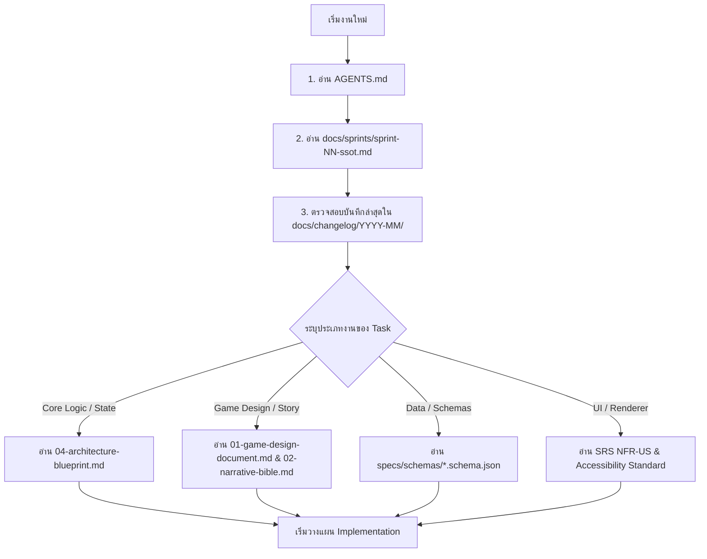
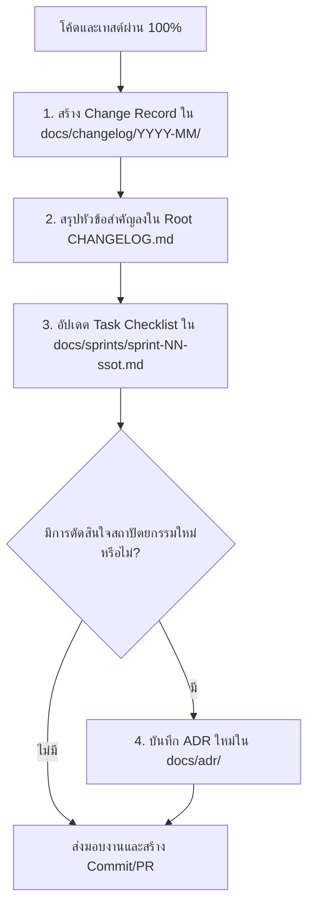

# JaoKob Master Documentation Portal & Engineering Operating Manual

ยินดีต้อนรับสู่ศูนย์กลางเอกสาร ข้อกำหนด และคู่มือปฏิบัติการวิศวกรรมของโครงการ **JaoKob (เจ้ากบ)**  
ระบบเอกสารและกระบวนการทำงานในโฟลเดอร์นี้ถูกจัดระเบียบตามมาตรฐานวิศวกรรมระดับโลก:
- **ISO/IEC/IEEE 12207:2017:** Systems and software engineering - Software life cycle processes
- **ISO/IEC/IEEE 29148:2018:** Systems and software engineering - Life cycle processes - Requirements engineering
- **ISO/IEC 25010:2011:** Systems and software quality requirements and evaluation (SQuaRE)
- **WCAG 2.2 Level AA:** Web Content Accessibility Guidelines

เอกสารนี้ทำหน้าที่เป็น **Single Source of Truth (SSOT)** และคู่มือนำทางสำหรับนักพัฒนาและ AI Agent ทุกตัวในการทำงานร่วมกันอย่างมีวินัย ตรวจสอบย้อนกลับได้ และไร้ข้อผิดพลาด

---

## 1. แผนผังโครงสร้างโฟลเดอร์ของโครงการ (Repository Directory Standard)

เพื่อให้การทำงานร่วมกันระหว่างมนุษย์และ AI มีระเบียบและไม่เกิดการวางไฟล์ผิดที่ ทุกคนต้องปฏิบัติตามผังโครงสร้างนี้:

```text
JaoKob/
├── AGENTS.md                      <-- กฎระเบียบสูงสุดของ Repository สำหรับ AI Agent
├── CHANGELOG.md                   <-- บันทึกการเปลี่ยนแปลงระดับ Release ภาพรวม (Keep a Changelog)
├── README.md                      <-- ข้อมูลโครงการสาธารณะ
├── .gitignore                     <-- รายการไฟล์ละเว้น (เฉพาะ OS/Artifacts ไม่ละเว้น Docs/Specs)
├── docs/                          <-- ศูนย์รวมเอกสารและข้อกำหนดของโครงการ
│   ├── README.md                  <-- (ไฟล์นี้) คู่มือการปฏิบัติงานและสารบัญนำทางเอกสาร
│   ├── ORGANIZATION-LOG.md        <-- บันทึกประวัติการจัดระเบียบโครงสร้างเอกสาร
│   ├── changelog/                 <-- คลังบันทึกประวัติการทำงานระดับ Execution Session (ISO 12207)
│   │   ├── README.md              <-- มาตรฐานและแม่แบบการบันทึกระดับวัน-เวลา
│   │   ├── 2026-08/               <-- บันทึกประจำเดือนสิงหาคม 2026
│   │   └── 2026-09/               <-- บันทึกประจำเดือนกันยายน 2026
│   ├── sprints/                   <-- เอกสาร SSOT ประจำรอบการพัฒนา (Sprint Execution)
│   │   └── sprint-01-ssot.md      <-- SSOT ประจำ Sprint 1: Core Vertical Slice
│   ├── phase-0/                   <-- เอกสารข้อกำหนดรากฐาน (Baseline Specifications 9 ฉบับ)
│   │   ├── 00-phase-0-charter.md  <-- ขอบเขต กฎบัตร และมาตรฐานอ้างอิง
│   │   ├── 01-game-design-document.md <-- GDD ฉบับเต็ม (Core Loop, Meters, Endings)
│   │   ├── 02-narrative-bible.md  <-- เรื่องเล่า 5 องก์, ตัวละคร, และ Sensory Rules
│   │   ├── 03-software-requirements-specification.md <-- SRS (FR 50 ข้อ, NFR 38 ข้อ)
│   │   ├── 04-architecture-blueprint.md <-- Clean Architecture, Ports & Adapters, ADRs
│   │   ├── 05-production-directory-plan.md <-- ผังโฟลเดอร์และกฎการเป็นเจ้าของไฟล์
│   │   ├── 06-ai-agent-engineering-guide.md <-- คู่มือวิศวกรรมสำหรับ AI Agent
│   │   ├── 07-git-governance-and-deployment-runbook.md <-- Git & GitHub Pages Runbook
│   │   └── 08-verification-traceability-and-quality-gates.md <-- แผนการตรวจรับและทดสอบ
│   ├── adr/                       <-- Architecture Decision Records เพิ่มเติม
│   └── traceability/              <-- Matrix ตรวจสอบย้อนกลับของแต่ละ Sprint
├── specs/                         <-- Machine-Readable Data Contracts (JSON Schemas Draft 2020-12)
│   ├── README.md                  <-- สารบัญ Schema และ Versioning Contract
│   └── schemas/                   <-- สัญญาข้อมูล 7 ฉบับ (character, dialogue, event, ฯลฯ)
├── src/                           <-- Production Source Code (Pure ES Modules, Clean Architecture)
│   ├── bootstrap/                 <-- จุดเดียวที่เชื่อม Adapters เข้ากับ Core Ports (Composition Root)
│   ├── core/                      <-- Pure Domain Logic (ห้ามเรียก DOM, window, localStorage)
│   ├── ui/                        <-- UI Adapters (DOM Renderer, CSS, Accessibility)
│   └── data/                      <-- Data Adapters (LocalStorage Persistence, Content, i18n)
├── tests/                         <-- Automated Test Suites
│   ├── unit/                      <-- Unit Tests สำหรับ Core Logic
│   └── fixtures/                  <-- ข้อมูลตัวอย่างสำหรับทดสอบ
└── .agents/                       <-- Skills, Standards และ Workflows ประจำระบบของ AI
```

---

## 2. ขั้นตอนก่อนเริ่มงานสำหรับ AI Agent ("ก่อนทำงานควรอ่านอะไร")

เพื่อประหยัด Token และป้องกันการหลุดกรอบสถาปัตยกรรม AI Agent ต้องปฏิบัติตามลำดับการโหลดบริบทดังนี้:



### Checklist ที่ต้องตรวจสอบก่อนเริ่มเขียนโค้ด (Definition of Ready - DoR):
1. [ ] **อ่าน [`AGENTS.md`](../AGENTS.md):** ยืนยันข้อห้าม Boundary และขอบเขตความปลอดภัย
2. [ ] **อ่าน SSOT ประจำ Sprint:** เช่น [`docs/sprints/sprint-01-ssot.md`](sprints/sprint-01-ssot.md) เพื่อทราบ Goal, Scope, Requirement IDs และเกณฑ์ส่งมอบ (DoD)
3. [ ] **อ่าน Change Record ล่าสุด:** ใน [`docs/changelog/2026-09/`](changelog/2026-09/) เพื่อทราบสถานะว่ารอบที่แล้วทำอะไรเสร็จไปแล้วบ้าง
4. [ ] **ตรวจสอบ Requirement ID:** ทราบแน่ชัดว่างานที่กำลังจะทำตอบโจทย์ Requirement ID ใด (เช่น `FR-STA-001`, `FR-ENG-001`)

---

## 3. ขั้นตอนหลังทำงานเสร็จสำหรับ AI Agent ("หลังทำงานควรอัปเดตอะไรใน docs")

เมื่อพัฒนาโค้ดและรัน Automated Tests ผ่านครบถ้วนแล้ว **งานจะยังไม่ถือว่าเสร็จสมบูรณ์ (Not Done)** จนกว่า AI Agent จะอัปเดตเอกสารตาม 4 ขั้นตอนนี้:



### Checklist ที่ต้องอัปเดตก่อนส่งมอบงาน (Definition of Done - DoD Documentation Gate):
1. [ ] **สร้าง Execution Change Record:** สร้างไฟล์ใหม่ใน `docs/changelog/YYYY-MM/YYYY-MM-DD-HHmm-<slug>.md` ตามแม่แบบใน [`docs/changelog/README.md`](changelog/README.md) โดยระบุวันเวลา, วัตถุประสงค์, Requirement IDs, รายการไฟล์ที่แก้ และผลการทดสอบ
2. [ ] **อัปเดต Root [`CHANGELOG.md`](../CHANGELOG.md):** เพิ่มสรุปสั้น 1-3 บรรทัดภายใต้หัวข้อ Release หรือ Unreleased พร้อมทำลิงก์ Markdown ชี้ไปยังไฟล์ Change Record ในข้อ 1
3. [ ] **อัปเดตสถานะใน Sprint SSOT:** เปิด [`docs/sprints/sprint-NN-ssot.md`](sprints/sprint-01-ssot.md) แล้วทำเครื่องหมาย `[x]` หน้า Task ที่ทำเสร็จแล้วในหัวข้อ Work Breakdown Structure (WBS)
4. [ ] **บันทึก ADR (ถ้ามี):** หากมีการตัดสินใจทางสถาปัตยกรรมที่เปลี่ยนไปจาก Phase 0 ให้บันทึก ADR ฉบับใหม่ใน [`docs/adr/`](adr/)

---

## 4. มาตรฐานวิศวกรรมที่นำมาใช้ (Governance & Compliance Mapping)

| มาตรฐานสากล | การนำมาใช้ในโครงสร้างเอกสารของ JaoKob |
|---|---|
| **ISO/IEC/IEEE 12207:2017** | กระบวนการ Configuration Management, Traceability Chain, Audit Trail ใน `docs/changelog/` |
| **ISO/IEC/IEEE 29148:2018** | โครงสร้างข้อกำหนดความต้องการซอฟต์แวร์ใน `docs/phase-0/03-software-requirements-specification.md` |
| **ISO/IEC 25010:2011** | โครงสร้าง Non-Functional Requirements ครอบคลุมทั้ง 8 ด้านคุณภาพ |
| **WCAG 2.2 Level AA** | เกณฑ์การเข้าถึงสำหรับผู้พิการและเทคโนโลยีช่วยเหลือใน `src/ui/accessibility/` |
