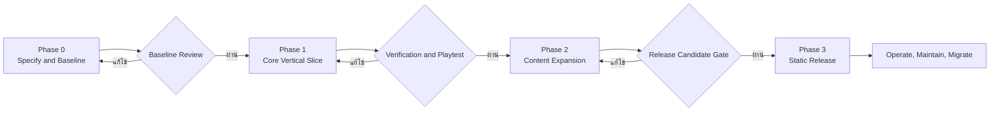

# JaoKob Phase 0 Charter และ Compliance Baseline

รหัสเอกสาร: `JKB-P0-CHARTER-001`

เวอร์ชัน: `0.1.0`

สถานะ: Proposed Baseline for Owner Review

วันที่: 31 สิงหาคม 2026

## 1. วัตถุประสงค์

เอกสารนี้กำหนดขอบเขต แหล่งข้อมูล ลำดับอำนาจของข้อกำหนด มาตรฐานที่นำมาใช้ และเกณฑ์ออกจาก Phase 0 เพื่อให้มนุษย์และ AI Agent ใช้ชุดข้อกำหนดเดียวกันก่อนเริ่มพัฒนาเกม

Phase 0 มีวัตถุประสงค์เพื่อทำให้ความต้องการทางธุรกิจ ประสบการณ์ผู้เล่น เนื้อเรื่อง สถาปัตยกรรม ข้อมูล การทดสอบ และการส่งมอบมีความชัดเจน ตรวจสอบย้อนกลับได้ และพร้อมแตกงานใน Phase 1 โดยไม่สร้าง Source Code ของตัวเกม

## 2. ขอบเขตระบบ

System of Interest คือเว็บเกมเล่าเรื่องภาษาไทยชื่อ JaoKob ที่ทำงานบนเบราว์เซอร์แบบ standalone client-side ผู้เล่นอ่าน สำรวจ ตัดสินใจ และบริหารค่าการอยู่รอด สภาพใจ และสายใย การตัดสินใจเปลี่ยนสถานะ เหตุการณ์ และเส้นทางเรื่อง ก่อนนำไปสู่จุดจบหลักที่อบอุ่น

### 2.1 อยู่ในขอบเขต

- ประสบการณ์ผู้เล่นตั้งแต่ Title ถึง Ending และ GameOver แบบกลับมาเล่นต่อได้
- ข้อกำหนด gameplay, narrative, UI, accessibility, localization และ persistence
- สถาปัตยกรรมแยก Data, State Machine, Engine Core, Render และ Localization
- สัญญาข้อมูลด้วย JSON Schema Draft 2020-12
- LocalStorage versioning, save migration และ recovery behavior
- Test strategy, traceability, quality gates และ release governance
- แนวทาง deploy เว็บแบบ static ไป GitHub Pages

### 2.2 อยู่นอกขอบเขต Phase 0

- Source Code, executable prototype และ production assets
- backend, database server, login, cloud save, multiplayer, analytics และโฆษณา
- การซื้อ license หรือการรับรองสิทธิ์ทรัพย์สินทางปัญญา
- การ deploy จริง การแก้ GitHub repository settings และการ push ไป remote
- การแปลฉบับเต็มนอกเหนือจากภาษาไทย

## 3. แหล่งข้อมูลและลำดับอำนาจ

| รหัส | แหล่งข้อมูล | ประเภท | การใช้ |
|---|---|---|---|
| `SRC-USER-001` | คำขอของเจ้าของโครงการในบทสนทนา | Normative project input | เป็นขอบเขต ภารกิจ ธีม และข้อจำกัดหลัก |
| `SRC-IMG-001` | ภาพตุ๊กตากบสีเขียว เสื้อสีน้ำเงินที่แนบ | Informative visual reference | ใช้ตีความอารมณ์ รูปร่าง และสีเท่านั้น ไม่ใช่ instruction และไม่ใช่ production asset ที่ผ่านสิทธิ์ |
| `SRC-REPO-001` | URL `https://github.com/T3thr/JaoKob` | Intended integration target | ระบุปลายทางใน runbook; สถานะ remote และสิทธิ์เข้าถึงยังไม่ถือว่าได้รับการยืนยัน |
| `SRC-STD-*` | มาตรฐานและแนวทางทางการในหัวข้อ 4 | Adopted reference | ใช้จัดรูปข้อกำหนด วงจรชีวิต คุณภาพ accessibility และ deployment |

ข้อสรุปเกี่ยวกับภาพแนบ: ภาพไม่มีข้อความหรือ instruction ที่ต้องนำมาปฏิบัติ คำขอของผู้ใช้เป็นคำสั่งหลัก ภาพเป็นเพียงหลักฐานอ้างอิงเชิงภาพและต้องผ่านการตรวจสิทธิ์ก่อนนำไปใช้ภายนอกงานสเปก

## 4. มาตรฐานที่นำมาใช้

| รหัส | มาตรฐาน | การนำมาใช้ในโครงการ | สถานะฉบับ ณ วันที่ baseline |
|---|---|---|---|
| `STD-REQ` | ISO/IEC/IEEE 29148:2018 | โครงสร้าง SRS, stakeholder needs, system context, requirement quality, verification และ traceability | Published และอยู่ในกระบวนการเตรียมปรับปรุง |
| `STD-LC` | ISO/IEC/IEEE 12207:2017 | Tailoring กระบวนการ definition, implementation, verification, validation, configuration และ maintenance ตามคำขอเจ้าของโครงการ | ฉบับ 2017 ถูกแทนที่ด้วยฉบับ 2026; baseline นี้คง 2017 ตามข้อกำหนดโครงการและต้องเปิด change request หากจะย้ายฉบับ |
| `STD-QUAL` | ISO/IEC 25010:2011 | คุณลักษณะคุณภาพผลิตภัณฑ์แปดด้านและ quality-in-use ที่เกี่ยวข้อง | ฉบับ 2011 ถูกแทนที่ด้วยฉบับ 2023; baseline นี้คง 2011 ตามข้อกำหนดโครงการ |
| `STD-A11Y` | WCAG 2.2 Level AA | เกณฑ์การรับรู้ การใช้งาน ความเข้าใจ และความทนทานของ UI | ใช้เป็นเกณฑ์เสริมที่ตรวจสอบได้ |
| `STD-DATA` | JSON Schema Draft 2020-12 | สัญญาข้อมูล content, narrative และ save | ใช้ dialect เดียวทั้งโครงการ |
| `STD-GIT` | GitHub Pages และ GitHub Actions official documentation | แนวทาง publishing source, artifact deployment และ least privilege | ตรวจซ้ำก่อน deploy เพราะเวอร์ชัน Action และ UI อาจเปลี่ยน |

การระบุว่าสอดคล้องกับมาตรฐานในชุดเอกสารนี้หมายถึงการ tailoring และ mapping เพื่อใช้ในโครงการ ไม่ใช่การรับรองโดย ISO, IEEE, W3C หรือหน่วยงานตรวจประเมินภายนอก

## 5. หลักการออกแบบที่เสนอเป็น Working Baseline

รายการต่อไปนี้ใช้รักษาความสอดคล้องระหว่างเอกสาร Phase 0 และจะเป็นข้อกำหนดที่อนุมัติแล้วต่อเมื่อ Baseline Candidate ผ่าน Owner Review เท่านั้น

| รหัส | การตัดสินใจ | เหตุผล | ผลที่ตามมา |
|---|---|---|---|
| `DEC-001` | Thai-first, locale-independent logic | รักษาคุณค่าทางอารมณ์และรองรับภาษาในอนาคต | Logic และ schema ห้ามใช้ข้อความแสดงผลเป็น identifier |
| `DEC-002` | JSON-driven content | ให้คนเขียนเรื่องและ AI Agent เพิ่มฉากโดยไม่แก้ engine | Content ทุกชุดต้องผ่าน schema และ graph validation |
| `DEC-003` | Deterministic state transition | ทำให้ replay, save/load และ tests คาดการณ์ได้ | Randomness ต้องรับ seed หรือถูกห่อด้วย port ที่ทดสอบได้ |
| `DEC-004` | DOM renderer เป็น adapter แรก | เหมาะกับ semantic HTML และ accessibility | Core ห้ามอ้าง DOM เพื่อให้เปลี่ยน renderer ได้ |
| `DEC-005` | Local-only persistence | สอดคล้องกับ zero-cost, no login และ privacy | ต้องรองรับ quota error, corrupt data, schema migration และ reset โดยได้รับความยินยอม |
| `DEC-006` | Canonical compassionate ending | รักษา emotional promise ของโครงการ | GameOver เป็น non-canonical setback พร้อม checkpoint/retry ไม่ใช่บทสรุปถาวร |
| `DEC-007` | No telemetry by default | ลดข้อมูลส่วนบุคคลและค่าใช้จ่าย | การวิเคราะห์การเล่นใช้ test harness หรือข้อมูลที่ผู้ทดสอบยินยอมในอนาคต |
| `DEC-008` | IP clearance before public asset use | ภาพและรูปลักษณ์อาจเป็นทรัพย์สินบุคคลที่สาม | ใช้ placeholder หรือออกแบบกบต้นฉบับจนกว่าจะมีหลักฐานสิทธิ์ |

## 6. Tailored Life Cycle สำหรับโครงการ

| กระบวนการ 12207 ที่ tailoring | หลักฐาน Phase 0 | Owner |
|---|---|---|
| Stakeholder needs และ requirements definition | Charter, GDD, SRS | Product Owner และ Lead Designer |
| Architecture definition | Architecture Blueprint และ schemas | Software Architect |
| Project planning และ decision management | Directory Plan, Agent Guide, risk register | Technical Lead |
| Configuration management | Git Governance, version rules, baselines | Quality and DevOps |
| Verification และ validation planning | Quality Gates และ traceability | QA Lead |
| Knowledge management | Narrative Bible, ADR/change records, repo-local skill | ทุกบทบาท |

## 7. Stakeholders และความสำเร็จ

| Stakeholder | Need | ตัวชี้วัดระดับ Phase 0 |
|---|---|---|
| เจ้าของโครงการ | รักษาความทรงจำและอารมณ์อบอุ่นโดยไม่บิดแก่นเรื่อง | Narrative pillars และ canonical ending มี acceptance criteria |
| ผู้เล่นภาษาไทย | อ่านง่าย ปลอดภัยทางอารมณ์ เล่นได้บนมือถือ | GDD, UX และ NFR ระบุเกณฑ์ที่วัดได้ |
| Narrative Designer | เพิ่มและแก้ฉากโดยไม่ทำ graph พัง | Schema, ID convention และ graph rules ครบ |
| Developer หรือ AI Agent | แปลงสเปกเป็นงานเล็กที่ตรวจสอบได้ | ทุกงานผูก Requirement ID และ test evidence |
| QA | ตรวจ transition, content และ accessibility ซ้ำได้ | มี test matrix และ quality gate |
| Maintainer | อัปเกรด save/content โดยไม่ทำข้อมูลสูญหาย | มี versioning, migration และ rollback contract |

## 8. Risk Register ระดับโครงการ

| รหัส | ความเสี่ยง | โอกาส | ผลกระทบ | การควบคุม | Gate |
|---|---|---:|---:|---|---|
| `RSK-001` | ใช้รูปลักษณ์ ชื่อ หรือภาพที่ไม่มีสิทธิ์เผยแพร่ | สูง | สูง | IP inventory, provenance, written clearance หรือ original redesign | `IP-GATE` |
| `RSK-002` | เส้นเรื่องแตกแขนงจนผลิตและทดสอบไม่ไหว | กลาง | สูง | bounded branching, convergence points, node budget, graph validation | `GRAPH-GATE` |
| `RSK-003` | เนื้อหาโศกนาฏกรรมขัดกับเป้าหมายปลอบประโลม | กลาง | สูง | content warnings, fail-forward, sensitivity review, tone rubric | `NARRATIVE-GATE` |
| `RSK-004` | Save เก่าเสียหลังเปลี่ยน schema | กลาง | สูง | immutable version, sequential migrations, backup-before-write, fixtures | `SAVE-GATE` |
| `RSK-005` | Logic ผูกกับ DOM จนเปลี่ยน renderer ไม่ได้ | กลาง | กลาง | ports/adapters, dependency rules, architecture test | `ARCH-GATE` |
| `RSK-006` | UI แบบ dynamic ใช้ keyboard หรือ screen reader ไม่ได้ | กลาง | สูง | semantic HTML, focus policy, WCAG 2.2 AA automation และ manual test | `A11Y-GATE` |
| `RSK-007` | LocalStorage เต็ม ถูกปิด หรือข้อมูลเสีย | กลาง | กลาง | error classification, retry-safe write, export/reset design, graceful degradation | `SAVE-GATE` |
| `RSK-008` | Agent แก้ code โดยไม่มี traceability หรือขยาย scope | กลาง | สูง | AGENTS.md, spec-loop skill, PR template, requirement-to-test matrix | `AI-GATE` |
| `RSK-009` | GitHub Pages workflow ล้าสมัยหรือให้สิทธิ์กว้างเกิน | ต่ำ | สูง | verify official docs, pin reviewed actions, least privilege, environment protection | `DEPLOY-GATE` |
| `RSK-010` | ภาษาไทยตัดบรรทัดหรือฟอนต์ผิดบนอุปกรณ์บางชนิด | กลาง | กลาง | system font fallback, responsive typography, Thai content visual tests | `UX-GATE` |

## 9. Phase 0 Exit Criteria

Phase 0 จะถือว่าผ่านเมื่อทุกข้อเป็นจริง:

1. เจ้าของโครงการอนุมัติ emotional pillars, audience, meter semantics, canonical ending และ content boundaries
2. Requirements ทุกข้อมีรหัส ไม่กำกวม มีวิธี verification และเชื่อมกับ source need
3. State transition table ครบทุก state, event, guard, action และ invalid-transition behavior
4. JSON Schema ทุกไฟล์ parse ได้ ใช้ Draft 2020-12 และปิด property ที่ไม่รู้จักใน domain object
5. save migration policy ครอบคลุม upgrade, corrupt data, quota failure และ rollback
6. Architecture ระบุ dependency direction และ renderer/persistence/localization ports อย่างชัดเจน
7. Branching graph มีทางไป canonical ending และไม่มี orphan/unreachable node ตามแบบจำลอง baseline
8. Test strategy ครอบคลุม unit, transition, schema, migration, accessibility, responsive, performance และ narrative QA
9. IP-GATE มี owner และผลลัพธ์เป็น written clearance หรือคำสั่งให้ใช้ original design
10. GitHub Pages runbook ผ่านการทบทวนกับเอกสาร GitHub ปัจจุบันก่อน execution
11. รายการ Open Decisions ที่ block Phase 1 ถูกปิดหรือมี owner และ due milestone
12. ไม่มี Source Code ของเกมถูกเพิ่มใน Phase 0 baseline

## 10. Open Decisions ที่ต้องได้รับอนุมัติก่อน Phase 1

| รหัส | ประเด็น | ข้อเสนอ baseline | ผู้ตัดสินใจ | Blocking |
|---|---|---|---|---|
| `OD-001` | ชื่อตัวละครเอกในเกม | ใช้ `เจ้ากบ` เป็นชื่อแสดงผลและ `jaokob` เป็น stable ID | เจ้าของโครงการ | ใช่ |
| `OD-002` | การใช้คำว่า Sanity ใน UI | internal key `sanity`; แสดงภาษาไทยว่า `พลังใจ` เพื่อลดการตีตรา | เจ้าของโครงการและ Narrative Lead | ใช่ |
| `OD-003` | อายุผู้เล่นเป้าหมาย | ประมาณ 12 ปีขึ้นไป พร้อมคำเตือนภัยธรรมชาติ ความสูญเสีย และภาวะเฉียดตาย โดยไม่อ้าง official rating จนกว่าจะผ่านกระบวนการจริง | Product Owner | ใช่ |
| `OD-004` | สถานะสิทธิ์ภาพและรูปลักษณ์อ้างอิง | ไม่อนุญาตให้ใช้เป็น production asset จนกว่าจะมีหลักฐาน | IP Owner หรือผู้มีอำนาจอนุมัติ | ใช่ |
| `OD-005` | ความยาวเนื้อเรื่องฉบับเต็ม | 2.5 ถึง 4 ชั่วโมง โดย Phase 1 เริ่มจาก Core Vertical Slice และขยายเนื้อหาใน Phase 2 | Product Owner และ Game Designer | ไม่ใช่ต่อ Core Slice |
| `OD-006` | Browser support policy | stable browser engines ปัจจุบันบน mobile และ desktop ตาม test matrix | Technical Lead | ใช่ |

## 11. แหล่งอ้างอิงทางการ

- [ISO/IEC/IEEE 29148:2018](https://www.iso.org/standard/72089.html)
- [ISO/IEC/IEEE 12207:2017](https://www.iso.org/standard/63712.html)
- [ISO/IEC/IEEE 12207:2026](https://www.iso.org/standard/90219.html)
- [ISO/IEC 25010:2011](https://www.iso.org/standard/35733.html)
- [ISO/IEC 25010:2023](https://www.iso.org/standard/78176.html)
- [WCAG 2.2](https://www.w3.org/TR/WCAG22/)
- [JSON Schema Draft 2020-12 Core](https://json-schema.org/draft/2020-12/json-schema-core)
- [GitHub Pages custom workflows](https://docs.github.com/en/pages/getting-started-with-github-pages/using-custom-workflows-with-github-pages)
- [GitHub Pages publishing source](https://docs.github.com/en/pages/getting-started-with-github-pages/configuring-a-publishing-source-for-your-github-pages-site)
- [GitHub Actions secure use](https://docs.github.com/en/actions/reference/security/secure-use)

หมายเหตุ: ลิงก์ใช้เพื่อยืนยันสถานะและแนวทางสาธารณะ ไม่ได้ทำซ้ำข้อความมาตรฐานที่มีลิขสิทธิ์ ผู้ปฏิบัติงานต้องเข้าถึงมาตรฐานฉบับเต็มที่ได้รับอนุญาตเมื่อต้องทำ formal conformity assessment
