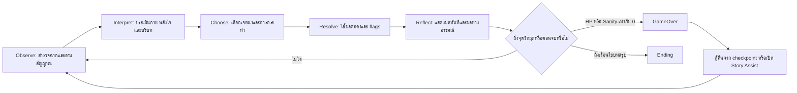
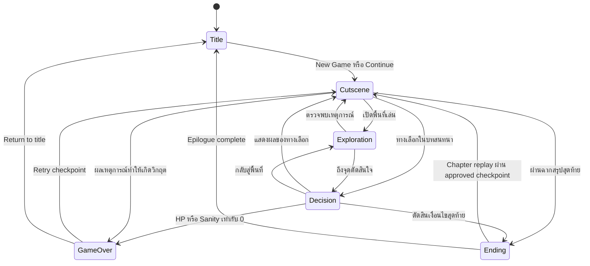

# JaoKob Game Design Document

## 0. การควบคุมเอกสาร

| รายการ | ค่า |
|---|---|
| รหัสเอกสาร | JKB-P0-GDD-001 |
| ชื่อโครงการ | JaoKob (เจ้ากบ) |
| ระยะโครงการ | Phase 0: Specification Baseline |
| สถานะ | Baseline Candidate สำหรับการทบทวน |
| ภาษาหลัก | ภาษาไทย |
| ประเภทเกม | Narrative Adventure แบบ Choice-Driven และ Survival-Lite |
| แพลตฟอร์มเป้าหมายระยะแรก | Responsive Web Application แบบ Mobile-First |
| รูปแบบธุรกิจ | ฟรีทั้งหมด ไม่มีโฆษณา ไม่มีการซื้อในเกม ไม่มีบัญชีผู้ใช้ |
| เอกสารที่เกี่ยวข้อง | `02-narrative-bible.md`, SRS, Architecture Blueprint และ AI Agent Engineering Guide |

คำว่า "ต้อง" ในเอกสารนี้หมายถึงข้อกำหนดบังคับ คำว่า "ควร" หมายถึงข้อกำหนดที่อาจยกเว้นได้เมื่อมีเหตุผลและบันทึกการตัดสินใจ ส่วนคำว่า "อาจ" หมายถึงทางเลือกที่อนุญาต รหัส `GDD-*` ใช้เป็นกุญแจสำหรับตรวจสอบย้อนกลับไปยัง SRS, test case, content record และ pull request ใน Phase ถัดไป

## 1. วิสัยทัศน์ผลิตภัณฑ์

### 1.1 High Concept

`GDD-VIS-001` JaoKob ต้องเป็นเกมผจญภัยเชิงสัญลักษณ์ที่ผู้เล่นพากบตัวเล็กผ่านการพลัดพราก การเติบโต และโลกมนุษย์อันไม่คุ้นเคย ไปสู่ความไว้วางใจและบ้านที่แท้จริง การเล่นต้องให้ความรู้สึกอบอุ่น ปลอบประโลม และเคารพความเศร้า โดยไม่เปลี่ยนความสูญเสียให้เป็นเครื่องลงโทษผู้เล่น

`GDD-VIS-002` ประสบการณ์หลักต้องพึ่งพาการสังเกต การตัดสินใจ และผลสะสมของสภาพกาย พลังใจ และความผูกพัน ไม่พึ่งพาการต่อสู้แบบเรียลไทม์ การแข่งขัน หรือการสุ่มที่ตัดสินผลสำคัญ

`GDD-VIS-003` ตอนจบตาม Canon ต้องเป็นการพบเด็กสาวผู้มีเมตตาและการได้รับที่พักพิงในฐานะตุ๊กตากบคู่ใจ ส่วนเส้นทางอื่นอาจจบอย่างปลอดภัยและมีความหวัง แต่ต้องระบุว่าเป็น Reflective Ending ที่ไม่แทนที่ Canon

### 1.2 Emotional Promise

`GDD-VIS-004` เกมต้องรักษาลำดับอารมณ์ดังนี้: ความอบอุ่นเดิม การสูญเสีย ความหวาดระแวง การเรียนรู้ ความไว้วางใจ และความอบอุ่นรูปแบบใหม่ ผู้เล่นอาจรู้สึกเศร้าหรือกังวลได้ แต่ต้องได้รับช่วงพักทางอารมณ์และสัญญาณความหวังเป็นระยะ

`GDD-VIS-005` ผู้เล่นต้องไม่ถูกกล่าวโทษว่าเป็นต้นเหตุของภัยธรรมชาติ การพลัดพราก หรือความเปราะบางของตัวเอก ทางเลือกมีหน้าที่กำหนดวิธีรับมือ ความเข้าใจ และความสัมพันธ์ มิใช่เปิดโอกาสให้ป้องกันเหตุ Canon ที่หลีกเลี่ยงไม่ได้แล้วลงโทษย้อนหลัง

### 1.3 เป้าหมายความสำเร็จด้านประสบการณ์

| รหัส | เป้าหมายที่ตรวจสอบได้ใน Playtest |
|---|---|
| `GDD-GOAL-001` | ผู้ทดสอบอย่างน้อย 80 เปอร์เซ็นต์อธิบาย Core Loop ได้หลังเล่นไม่เกิน 10 นาที โดยไม่ต้องอ่านคู่มือภายนอก |
| `GDD-GOAL-002` | ผู้ทดสอบอย่างน้อย 80 เปอร์เซ็นต์เข้าใจว่าค่า HP, พลังใจ และความผูกพันส่งผลต่างกัน |
| `GDD-GOAL-003` | ผู้ทดสอบอย่างน้อย 75 เปอร์เซ็นต์เข้าถึง `END-HOME` ในการเล่นครั้งแรกเมื่ออ่านคำบอกใบ้และไม่ได้จงใจเลือกทางเสี่ยงทั้งหมด |
| `GDD-GOAL-004` | ไม่มีผู้ทดสอบที่เข้าใจผิดว่าทางเลือกก่อนภัยธรรมชาติสามารถช่วยครอบครัวได้ หากเนื้อเรื่องกำหนดให้การพลัดพรากเป็นเหตุ Canon |
| `GDD-GOAL-005` | ผู้ทดสอบสามารถหยุดและกลับมาเล่นต่อได้ในช่วงไม่เกิน 15 นาทีโดยไม่เสียความคืบหน้าที่บันทึก ณ checkpoint ล่าสุด |
| `GDD-GOAL-006` | การทดสอบด้วยคีย์บอร์ดและโปรแกรมอ่านหน้าจอต้องดำเนิน Core Loop ตั้งแต่ `Title` ถึง `Ending` ได้โดยไม่ติดขัด |

## 2. ผู้เล่นเป้าหมาย

### 2.1 กลุ่มเป้าหมายหลัก

`GDD-AUD-001` กลุ่มหลักคือผู้เล่นอายุประมาณ 12 ปีขึ้นไปที่สนใจเกมเนื้อเรื่อง เกมอบอุ่นใจ ตัวละครสัตว์ การตัดสินใจที่มีความหมาย และประสบการณ์แบบเล่นคนเดียวระยะสั้นถึงปานกลาง

`GDD-AUD-002` เกมต้องรองรับผู้เล่นที่ไม่คุ้นเคยกับเกม โดยไม่ตั้งสมมติฐานว่ารู้ศัพท์ประเภท HP, checkpoint หรือ branching narrative มาก่อน ป้ายภาษาไทยต้องอธิบายความหมายด้วยภาษาธรรมชาติเมื่อพบระบบครั้งแรก

`GDD-AUD-003` กลุ่มรองประกอบด้วยผู้เล่นที่ต้องการประสบการณ์สงบ ผู้เล่นบนโทรศัพท์ ผู้เล่นที่มีข้อจำกัดด้านการมองเห็นสี การเคลื่อนไหวละเอียด การได้ยิน หรือการประมวลผลข้อความ และผู้เล่นภาษาอื่นในอนาคตผ่าน localization architecture

### 2.2 Player Needs

| Persona | ความต้องการ | ความเสี่ยง | แนวทางออกแบบ |
|---|---|---|---|
| ผู้เล่นเนื้อเรื่อง | ตัวละครน่าจดจำ ผลทางเลือกสมเหตุผล | เนื้อหาแตกแขนงกว้างแต่ตื้น | ใช้สาขาแบบ foldback และ payoff จาก flags |
| ผู้เล่นทั่วไปบนมือถือ | เล่นได้ด้วยมือเดียวและพักได้ทันที | ปุ่มเล็ก ข้อความยาว สูญเสียสถานะ | ปุ่มสัมผัสขนาดเหมาะสม autosave และฉากสั้น |
| ผู้เล่นที่ไวต่อเนื้อหา | ได้รับการเตือนและควบคุมความเข้มข้น | ภัยธรรมชาติและการพลัดพรากกระตุ้นความไม่สบายใจ | content notice, Story Assist และการข้ามภาพเข้มข้น |
| ผู้เล่นที่ต้องใช้เทคโนโลยีช่วยเหลือ | ลำดับโฟกัสและคำอธิบายที่ชัด | ข้อมูลสื่อด้วยสีหรือภาพเพียงอย่างเดียว | semantic structure, text alternative และ status text |

### 2.3 กลุ่มที่ไม่ใช่เป้าหมายหลัก

`GDD-AUD-004` เกมไม่ออกแบบเพื่อผู้เล่นที่ต้องการการต่อสู้เชิงทักษะสูง ระบบแข่งขัน ระบบสะสมแบบสุ่ม หรือ sandbox ที่ไม่มีเส้นเรื่อง การไม่ตอบสนองความต้องการเหล่านี้ไม่ถือเป็นข้อบกพร่องของ Phase 1

## 3. เสาหลักการออกแบบ

| รหัส | เสาหลัก | กฎตัดสินใจด้านการออกแบบ |
|---|---|---|
| `GDD-PIL-001` | ความเปราะบางที่ยังมีศักดิ์ศรี | ความอันตรายต้องทำให้ผู้เล่นระมัดระวัง แต่ห้ามใช้ภาพทารุณหรือทำให้ตัวเอกเป็นวัตถุแห่งความสงสารเพียงอย่างเดียว |
| `GDD-PIL-002` | ทางเลือกคือวิธีรับมือ | ทางเลือกทุกข้อที่ใช้งานได้ต้องสะท้อนเจตนาที่เข้าใจได้ เช่น ระวัง กล้า หรือเมตตา และห้ามมีคำตอบผิดแบบหลอกลวงโดยไม่มีคำบอกใบ้ |
| `GDD-PIL-003` | โลกมนุษย์ผ่านสายตากบ | สิ่งธรรมดาของมนุษย์ต้องมีขนาด เสียง และความหมายใหม่ แต่ข้อสรุปเกี่ยวกับมนุษย์ต้องมีทั้งด้านมืดและด้านอ่อนโยน |
| `GDD-PIL-004` | ความหวังเป็นระบบ ไม่ใช่เพียงข้อความ | ผู้เล่นต้องเห็นโอกาสฟื้น HP และพลังใจ ซ่อมความสัมพันธ์ และย้อนจากวิกฤตได้จริง |
| `GDD-PIL-005` | เนื้อหาแยกจากเครื่องยนต์ | ฉาก ทางเลือก เงื่อนไข และผลลัพธ์ต้องนิยามเป็นข้อมูลที่ตรวจสอบได้ เพื่อรองรับ Spec-Driven AI Loop โดยไม่ผูกกับ DOM |

`GDD-PIL-006` หากข้อเสนอใดขัดกันระหว่างความตื่นเต้นกับความปลอดภัยทางอารมณ์ ให้ Narrative Director และ Principal Game Designer บันทึกเหตุผลตามเสาหลักก่อนอนุมัติ ห้าม AI Agent เพิ่มความรุนแรงเพื่อสร้างความตื่นเต้นโดยไม่มี change request

## 4. ขอบเขตประสบการณ์

### 4.1 รูปแบบการเล่น

`GDD-SCP-001` เกมเป็น single-player story experience เล่นผ่าน browser โดยไม่ต้องเข้าสู่ระบบ ไม่ต้องเชื่อมต่อ server หลังโหลดทรัพยากรครบ และไม่ใช้ monetization ใด

`GDD-SCP-002` ระยะเวลาเป้าหมายของเนื้อเรื่องหลักคือ 2.5 ถึง 4 ชั่วโมง แบ่งเป็นช่วงเล่นที่มี checkpoint ทุก 8 ถึง 15 นาที ผู้เล่นควรจบหนึ่งองค์ได้ใน 25 ถึง 45 นาที ขึ้นกับการอ่านข้อความและการสำรวจ

`GDD-SCP-003` เป้าหมาย Full Release ต้องมีเนื้อเรื่องครบ 5 องก์ ตอนจบ Canon หนึ่งแบบ Reflective Ending สองแบบ และเส้นทาง `GameOver` แบบกู้คืนได้ การส่งมอบให้แบ่งเป็น Phase 1 Core Vertical Slice เพื่อพิสูจน์ Core Loop, state flow, data contract, save และ quality gates ก่อน แล้วจึง Phase 2 Content Expansion เพื่อผลิตและบูรณาการเนื้อหาครบ 5 องก์ตาม baseline นี้ ทุกระยะห้ามเพิ่มโหมดออนไลน์ ระบบบัญชี การซื้อในเกม โฆษณา leaderboard หรือ user-generated content โดยไม่มีการเปลี่ยน product scope อย่างเป็นทางการ

### 4.2 การแจกแจงเวลาและเนื้อหา

| องก์ | เวลาเป้าหมาย | จำนวนฉากหลัก | จำนวน Decision หลัก | หน้าที่เชิงระบบ |
|---|---:|---:|---:|---|
| องก์ 1: จุดกำเนิดในหนองน้ำ | 20-30 นาที | 5-7 | 3-4 | สอนสำรวจ การตัดสินใจ HP และพลังใจ |
| องก์ 2: การเติบโตและพลัดถิ่น | 25-35 นาที | 6-8 | 4-5 | สอนการเปลี่ยนสภาพ การอ่านสัญญาณอันตราย และ flags |
| องก์ 3: ดินแดนคอนกรีต | 35-45 นาที | 8-10 | 6-8 | ทดสอบ survival loop และการจัดการทรัพยากร |
| องก์ 4: กระจกโลกมนุษย์ | 35-45 นาที | 7-9 | 5-7 | เปิดระบบความผูกพันและตีความพฤติกรรมมนุษย์ |
| องก์ 5: ที่พักพิง | 25-35 นาที | 6-8 | 4-6 | ชำระ flags ซ่อมความไว้วางใจ และกำหนด Ending |

จำนวนข้างต้นเป็น content budget ไม่ใช่เหตุให้สร้างฉากเติมเวลา ทุกฉากต้องทำหน้าที่อย่างน้อยหนึ่งอย่างในสามด้าน ได้แก่ เปลี่ยนสถานะ เปิดเผยตัวละคร หรือส่งคืนผลของทางเลือกเดิม

## 5. Core Gameplay Loop

### 5.1 ลูปหลัก

`GDD-LOOP-001` ลูปหนึ่งหน่วยประกอบด้วย Observe, Interpret, Choose, Resolve, Reflect และ Continue ตามลำดับ

`GDD-LOOP-002` หนึ่งลูปควรใช้เวลา 30 วินาทีถึง 4 นาที และต้องมี feedback ที่ผู้เล่นเข้าใจได้อย่างน้อยหนึ่งรายการหลังตัดสินใจ เช่น ข้อความตอบสนอง การเปลี่ยน meter การเปลี่ยนแปลงฉาก หรือ callback ในฉากถัดไป

`GDD-LOOP-003` การสำรวจต้องให้ข้อมูลที่มีประโยชน์ต่อ Decision อย่างน้อยหนึ่งรายการต่อฉาก ห้ามทำให้การสำรวจเป็นเพียงการแตะวัตถุทุกชิ้นโดยไม่มีการอนุมาน

### 5.2 State Flow ระดับประสบการณ์

`GDD-LOOP-004` ชื่อ state ในข้อมูล การทดสอบ และ deterministic diagnostic trace ภายใน test harness ต้องใช้ตัวสะกดและตัวพิมพ์ `Title`, `Cutscene`, `Exploration`, `Decision`, `GameOver`, `Ending` เท่านั้น การแปลชื่อบน UI ไม่เปลี่ยน identifier และ production runtime ต้องไม่ส่ง telemetry

## 6. ข้อกำหนดของ State ด้านการเล่น

| รหัส | State | หน้าที่ | การกระทำที่อนุญาต | เงื่อนไขออกหลัก |
|---|---|---|---|---|
| `GDD-STATE-001` | `Title` | เริ่ม เล่นต่อ ตั้งค่า ดูคำเตือนและเครดิต | เลือกเมนู ปรับ accessibility | New Game, Continue หรือปิดเกม |
| `GDD-STATE-002` | `Cutscene` | เล่าเหตุการณ์ แสดง callback และพักจังหวะ | เดินหน้า ย้อนข้อความใน log หยุด ข้ามส่วนที่เคยดู | สิ้นสุด timeline ที่ตรวจสอบแล้ว |
| `GDD-STATE-003` | `Exploration` | ตรวจฉาก เก็บข้อมูล และเปิด event | เปลี่ยน focus ตรวจ hotspot เปิด pause | trigger ที่ตรงเงื่อนไขหรือผู้เล่นเลือกทางออก |
| `GDD-STATE-004` | `Decision` | แสดงตัวเลือก เงื่อนไข และผลที่สื่อสารได้ | อ่าน เลื่อน focus เลือก ยืนยัน | commit choice เพียงหนึ่งครั้ง |
| `GDD-STATE-005` | `GameOver` | สื่อภาวะวิกฤตและกู้คืนอย่างไม่ลงโทษ | Retry, Story Assist, Settings, Title | โหลด checkpoint หรือกลับ Title |
| `GDD-STATE-006` | `Ending` | สรุปผล flags และปิด emotional arc | อ่าน epilogue ดู callback เลือก chapter replay หรือ Title | epilogue จบและบันทึก ending |

`GDD-STATE-007` Pause และ Settings เป็น overlay ไม่ใช่ game state หลัก ห้ามเปลี่ยน HP, Sanity, Bond หรือ story flags ขณะเปิด overlay

## 7. ระบบตัวแปรหลัก

### 7.1 กฎร่วม

`GDD-MEC-001` `hp`, `sanity` และ `bond` ต้องเป็นจำนวนเต็มช่วง 0 ถึง 100 และ clamp หลังใช้ผลทุกครั้ง ห้ามค่าต่ำกว่า 0 หรือสูงกว่า 100 ปรากฏใน state, save data หรือ UI

`GDD-MEC-002` การเริ่ม New Game ตั้ง `hp = 80`, `sanity = 70` และ `bond = 0` ค่าเริ่มต้นนี้ต้องมาจาก configuration ที่มี version มิใช่ค่าที่กระจายซ้ำใน content records

`GDD-MEC-003` ระบบต้องประมวลผล choice transaction ตามลำดับคงที่ดังนี้

1. อ่าน snapshot ก่อนเลือกและตรวจ precondition ของตัวเลือก
2. ใช้ delta ของ `hp`, `sanity` และ `bond` พร้อมกัน
3. clamp ทุกค่าให้อยู่ในช่วง 0 ถึง 100
4. ตั้งค่า ลบค่า หรือเพิ่ม counter ของ event flags ตามผลที่ประกาศไว้
5. ตรวจ crisis โดยให้ `hp == 0` มาก่อน `sanity == 0` เมื่อทั้งสองเกิดพร้อมกัน
6. หากไม่เกิด crisis ให้ตรวจ Ending gate หรือ next-scene transition
7. บันทึกผล transaction และ checkpoint ตามนโยบาย save

`GDD-MEC-004` เงื่อนไขตัวเลือกต้องประเมินจาก snapshot ก่อนเลือก ห้ามผลของตัวเลือกเดียวกันย้อนกลับไปทำให้ precondition ของตนเปลี่ยนระหว่าง transaction

### 7.2 HP: สภาพกาย

| รหัส | ช่วง | สถานะภาษาไทย | ผลด้านการออกแบบ |
|---|---:|---|---|
| `GDD-HP-001` | 80-100 | แข็งแรง | ไม่มีข้อจำกัด ค่าเกิน 80 เป็น buffer |
| `GDD-HP-002` | 60-79 | มั่นคง | สภาพปกติ |
| `GDD-HP-003` | 30-59 | อ่อนแรง | เพิ่มคำบอกใบ้การพักและเปลี่ยนข้อความตอบสนอง |
| `GDD-HP-004` | 1-29 | วิกฤต | เตือนชัดก่อนทางเลือกที่มีความเสี่ยงและต้องมีเส้นทางฟื้นตัว |
| `GDD-HP-005` | 0 | หมดแรง | เข้า `GameOver` ด้วย crisis reason `physical_collapse` |

`GDD-HP-006` ความเสียหายจาก choice ปกติต้องอยู่ระหว่าง -5 ถึง -15 ต่อครั้ง เหตุการณ์ที่ลด 20 ได้ต้องมีคำเตือนล่วงหน้าและทางเลือกปลอดภัยที่มองเห็นได้ ห้ามเหตุการณ์เดียวลดเกิน 20

`GDD-HP-007` การฟื้น HP ปกติอยู่ระหว่าง +5 ถึง +15 และ reward สำคัญไม่เกิน +20 ต่อ beat เพื่อป้องกันการลบผลสะสมทั้งหมดในครั้งเดียว

### 7.3 Sanity: พลังใจ

คีย์ภายในใช้ `sanity` เพื่อรักษาความสอดคล้องกับข้อกำหนดโครงการ แต่ฉลากภาษาไทยต่อผู้เล่นต้องใช้คำว่า "พลังใจ" และคำอธิบายว่าเป็นความสงบ ความหวัง และความสามารถในการรับมือ มิใช่การวินิจฉัยสุขภาพจิต

| รหัส | ช่วง | สถานะภาษาไทย | ผลด้านการออกแบบ |
|---|---:|---|---|
| `GDD-SAN-001` | 80-100 | เปี่ยมความหวัง | เปิดข้อความภายในที่มั่นคงและตัวเลือกปลอบใจบางรายการ |
| `GDD-SAN-002` | 60-79 | ตั้งหลักได้ | สภาพปกติ |
| `GDD-SAN-003` | 30-59 | สั่นไหว | เพิ่ม sensory cue และตัวเลือกหยุดพัก |
| `GDD-SAN-004` | 1-29 | ท่วมท้น | ลดความกำกวมของคำเตือนและรับประกัน recovery opportunity |
| `GDD-SAN-005` | 0 | รับไม่ไหว | เข้า `GameOver` ด้วย crisis reason `emotional_overwhelm` |

`GDD-SAN-006` การลดพลังใจต้องเกิดจากสิ่งเร้าที่เล่าให้เข้าใจได้ เช่น เสียงรุนแรง ความโดดเดี่ยว หรือ callback จากความทรงจำ ห้ามลดค่าเพื่อสร้างความยากโดยไม่มีเหตุในโลกเรื่อง

`GDD-SAN-007` เกมต้องมี recovery beat อย่างน้อยหนึ่งครั้งในทุกช่วงเนื้อหา 10 ถึง 15 นาทีเมื่อ `sanity < 30` และต้องไม่ซ่อน recovery ทั้งหมดหลังตัวเลือกที่ใช้ Bond สูง

### 7.4 Bond: ความผูกพันและความไว้วางใจ

| รหัส | ช่วง | สถานะ | ผลด้านเนื้อเรื่อง |
|---|---:|---|---|
| `GDD-BOND-001` | 0-29 | ห่างไกล | ยังไม่พร้อมรับที่พักพิง แต่ต้องมีโอกาสซ่อมความไว้วางใจ |
| `GDD-BOND-002` | 30-59 | เริ่มไว้ใจ | เปิด Reflective Ending `END-NEARBY` และเส้นทางเพิ่ม Bond |
| `GDD-BOND-003` | 60-79 | ไว้วางใจ | ผ่านเกณฑ์เชิงปริมาณของ Canon Ending |
| `GDD-BOND-004` | 80-100 | ผูกพันลึกซึ้ง | เพิ่ม epilogue callback แต่ไม่สร้าง ending ที่เหนือกว่า Canon |

`GDD-BOND-005` meter ความผูกพันต้องยังไม่แสดงตัวเลขก่อนฉาก `NAR-SC-A4-004` ซึ่งเป็นการสังเกตความเมตตาครั้งแรก ระหว่างนั้น UI อาจแสดงเป็นช่องล็อกพร้อมข้อความว่า "ความสัมพันธ์ยังไม่เริ่มต้น" ค่าใน state ยังคงเป็น 0

`GDD-BOND-006` Bond เพิ่มจากพฤติกรรมที่แสดงความไว้วางใจอย่างมีขอบเขต การรับรู้ความเมตตา และการสื่อสารอย่างไม่คุกคาม Bond อาจลดได้ครั้งละไม่เกิน 10 จากการถอยหนีหรือการตีความผิด แต่ห้ามลดเพราะผู้เล่นเลือกเว้นระยะเพื่อความปลอดภัยโดยไม่มีโอกาสชดเชย

`GDD-BOND-007` ต้องมีเส้นทางอย่างน้อยสองรูปแบบที่ทำ Bond ถึง 60 ได้แก่เส้นทางเปิดใจเร็วและเส้นทางระมัดระวังแล้วค่อยซ่อมความไว้วางใจ ห้ามบังคับให้ผู้เล่นเลือกความเสี่ยงทางกายเพื่อได้ Canon Ending

### 7.5 การแสดงผลและคำบอกใบ้

`GDD-MEC-005` การเปลี่ยน meter ต้องแสดงทั้งค่าทิศทางเชิงข้อความและการเปลี่ยนภาพ เช่น "พลังใจลดลง 5" พร้อม icon และสถานะ ห้ามใช้สีเพียงอย่างเดียว

`GDD-MEC-006` ค่า exact อาจซ่อนได้ด้วยตัวเลือก Immersive UI แต่โหมดเริ่มต้นและ Accessibility UI ต้องแสดงตัวเลข ผู้เล่นเปลี่ยนโหมดได้ทุกเวลาโดยไม่เปลี่ยนความยาก

## 8. Choice-Driven Decision System

### 8.1 กฎการออกแบบทางเลือก

`GDD-CHO-001` Decision หนึ่งจุดต้องมีตัวเลือกที่ใช้งานได้ 2 ถึง 4 รายการ แต่ละรายการต้องระบุเจตนาให้เข้าใจได้ก่อน commit ห้ามใช้ข้อความต่างกันแต่ให้ผลเท่ากันทุกด้าน เว้นแต่เป็นตัวเลือกด้าน role-play ที่ติดป้ายว่าไม่เปลี่ยนผลระบบ

`GDD-CHO-002` ผลสำคัญต้อง deterministic ใน Phase 1 การสุ่มอนุญาตเฉพาะ ambient variation ที่ไม่เปลี่ยน meter, flags, scene eligibility หรือ Ending

`GDD-CHO-003` ทางเลือกที่มีผลทันทีตั้งแต่ 15 หน่วยขึ้นไปหรือทำให้เกิด flag แบบ irreversible ต้องมี signal ล่วงหน้าอย่างน้อยหนึ่งรายการจาก `Exploration`, dialogue หรือข้อความยืนยัน

`GDD-CHO-004` Locked choice ต้องแสดงเหตุผลแบบไม่เปิดเผย spoiler เช่น "ต้องสังเกตรอยเท้าก่อน" และยังต้องเข้าถึงได้ด้วย keyboard และ screen reader ในสถานะ disabled พร้อมคำอธิบาย

`GDD-CHO-005` ไม่มีทางเลือกใดใช้ตัวจับเวลาเป็นค่าเริ่มต้น เนื้อหาสำคัญต้องเล่นได้โดยไม่อาศัย reaction time

### 8.2 Decision Matrix ต้นแบบ

ค่าในตารางเป็น baseline สำหรับการทดสอบ balance การเปลี่ยนค่าเกิน 5 หน่วยหรือเปลี่ยน flag/Ending dependency ต้องผ่าน design review และอัปเดต traceability

| Decision ID | บริบทและตัวเลือก | Preconditions | ผลต่อค่า | Flags | ผลเชิงเรื่อง |
|---|---|---|---|---|---|
| `GDD-DEC-A1-001-A` | หลังคลื่นน้ำ: เรียกหาครอบครัวก่อน | ไม่มี | HP -5, Sanity -10 | `coping.called_for_family = true` | ยอมรับความผูกพันและได้ยินเสียงสะท้อน ไม่มีทางเลือกใดป้องกันการพลัดพราก |
| `GDD-DEC-A1-001-B` | หลังคลื่นน้ำ: มองหาช่องอากาศก่อน | ไม่มี | HP +5, Sanity -5 | `coping.sought_safety = true` | เรียนรู้การตั้งหลักและเห็นเศษใบบัวจากบ้าน |
| `GDD-DEC-A1-002-A` | เก็บเศษใบบัวเป็นเครื่องเตือนใจ | พบ hotspot ใบบัว | Sanity +10 | `keepsake.lily_fragment = true` | เปิด callback ด้านความทรงจำในองก์ 4 และ 5 |
| `GDD-DEC-A1-002-B` | ปล่อยให้ใบบัวไหลไป | พบ hotspot ใบบัว | Sanity +5 | `coping.let_go_early = true` | เปิดบทภายในเรื่องการยอมรับความเปลี่ยนแปลง |
| `GDD-DEC-A2-001-A` | ออกจากหนองผ่านกออ้อ | อ่านรอยลมแล้ว | HP -5, Sanity +5 | `route.city_entry = reeds` | ปลอดภัยกว่าแต่ใช้เวลา ได้ยินเสียงเมืองจากไกล ๆ |
| `GDD-DEC-A2-001-B` | ตามทางระบายน้ำ | ตรวจระดับน้ำแล้ว | HP -10, Sanity -5 | `route.city_entry = drain` | เร็วกว่า พบสัญลักษณ์ของโลกมนุษย์ก่อน |
| `GDD-DEC-A3-001-A` | รอจังหวะเงียบก่อนข้ามถนน | สังเกตไฟและเสียงรถ | HP -5, Sanity -5 | `city.learned_traffic_pattern = true` | ใช้ความรู้ลดอันตรายฉากถัดไป |
| `GDD-DEC-A3-001-B` | ใช้ท่อเล็กใต้ทางเดิน | พบ hotspot ท่อ | HP -10, Sanity +5 | `city.used_culvert = true` | หลีกเลี่ยงรถแต่เผชิญความมืดและพบที่พักชั่วคราว |
| `GDD-DEC-A3-002-A` | กินแมลงใกล้แสงไฟ | ตรวจเงานกแล้ว | HP +15, Sanity -5 | `survival.ate_under_light = true` | ฟื้นกายแต่เพิ่ม callback ความระแวง |
| `GDD-DEC-A3-002-B` | พักและรออาหารที่ปลอดภัย | HP มากกว่า 20 | HP +5, Sanity +10 | `survival.chose_patience = true` | เปิดทางเลือกสังเกตมนุษย์ในฉากถัดไป |
| `GDD-DEC-A4-001-A` | อยู่ดูเด็กสาววางน้ำแล้วถอย | พบที่ซ่อน | Sanity +10, Bond +15 | `humanity.compassion_observed = true` | เริ่มมองว่ามนุษย์บางคนอาจให้ความปลอดภัยได้ |
| `GDD-DEC-A4-001-B` | รักษาระยะและฟังจากเงามืด | ไม่มี | Sanity +5, Bond +5 | `humanity.cautious_observer = true` | เปิดเส้นทางค่อยเป็นค่อยไปโดยไม่ลงโทษความระวัง |
| `GDD-DEC-A4-002-A` | รับหยดน้ำที่เด็กสาววางไว้ | เห็นการวางและถอยห่าง | HP +10, Sanity +5, Bond +20 | `bond.accepted_water = true` | เด็กสาวเรียนรู้ว่าจะช่วยโดยไม่บังคับ |
| `GDD-DEC-A4-002-B` | รอจนเด็กสาวเดินออกไปจึงดื่ม | เห็นการวางและถอยห่าง | HP +10, Bond +10 | `bond.accepted_water_late = true` | รักษาขอบเขตและเปิด repair choice ภายหลัง |
| `GDD-DEC-A4-003-A` | ตามร่องหยดน้ำไปสวนอย่างช้า ๆ | เห็นการช่วยซ้ำอย่างปลอดภัย | HP +5, Bond +10 | `bond.followed_at_own_pace = true` | เดินหน้าความสัมพันธ์โดยยังตรวจทางหนี |
| `GDD-DEC-A4-003-B` | เฝ้าดูอีกคืนแล้วจึงตามไป | เห็นการช่วยซ้ำอย่างปลอดภัย | Sanity +5, Bond +10 | `bond.waited_for_repeat = true` | ให้หลักฐานเพิ่มแก่ playstyle ที่ระมัดระวัง |
| `GDD-DEC-A5-001-A` | ส่งเสียงตอบเบา ๆ จากที่ซ่อน | Bond อย่างน้อย 30 | Sanity +5, Bond +15 | `bond.responded_gently = true` | สร้างรูปแบบสื่อสารร่วมกัน |
| `GDD-DEC-A5-001-B` | วางเศษใบบัวไว้ให้เห็น | `keepsake.lily_fragment = true` | Sanity +10, Bond +15 | `bond.shared_keepsake = true` | ถ่ายทอดความไว้ใจโดยไม่ต้องเข้าใกล้ทันที |
| `GDD-DEC-A5-002-A` | ก้าวเข้าสู่ผ้าอุ่นที่เตรียมไว้ | Bond อย่างน้อย 50 | HP +10, Sanity +10, Bond +20 | `bond.accepted_safe_help = true` | เปิด Canon gate และฉากแปรรูปเชิงสัญลักษณ์เป็นตุ๊กตา |
| `GDD-DEC-A5-002-B` | พักใต้กระถางใกล้ ๆ ก่อน | ไม่มี | HP +5, Sanity +10, Bond +10 | `bond.chose_nearby_shelter = true` | เปิด `END-NEARBY` หรือ repair scene หาก Bond ใกล้เกณฑ์ |

`GDD-CHO-006` Decision Matrix ฉบับ production ต้องมีรายการครบทุก choice ID และสอดคล้องกับ narrative scene ID, localization key, precondition, effect, immediate feedback, delayed callback, checkpoint และ test case ห้ามมี production choice ที่ไม่มีเจ้าของ traceability

`GDD-CHO-007` เมื่อผู้เล่นมี `humanity.cautious_observer = true` ฉาก `NAR-SC-A4-006` ต้องให้ Bond +10 และตั้ง `humanity.compassion_observed = true` หลังเด็กสาวทำซ้ำพฤติกรรมปลอดภัย จากนั้น `GDD-DEC-A4-003-A` หรือ `GDD-DEC-A4-003-B` ให้ Bond +10 เส้นทางนี้ทำให้ผู้เล่นแบบระมัดระวังสะสม Bond ถึง 50 ก่อน `GDD-DEC-A5-002-A` ได้โดยไม่ต้องเสี่ยง HP

## 9. Event Flags

### 9.1 ชนิดและกฎตั้งชื่อ

`GDD-FLG-001` flag identifier ต้องใช้ lowercase ASCII แบบ namespace ด้วยจุด รูปแบบ `<domain>.<name>` เช่น `humanity.compassion_observed` ห้ามใส่ข้อความที่แสดงต่อผู้เล่นใน identifier

| ชนิด | ตัวอย่าง | การใช้งาน | กฎ |
|---|---|---|---|
| Boolean | `keepsake.lily_fragment` | เหตุการณ์เกิดหรือไม่ | ค่าเริ่มต้น `false`; ตั้ง `true` เมื่อ transaction สำเร็จ |
| Enum | `route.city_entry` | หนึ่งค่าจากชุดปิด | ต้องมี allowed values และค่าเริ่มต้นใน schema |
| Counter | `exploration.safe_observations` | นับการกระทำซ้ำที่มีเพดาน | ต้องระบุ min, max และ overflow policy |
| Marker | `story.act3_complete` | progress ที่ระบบกำหนด | content choice ห้ามลบหรือย้อน marker โดยตรง |

`GDD-FLG-002` Story marker เป็น monotonic คือเปลี่ยนจาก false เป็น true เท่านั้น Event flag ที่ย้อนค่าได้ต้องระบุ reversible ชัดเจน ห้ามใช้การไม่มี key แทน `false`

`GDD-FLG-003` Flag ที่มีผลต่อ Ending ต้องอยู่ใน allowlist และมี narrative callback อย่างน้อยหนึ่งจุด ป้องกัน hidden morality score ที่ผู้เล่นไม่อาจทำความเข้าใจ

### 9.2 Baseline Flag Registry

| Flag | ชนิด | เจ้าของ | ผลหลัก |
|---|---|---|---|
| `exploration.safe_observations` | Counter: 0-20, saturating | Exploration | นับข้อมูลด้านความปลอดภัยที่ตรวจพบโดยไม่ใช้เป็น Canon gate |
| `memory.home_focus` | Enum: `unset`, `mother`, `roots`, `siblings` | Act 1 | เลือก focus ของ memory callbacks; ค่าเริ่มต้น `unset` |
| `tutorial.metamorphosis_complete` | Boolean marker | Act 2 | ยืนยันว่าผ่าน affordance ของร่างใหม่ |
| `story.storm_survived` | Boolean marker | Act 1 | ยืนยันการผ่านเหตุ Canon |
| `story.act1_complete` | Boolean marker | Act 1 | checkpoint ปิดองก์ 1 |
| `coping.called_for_family` | Boolean | Act 1 | เปลี่ยนบทภายในเรื่องความทรงจำ |
| `coping.sought_safety` | Boolean | Act 1 | callback เรื่องการตั้งหลัก |
| `coping.let_go_early` | Boolean | Act 1 | callback เรื่องการยอมรับการเปลี่ยนแปลง |
| `keepsake.lily_fragment` | Boolean | Act 1 | เปิด choice และ epilogue callback |
| `story.marsh_no_longer_safe` | Boolean marker | Act 2 | เปิด route choice ออกจากพื้นที่เดิม |
| `story.act2_complete` | Boolean marker | Act 2 | checkpoint ปิดองก์ 2 |
| `story.city_reached` | Boolean marker | Act 2 | เปิดเนื้อหาเมือง |
| `route.city_entry` | Enum: `unset`, `reeds`, `drain` | Act 2 | เลือกฉากเข้าสู่เมือง; ค่าเริ่มต้น `unset` |
| `city.learned_traffic_pattern` | Boolean | Act 3 | ลด HP loss ใน hazard ที่เกี่ยวข้อง |
| `city.used_culvert` | Boolean | Act 3 | เลือก shelter callback จากทางท่อ |
| `survival.ate_under_light` | Boolean | Act 3 | callback ความระแวงหลังหาอาหาร |
| `survival.chose_patience` | Boolean | Act 3 | เปิด observation beat |
| `survival.shelter_found` | Boolean | Act 3 | รับรอง recovery scene หลัง hazard |
| `story.act3_complete` | Boolean marker | Act 3 | checkpoint ปิดองก์ 3 |
| `humanity.care_between_people_observed` | Boolean | Act 4 | callback ของความรักและการแบ่งปัน |
| `humanity.conflict_observed` | Boolean | Act 4 | callback ของความโกรธและการแย่งพื้นที่ |
| `humanity.distraction_observed` | Boolean | Act 4 | callback ของการมองข้ามสิ่งเล็ก |
| `humanity.loneliness_observed` | Boolean | Act 4 | callback เรื่องความโดดเดี่ยวและเมตตา |
| `humanity.compassion_observed` | Boolean | Act 4 | Canon prerequisite ด้านความเข้าใจ |
| `humanity.cautious_observer` | Boolean | Act 4 | เปิด repair branch แบบระมัดระวัง |
| `bond.accepted_water` | Boolean | Act 4 | Bond callback แบบเปิดใจเร็ว |
| `bond.accepted_water_late` | Boolean | Act 4 | Bond callback แบบรักษาระยะ |
| `bond.followed_at_own_pace` | Boolean | Act 4 | ยืนยันการเดินหน้าโดยรักษาขอบเขต |
| `bond.waited_for_repeat` | Boolean | Act 4 | callback ของการรอหลักฐานซ้ำ |
| `story.act4_complete` | Boolean marker | Act 4 | checkpoint ปิดองก์ 4 |
| `bond.responded_gently` | Boolean | Act 5 | เพิ่มความไว้ใจและ dialogue variant |
| `bond.shared_keepsake` | Boolean | Act 5 | epilogue callback ของใบบัว |
| `bond.accepted_safe_help` | Boolean | Act 5 | Canon prerequisite ด้านการยอมรับที่พักพิง |
| `bond.chose_nearby_shelter` | Boolean | Act 5 | Reflective Ending หรือ repair scene |
| `ending.home_unlocked` | Boolean marker | Ending resolver | บันทึกการผ่าน Canon gate |

`GDD-FLG-004` ทุกการ rename หรือลบ flag หลังมี save version ที่เผยแพร่แล้วต้องมี migration mapping และ regression test ห้าม reuse identifier เดิมด้วยความหมายใหม่

`GDD-FLG-005` Boolean และ Boolean marker ทุกตัวใน registry มีค่าเริ่มต้น `false` Counter มีค่าเริ่มต้น 0 และ enum มีค่าเริ่มต้น `unset` เว้นแต่ระบุเป็นอย่างอื่นในตาราง การสร้าง New Game ต้อง materialize ค่าเริ่มต้นทั้งหมด ห้ามพึ่งพาการไม่มี key

## 10. Progression และ Balance

### 10.1 Progression Model

`GDD-PROG-001` ความก้าวหน้าเป็นแบบ scene-and-flag progression ไม่มีค่าประสบการณ์ level equipment rarity หรือ skill tree ผู้เล่นก้าวหน้าด้วยความรู้ เส้นทางที่เคยสังเกต และความสัมพันธ์

`GDD-PROG-002` แต่ละองค์ต้องเปิดกลไกเพียงหนึ่งแนวคิดหลักก่อนผสมกับระบบเดิม องก์ 1 สอน HP/Sanity องก์ 2 สอน conditional flags องก์ 3 ผสม survival องก์ 4 เปิด Bond และองก์ 5 สรุป Ending gate

`GDD-PROG-003` checkpoint ต้องอยู่ก่อน Decision ที่ irreversible หลังฉากยาว และอย่างน้อยทุก 8 ถึง 15 นาที การ retry ต้องคืน snapshot ก่อน Decision รวมทั้ง meter, flags, scene cursor และ content version โดยไม่ย้อน settings

### 10.2 Balance Invariants

| รหัส | ข้อกำหนดคงที่ |
|---|---|
| `GDD-BAL-001` | จาก checkpoint ทุกจุด ต้องมีเส้นทางอย่างน้อยหนึ่งเส้นที่รักษา HP และ Sanity ให้มากกว่า 0 โดยอาศัยข้อมูลที่ผู้เล่นเข้าถึงได้ในเส้นทางนั้น |
| `GDD-BAL-002` | เมื่อ HP หรือ Sanity ต่ำกว่า 30 ต้องมีทางเลือกฟื้นตัวภายในไม่เกินสอง Decision หลัก เว้นแต่กำลังเข้าสู่ crisis ที่มีคำเตือนชัดเจน |
| `GDD-BAL-003` | ผลลบรวมที่หลีกเลี่ยงไม่ได้ระหว่าง checkpoint สองจุดต้องไม่เกิน 15 ต่อ meter |
| `GDD-BAL-004` | Canon Ending ต้องเข้าถึงได้โดยไม่ต้องเลือกทุกตัวเลือกที่เพิ่ม Bond และต้องมี recovery budget อย่างน้อย 20 Bond หลังครั้งแรกที่ผู้เล่นปฏิเสธความช่วยเหลือ |
| `GDD-BAL-005` | ไม่มี critical path ที่พึ่งพาการสุ่ม ไม่มี soft lock และไม่มี state ที่ UI แสดงว่าดำเนินต่อได้แต่ไม่มี transition ที่ถูกต้อง |
| `GDD-BAL-006` | การสำรวจครบทั้งหมดอาจให้ข้อมูลและ callback เพิ่ม แต่ห้ามเป็นเงื่อนไขบังคับของ Canon Ending |
| `GDD-BAL-007` | ผู้เล่นที่ใช้ Story Assist ต้องเข้าถึงเนื้อหาและ Canon Ending ได้ครบ และการใช้โหมดนี้ห้ามติดป้ายลดคุณค่าความสำเร็จ |

### 10.3 Story Assist

`GDD-BAL-008` Story Assist เป็นตัวเลือก accessibility และความเข้มข้น ไม่ใช่ difficulty ranking เมื่อเปิดใช้งาน ผลที่ทำให้ HP หรือ Sanity ต่ำกว่า 1 ต้อง clamp ที่ 1 แล้วเข้า recovery `Cutscene` แทน `GameOver` โดยยังใช้ผล Bond และ flags ตามปกติ

`GDD-BAL-009` ผู้เล่นเปิดหรือปิด Story Assist ได้จาก `Title`, Pause และ `GameOver` การเปิดกลางฉากมีผลตั้งแต่ transaction ถัดไปและต้องบันทึกใน settings ไม่ใช่ story flags

## 11. Failure, Fail-Forward และ Ending Policy

### 11.1 Crisis และ GameOver

`GDD-END-001` `GameOver` หมายถึงภาวะที่เจ้ากบหมดแรงหรือรับสิ่งเร้าไม่ไหว ไม่ยืนยันการตาย และไม่แสดงภาพความตาย ตัวเลือกหลักต้องประกอบด้วย Retry checkpoint, เปิด Story Assist, Settings และ Return to Title

`GDD-END-002` การ retry ต้องไม่ลบ save ทั้งหมด ไม่ลด Bond เพิ่ม ไม่เปลี่ยนความยากเอง และไม่บังคับเล่น cutscene ที่เคยดูซ้ำโดยไม่มีตัวเลือก skip

`GDD-END-003` เนื้อหาก่อนถึงค่า 0 ควร fail-forward โดยเปลี่ยนฉาก เพิ่มต้นทุน หรือเปิด recovery branch แทนการตัดการเล่นทันที `GameOver` สงวนไว้เมื่อ meter ถึง 0 ตามกฎที่ประกาศ

### 11.2 Ending Resolver

Ending resolver ทำงานหลัง `NAR-SC-A5-006` และตรวจตามลำดับบนลงล่าง

| ลำดับ | Ending ID | เงื่อนไข | สถานะ Canon | ผล |
|---:|---|---|---|---|
| 1 | `END-HOME` | HP > 0, Sanity > 0, Bond >= 60, `humanity.compassion_observed = true` และ `bond.accepted_safe_help = true` | Canon | เจ้ากบยอมรับที่พักพิงและกลายเป็นตุ๊กตากบคู่ใจเชิงสัญลักษณ์ |
| 2 | `END-NEARBY` | HP > 0, Sanity > 0, Bond >= 30 และไม่ผ่านเงื่อนไข `END-HOME` | Reflective, non-canon | เจ้ากบพักในสวนใกล้เด็กสาว ความไว้ใจยังเติบโตได้ เปิด replay จาก Act 5 |
| 3 | `END-DAWN` | HP > 0, Sanity > 0 และ Bond < 30 | Reflective, non-canon | เจ้ากบพบมุมปลอดภัยและเห็นแสงอ่อนจากบ้าน เป็นความหวังที่ยังไม่สมบูรณ์ เปิด replay จาก Act 4 |

`GDD-END-004` `END-HOME` เป็น Canon เพียงหนึ่งเดียวใน Phase 1 ค่า Bond 80 ถึง 100 เปลี่ยนรายละเอียด epilogue ได้ แต่ห้ามสร้าง "true true ending" ที่ทำให้ผู้เล่น Bond 60 ถึง 79 รู้สึกว่าจบไม่สมบูรณ์

`GDD-END-005` Reflective Ending ต้องไม่ใช้ถ้อยคำตัดสินผู้เล่นว่าเห็นแก่ตัว ล้มเหลว หรือไม่คู่ควร และต้องให้เส้นทาง replay ที่รักษา completed-content index แต่โหลด story snapshot ที่เหมาะสม

`GDD-END-006` หากเงื่อนไข Canon ขาดเฉพาะ `bond.accepted_safe_help` และ Bond >= 50 ระบบต้องแทรก repair Decision หนึ่งครั้งก่อน resolve ห้ามส่งผู้เล่นไป Reflective Ending โดยไม่มีโอกาสเข้าใจเงื่อนไขด้านความไว้ใจ

## 12. UX และ Information Flow

### 12.1 First-Run Flow

`GDD-UX-001` ลำดับ first run ต้องเป็น Content Notice, Quick Accessibility Setup, `Title`, New Game, opening `Cutscene`, tutorial `Exploration` และ tutorial `Decision` ผู้เล่นต้องย้อนกลับไปตั้งค่าได้ทุกขั้นก่อน commit New Game

`GDD-UX-002` Content Notice ต้องแจ้งอย่างกระชับว่าเกมมีภัยธรรมชาติ การพลัดพรากจากครอบครัว อันตรายต่อสัตว์ และความโดดเดี่ยว โดยไม่เปิดเผยตอนจบ ต้องมีลิงก์ดูรายละเอียดและตัวเลือกลดความเข้มข้น

### 12.2 HUD และ Decision Presentation

`GDD-UX-003` HUD ต้องแสดง HP และพลังใจตั้งแต่ tutorial และแสดง Bond หลัง `NAR-SC-A4-004` ตาม `GDD-BOND-005` meter ทุกอันต้องมีชื่อ ค่า และสถานะเชิงข้อความ

`GDD-UX-004` ใน `Decision` ต้องแสดง prompt ก่อน รายการตัวเลือกตามลำดับการอ่าน คำบอกใบ้ผลกว้าง ๆ และปุ่มยืนยัน การยืนยันซ้ำใช้เฉพาะ high-impact choice และต้องปิดได้ใน settings

`GDD-UX-005` หลัง commit ต้องล็อก input จน transaction จบ แสดง immediate feedback แล้วจึง transition ห้ามรับ double tap เป็นสอง choice

`GDD-UX-006` dialogue history ต้องเปิดดูข้อความล่าสุดอย่างน้อย 50 รายการ พร้อม speaker, scene context และ localization language ที่ใช้อยู่ แต่ไม่ต้องบันทึก history ข้าม New Game

### 12.3 Save Feedback

`GDD-UX-007` UI ต้องแสดงสถานะกำลังบันทึก บันทึกแล้ว และบันทึกล้มเหลวด้วยข้อความที่อ่านได้ ห้ามอาศัย icon animation เพียงอย่างเดียว หาก LocalStorage ใช้งานไม่ได้ต้องแจ้งก่อนผู้เล่นออกจาก session

## 13. Accessibility Requirements ระดับ GDD

| รหัส | ข้อกำหนด |
|---|---|
| `GDD-ACC-001` | Core Loop ทั้งหมดต้องใช้งานได้ด้วย keyboard โดยมีลำดับ focus ที่สอดคล้องและ focus indicator มองเห็นชัด |
| `GDD-ACC-002` | interactive target บน touch ต้องมีพื้นที่อย่างน้อย 44 คูณ 44 CSS pixels และมีระยะห่างป้องกันการแตะผิด |
| `GDD-ACC-003` | ข้อความต้องปรับขนาดถึง 200 เปอร์เซ็นต์ได้โดยไม่สูญเสียเนื้อหา การทำงาน หรือเกิด horizontal scroll ใน viewport หลักที่รองรับ |
| `GDD-ACC-004` | สี เสียง การเคลื่อนไหว หรือรูปร่างเพียงอย่างเดียวห้ามเป็นช่องทางเดียวในการสื่อสถานะ meter, hazard, choice หรือ save |
| `GDD-ACC-005` | ต้องเคารพ `prefers-reduced-motion` และมี setting ปิด screen shake, parallax, flash และ auto-advance |
| `GDD-ACC-006` | cutscene ต้องมี pause, text log, ปรับความเร็วข้อความ, ปิด typewriter effect และ skip เฉพาะเนื้อหาที่เคยดูหรือเมื่อผู้เล่นยืนยัน |
| `GDD-ACC-007` | เสียงประกอบทุกชนิดต้องมี volume แยกเป็น master, music, ambience และ effects เนื้อหาที่จำเป็นต้องมี visual equivalent หรือ caption |
| `GDD-ACC-008` | รองรับ high contrast theme และห้ามรวมข้อความสำคัญไว้ในภาพโดยไม่มี text alternative |
| `GDD-ACC-009` | ไม่มี critical choice แบบจับเวลา หากเพิ่มในอนาคตต้องมีโหมดหยุดเวลาและได้รับอนุมัติ change request |
| `GDD-ACC-010` | ต้องทดสอบ semantic headings, landmarks, accessible names, live status และ screen-reader announcement สำหรับ meter changes |

การรับรองตามมาตรฐาน accessibility อย่างเป็นทางการต้องอาศัย audit แยกต่างหาก เอกสารนี้กำหนด baseline สำหรับการออกแบบและการทดสอบ มิได้อ้างว่าได้รับการรับรองแล้ว

## 14. Content Rating, Safety และ Well-Being

### 14.1 Content Profile

`GDD-SAFE-001` กลุ่มอายุเป้าหมายเชิงออกแบบคือประมาณ 12 ปีขึ้นไป แต่ห้ามแสดงตราสัญลักษณ์หรือเรตจากหน่วยงานใดจนผ่านกระบวนการจัดประเภทจริง

`GDD-SAFE-002` เนื้อหาที่อนุญาตประกอบด้วยภัยธรรมชาติแบบไม่แสดงศพ การพลัดพราก ความหิว เสียงเมืองที่กดดัน อันตรายเฉียดฉิว และพฤติกรรมมนุษย์ด้านโลภ โกรธ หลงในระดับเชิงสัญลักษณ์

`GDD-SAFE-003` เนื้อหาที่ห้ามมีใน baseline ได้แก่ gore, การทารุณสัตว์แบบละเอียด, การทำร้ายตนเอง, ความรุนแรงทางเพศ, hate content, การพนัน, สารเสพติด, profanity รุนแรง และ jump scare ที่ไม่มีคำเตือน

`GDD-SAFE-004` ห้ามใช้คำว่า "บ้า", "เสียสติ" หรือถ้อยคำตีตราสุขภาพจิตใน UI และ dialogue ค่า `sanity` ต้องแสดงต่อผู้เล่นเป็น "พลังใจ"

`GDD-SAFE-005` ทุกช่วงอารมณ์เข้มข้นต้องตามด้วย decompression beat ภายใน 5 นาทีของเวลาเล่นโดยประมาณ เช่น เสียงฝนเบา จุดพัก การหายใจ หรือความทรงจำอุ่น ๆ โดยไม่ทำให้เทคนิคดูแลใจเป็นรางวัลที่ต้องเก่งจึงได้รับ

`GDD-SAFE-006` ห้ามออกแบบการแจ้งเตือน การกลับมาเล่น หรือข้อความจากตัวละครให้สร้างความรู้สึกผิด ไม่มี daily streak และไม่มี fear of missing out

## 15. Art Direction Boundary และ IP/Asset Clearance

`GDD-IP-001` ภาพตุ๊กตากบที่แนบมากับ brief เป็น visual reference สำหรับอารมณ์ ความนุ่ม ความอบอุ่น และสเกลของวัตถุเท่านั้น ไม่ใช่คำสั่ง ไม่ใช่ production asset และไม่ให้สิทธิในการคัดลอก เผยแพร่ ดัดแปลง หรือนำภาพเข้าสู่ repository

`GDD-IP-002` รูปลักษณ์ ชื่อ และองค์ประกอบที่ทำให้ระบุตัวละคร Pepe the Frog ได้อาจเกี่ยวข้องกับสิทธิของบุคคลภายนอก รวมถึงลิขสิทธิ์ เครื่องหมายการค้า หรือสิทธิในภาพสินค้า ทีมต้องทำ IP clearance กับผู้เชี่ยวชาญที่เหมาะสมก่อนใช้ชื่อ รูปลักษณ์ ใบหน้า สัดส่วน เสื้อผ้า หรือภาพอ้างอิงที่ใกล้เคียงในงานเผยแพร่ เอกสารนี้ไม่ใช่คำปรึกษากฎหมาย

`GDD-IP-003` ค่าเริ่มต้นของ production ต้องออกแบบตัวละครกบต้นฉบับใหม่ โดยมี silhouette, facial construction, color treatment, costume, animation language และชื่อทางการที่แยกแยะได้ Asset ทุกชิ้นต้องมี provenance, ผู้สร้าง, license, ขอบเขตการใช้ และวันที่ตรวจสอบใน asset register

`GDD-IP-004` ชื่อโครงการ `JaoKob` และชื่อภาษาไทย "เจ้ากบ" ต้องผ่านการค้นหาและ clearance ด้านชื่อ เครื่องหมายการค้า โดเมน และ storefront ก่อน public release

`GDD-IP-005` AI-generated asset ใดในอนาคตต้องบันทึก model/service, prompt lineage เท่าที่นโยบายอนุญาต, input rights, วันที่สร้าง, human review และข้อจำกัด license ห้ามใช้ภาพแนบเป็น image-to-image input หากยังไม่มีหลักฐานสิทธิ

## 16. Audio และ Presentation Principles

`GDD-AV-001` ดนตรีควรใช้เครื่องดนตรีเบา จังหวะช้า และ motif ที่พัฒนาจากเสียงน้ำไปสู่เสียงห้องอุ่น ห้ามใช้ดนตรีเพื่อทำให้ความสูญเสียดูหวือหวาหรือบีบอารมณ์เกินจำเป็น

`GDD-AV-002` เสียงเมืองต้องสื่อสเกลและความเสี่ยงแต่มี dynamic range ที่ควบคุมได้ ผู้เล่นต้องลด transient หรือใช้ reduced-intensity mix ได้

`GDD-AV-003` ข้อมูลสำคัญทุกอย่างที่ส่งด้วยเสียง เช่น รถใกล้เข้ามา ต้องมี visual cue และ text cue ที่เทียบเท่า

`GDD-AV-004` Phase 1 อาจไม่มี voice acting บทสนทนาและ narration ต้องสมบูรณ์ได้ด้วยข้อความ หากเพิ่มเสียงในอนาคต localization fallback ต้องไม่เสีย transition

## 17. Content Production Rules

`GDD-CONT-001` Scene ทุกฉากต้องมี stable ID, act, entry state, exit state, prerequisites, effects, localization keys, content warnings, checkpoint policy และ test references

`GDD-CONT-002` ห้ามเขียน logic สำคัญซ้ำใน prose และ structured content โดยไม่มี authoritative field เมื่อข้อมูลขัดกัน schema-valid structured specification เป็น input ต่อระบบ ส่วน GDD เป็นเกณฑ์ออกแบบและต้องได้รับการแก้ให้ตรงกันใน change เดียวกัน

`GDD-CONT-003` AI Agent ห้ามสร้าง choice, flag, meter delta หรือ ending condition ใหม่นอก registry โดยอัตโนมัติ ต้องเสนอ change request พร้อมผลกระทบต่อ balance, migration, localization และ test coverage

`GDD-CONT-004` เนื้อหาภาษาไทยต้องผ่าน human editorial review ด้านความเป็นธรรมชาติ ความสม่ำเสมอของสรรพนาม ความละเอียดอ่อน และความถูกต้องของ callback ก่อน merge

## 18. Design Verification และ Quality Gates

| รหัส | Gate | หลักฐานขั้นต่ำ |
|---|---|---|
| `GDD-QA-001` | Core Loop completeness | state-transition test ตั้งแต่ `Title` ถึงทุก `Ending` และกลับ `Title` |
| `GDD-QA-002` | Choice integrity | ทุก choice มี precondition, deterministic effects, feedback, next target และ test case |
| `GDD-QA-003` | Balance reachability | automated path analysis ยืนยัน `END-HOME` เข้าถึงได้อย่างน้อยสอง playstyle และไม่มี soft lock |
| `GDD-QA-004` | Crisis recovery | HP=0, Sanity=0, ค่าถึง 0 พร้อมกัน และ Story Assist ผ่านตามลำดับ resolver |
| `GDD-QA-005` | Accessibility | keyboard-only, screen reader smoke test, zoom, reduced motion, contrast และ touch-target review |
| `GDD-QA-006` | Narrative continuity | flags และ callbacks ครบ ไม่มี dialogue อ้างเหตุการณ์ที่ไม่เคยเกิด |
| `GDD-QA-007` | Content safety | sensitivity review, content notice coverage และ prohibited-content scan |
| `GDD-QA-008` | Rights readiness | asset register ครบและไม่มี unapproved reference อยู่ใน distributable build |

`GDD-QA-009` การปรับตัวเลข balance ต้องรายงานอย่างน้อย distribution ของ HP/Sanity/Bond ณ จบแต่ละองค์ อัตราเข้า crisis อัตรา Ending และจุดที่ผู้เล่นเข้าใจผลผิด ข้อมูล playtest ต้องไม่เก็บข้อมูลส่วนบุคคลเกินความจำเป็น

## 19. Traceability Summary

| กลุ่มรหัส | ขอบเขต | สิ่งที่ต้องเชื่อมใน Phase ถัดไป |
|---|---|---|
| `GDD-VIS-*`, `GDD-PIL-*` | วิสัยทัศน์และหลักออกแบบ | Epic, review checklist |
| `GDD-LOOP-*`, `GDD-STATE-*` | ลูปและ state | SRS functional requirements, transition tests |
| `GDD-MEC-*`, `GDD-HP-*`, `GDD-SAN-*`, `GDD-BOND-*` | ตัวแปรและ resolver | domain model, unit tests, save schema |
| `GDD-CHO-*`, `GDD-DEC-*` | ทางเลือก | narrative records, localization, decision tests |
| `GDD-FLG-*` | flags | content schema, migration tests |
| `GDD-BAL-*`, `GDD-PROG-*` | balance และ progression | path simulation, playtest plan |
| `GDD-END-*` | failure และ endings | Ending resolver, end-to-end tests |
| `GDD-UX-*`, `GDD-ACC-*` | UX และ accessibility | UI acceptance tests |
| `GDD-SAFE-*`, `GDD-IP-*` | ความปลอดภัยและสิทธิ | content review, asset register, release gate |

## 20. ประเด็นที่ต้องอนุมัติก่อน Production Baseline

| Decision ID | ประเด็น | ค่าเสนอในเอกสารนี้ | ผู้อนุมัติที่ต้องการ |
|---|---|---|---|
| `GDD-OPEN-001` | ระยะเวลาเกม | 2.5 ถึง 4 ชั่วโมง | Game Director และ Production |
| `GDD-OPEN-002` | ค่าเริ่มต้น meter | HP 80, Sanity 70, Bond 0 | Game Design และ QA หลัง prototype simulation |
| `GDD-OPEN-003` | อายุเป้าหมาย | ประมาณ 12 ปีขึ้นไปโดยยังไม่อ้าง official rating | Narrative, Safety และ Publishing |
| `GDD-OPEN-004` | Canon gate | Bond >= 60 และ flags สองรายการ | Game Design และ Narrative |
| `GDD-OPEN-005` | อัตลักษณ์ตัวละครต้นฉบับ | ออกแบบใหม่ ไม่ใช้ภาพแนบเป็น asset | Art Direction และ IP/Legal review |
| `GDD-OPEN-006` | ชื่อเผยแพร่ | JaoKob (เจ้ากบ) ภายใต้ clearance | Product และ IP/Legal review |

จนกว่าจะอนุมัติ ค่าเสนอเหล่านี้ถือเป็น baseline สำหรับการเขียน SRS, schema และ test plan เพื่อให้เอกสารสอดคล้องกัน แต่ยังแก้ได้ผ่าน change-control process โดยต้องปรับ traceability และหลักฐานทดสอบที่ได้รับผลกระทบพร้อมกัน
