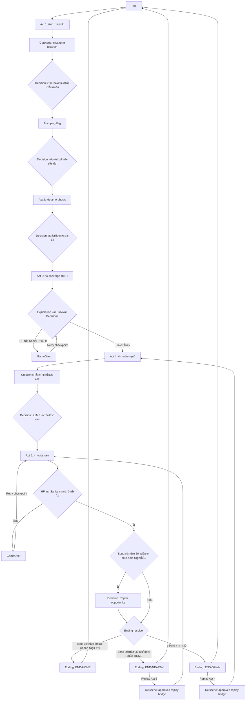

# JaoKob Narrative Bible

## 0. การควบคุมเอกสาร

| รายการ | ค่า |
|---|---|
| รหัสเอกสาร | JKB-P0-NAR-001 |
| ชื่อโครงการ | JaoKob (เจ้ากบ) |
| ระยะโครงการ | Phase 0: Narrative Baseline |
| สถานะ | Baseline Candidate สำหรับการทบทวน |
| ภาษาต้นฉบับ | ภาษาไทย |
| โครงสร้าง | 5-Act Dramatic Structure และ controlled branching |
| เอกสารบังคับร่วม | `01-game-design-document.md` โดยเฉพาะ `GDD-STATE-*`, `GDD-DEC-*`, `GDD-FLG-*` และ `GDD-END-*` |

คำว่า "ต้อง" หมายถึงข้อกำหนดบังคับ คำว่า "ควร" หมายถึงข้อกำหนดที่ยกเว้นได้เมื่อมีบันทึกเหตุผล รหัส `NAR-*` เป็น stable identifier สำหรับเชื่อม scene, dialogue, localization, content warning, flag, test และ asset ใน Phase ถัดไป

## 1. Narrative Mandate

### 1.1 Logline

`NAR-VIS-001` หลังภัยธรรมชาติพรากลูกอ๊อดตัวหนึ่งจากหนองน้ำและครอบครัว มันต้องเติบโตเป็นกบกลางโลกมนุษย์ที่กว้างใหญ่ เรียนรู้ทั้งความโหดร้ายและความอ่อนโยน ก่อนจะกล้าเชื่อใจเด็กสาวผู้มอบบ้านรูปแบบใหม่ให้ความทรงจำของมัน

### 1.2 Premise และคำมั่นต่อผู้เล่น

`NAR-VIS-002` เรื่องนี้เป็น symbolic adventure ว่าด้วยการพกพาความทรงจำเมื่อบ้านเดิมไม่อาจกลับคืนในรูปเดิม ความอบอุ่นปลายทางไม่ได้ลบความสูญเสีย แต่ทำให้ตัวเอกอยู่กับความสูญเสียนั้นได้โดยไม่อยู่ลำพัง

`NAR-VIS-003` เรื่องต้องเล่าจากระยะใกล้กับการรับรู้ของเจ้ากบ โลกจึงเริ่มจากกลิ่น แรงสั่น เงา อุณหภูมิ และจังหวะ ก่อนกลายเป็นคำอธิบายแบบมนุษย์ ห้ามให้ผู้บรรยายรู้เจตนาของมนุษย์เกินกว่าสิ่งที่เจ้ากบสังเกตและอนุมานได้

`NAR-VIS-004` ความเศร้าต้องมีพื้นที่โดยไม่ถูกเร่งให้หาย ความหวังต้องเกิดจากการกระทำซ้ำที่ปลอดภัย เช่น การวางน้ำแล้วถอย การรอ และการรักษาระยะ ไม่ใช่จากคำประกาศว่าทุกอย่างดีขึ้นทันที

### 1.3 Canon Statement

`NAR-CAN-001` เหตุ Canon ประกอบด้วยชีวิตอบอุ่นในหนองน้ำ ภัยธรรมชาติและการพลัดพราก การเปลี่ยนจากลูกอ๊อดเป็นกบ การเข้าสู่เมือง การสังเกตมนุษย์ การพบเด็กสาวผู้เมตตา และ `END-HOME`

`NAR-CAN-002` ทางเลือกเปลี่ยนวิธีรับมือ เส้นทางในเมือง ความทรงจำที่ถูกเรียกกลับ ความไว้วางใจ และรายละเอียดบทส่งท้าย แต่ไม่สามารถยกเลิกภัยธรรมชาติหรือยืนยันชะตาของครอบครัว

`NAR-CAN-003` `END-NEARBY` และ `END-DAWN` เป็น Reflective Ending ที่ปลอดภัยและมีความหวัง แต่ไม่แทนที่ Canon ผู้เล่นต้องสามารถย้อนเล่นช่วงที่เกี่ยวข้องเพื่อไปยัง `END-HOME` โดยไม่ถูกประณาม

## 2. Theme, Countertheme และ Dramatic Question

### 2.1 Theme Matrix

| รหัส | Theme | คำถามเชิงละคร | การแสดงผ่านระบบ | ขอบเขตการตีความ |
|---|---|---|---|---|
| `NAR-THM-001` | การพลัดพราก | เมื่อกลับบ้านเดิมไม่ได้ เราพกอะไรไปต่อ | keepsake flags, memory callbacks, Sanity | ห้ามเสนอว่าการลืมคือวิธีเดียวที่จะหายเศร้า |
| `NAR-THM-002` | การเอาชีวิตรอด | จะรักษากายโดยไม่สูญเสียความอ่อนโยนได้อย่างไร | HP, route choices, recovery beats | ห้ามเท่ากับความเข้มแข็งกับการไม่รู้สึก |
| `NAR-THM-003` | การเรียนรู้โลกมนุษย์ | มนุษย์คือภัยหรือที่พักพิง | observation, human-condition vignettes, Bond | ต้องแสดงความหลากหลาย ไม่ตัดสินมนุษย์ทั้งหมดจากคนเดียว |
| `NAR-THM-004` | ความหวัง | เราจะเชื่อสัญญาณเล็ก ๆ ได้เมื่อใด | repeated safe gestures, repair branches | ความหวังต้องมีหลักฐาน ไม่ใช่ความไว้ใจแบบไร้ขอบเขต |
| `NAR-THM-005` | บ้าน | บ้านคือสถานที่ ร่างกาย บุคคล หรือความทรงจำ | sanctuary motif และ Ending resolver | บ้านใหม่ไม่แทนที่หรือทำให้บ้านเดิมไร้ความหมาย |

`NAR-THM-006` Countertheme คือ "เพื่อไม่เจ็บอีก เราต้องไม่ผูกพันอีกเลย" เรื่องต้องยอมรับว่าความคิดนี้ช่วยปกป้องตัวเอกชั่วคราว แต่ค่อย ๆ แสดงว่าขอบเขตและความสัมพันธ์สามารถอยู่ร่วมกันได้

`NAR-THM-007` Dramatic question หลักคือ "เจ้ากบจะเรียนรู้แยกความอันตรายออกจากความเมตตา และกล้ายอมรับที่พักพิงโดยยังรักษาความทรงจำเดิมไว้ได้หรือไม่"

### 2.2 Emotional Curve

| ช่วง | ค่าอารมณ์หลัก | แรงตึง | ช่วงผ่อน |
|---|---|---|---|
| องก์ 1 ตอนต้น | ปลอดภัยและอยากรู้อยากเห็น | ต่ำ | การเล่นกับครอบครัวและเสียงใต้น้ำ |
| องก์ 1 ตอนปลาย | ช็อกและโศกเศร้า | สูง | ช่องอากาศ เศษใบบัว และความเงียบหลังพายุ |
| องก์ 2 | แปลกแยกแต่เติบโต | ปานกลาง | การค้นพบขา เสียงฝน และกออ้อ |
| องก์ 3 | หิว กลัว และอ่อนแรง | สูงที่สุด | ที่พักชั่วคราว น้ำค้าง และรุ่งเช้า |
| องก์ 4 | ระวังและครุ่นคิด | ปานกลาง | การเห็นมนุษย์แบ่งอาหารและเด็กสาวถอยให้พื้นที่ |
| องก์ 5 | ลังเล ความหวัง และอบอุ่น | เพิ่มแล้วคลาย | ผ้าอุ่น แสงห้อง และการยอมรับที่พักพิง |

`NAR-TONE-001` หลัง sequence ที่มีแรงตึงสูงต้องมี decompression beat ตาม `GDD-SAFE-005` ห้ามวางภัยธรรมชาติ road hazard และการคุกคามจากสัตว์ติดกันโดยไม่มีช่วงตั้งหลัก

## 3. Narrative Ontology และกฎของโลก

### 3.1 ระดับความจริง

`NAR-WLD-001` โลกช่วงองก์ 1 ถึง 4 มีตรรกะทางกายภาพที่ผู้เล่นเชื่อได้ แต่เล่าผ่าน perception เชิงกวี ขนาดและเสียงอาจขยายตามความรู้สึกโดยไม่เปลี่ยนเหตุการณ์หลัก

`NAR-WLD-002` เจ้ากบไม่พูดภาษามนุษย์ออกเสียง ความคิดภายในแสดงเป็นภาษาไทยเพื่อให้ผู้เล่นเข้าถึงประสบการณ์ สัตว์อื่นสื่อสารผ่านจังหวะ การเคลื่อนไหว และความรู้สึกที่ผู้บรรยายถอดความอย่างจำกัด

`NAR-WLD-003` เจ้ากบได้ยินคำมนุษย์ตั้งแต่แรก แต่เข้าใจจากน้ำเสียง ท่าทาง และคำซ้ำ ก่อนจะเชื่อมคำง่าย ๆ เช่น "น้ำ", "รอ" และ "ไม่เป็นไร" ในองก์ 4 ห้ามทำให้เรียนภาษาได้สมบูรณ์โดยไม่มีเวลาและบริบท

`NAR-WLD-004` การเปลี่ยนเป็นตุ๊กตาใน `END-HOME` เป็น symbolic metamorphosis ไม่ใช่ taxidermy การตาย การถูกจับ หรือกระบวนการทางวิทยาศาสตร์ เรื่องต้องสื่อว่าความทรงจำได้พบรูปทรงที่กอดได้ โดยไม่อธิบายกลไกจนทำลายความมหัศจรรย์

`NAR-WLD-005` เวลาผ่านไปตามฤดูกาลขนาดย่อมจากลูกอ๊อดสู่กบ แต่ไม่ระบุปี ประเทศ หรือเมืองจริง เพื่อรักษาความเป็นสากลและหลีกเลี่ยงรายละเอียดชีววิทยาที่ขัดกับจังหวะเชิงสัญลักษณ์

### 3.2 สถานที่หลัก

| รหัส | สถานที่ | หน้าที่เชิงเรื่อง | ภาษาภาพและเสียง | สิ่งที่ห้ามทำ |
|---|---|---|---|---|
| `NAR-LOC-001` | หนองน้ำบ้านเกิด | นิยามความปลอดภัย ความสัมพันธ์ และจังหวะเดิม | เส้นโค้ง สีเขียวอุ่น ทองอ่อน เสียงน้ำเป็นวง | ห้ามทำให้เป็นสวรรค์ไร้ความซับซ้อนจนตัวละครไม่มีชีวิตก่อนพายุ |
| `NAR-LOC-002` | ทางน้ำและกออ้อ | เขตเปลี่ยนผ่านของร่างกายและอัตลักษณ์ | แสงแบ่งครึ่ง เสียงลม ระดับน้ำลด | ห้ามนำภัยเมืองเข้ามาทั้งหมดก่อนเจ้ากบได้เรียนรู้ร่างใหม่ |
| `NAR-LOC-003` | ขอบเมือง | แสดงสิ่งมนุษย์ครั้งแรกโดยยังไม่มีคำอธิบาย | ท่อ เงาสี่เหลี่ยม กลิ่นโลหะ เสียงเป็นจังหวะแปลก | ห้ามให้มนุษย์ทุกคนดูน่ากลัวเหมือนกัน |
| `NAR-LOC-004` | ดินแดนคอนกรีต | กดสเกล ความหิว และความไม่แน่นอน | รูปทรงแข็ง แสงตัด เสียงเครื่องจักร | ห้ามแสดงภาพถูกรถชนหรือบาดแผลละเอียด |
| `NAR-LOC-005` | ลานสังเกตมนุษย์ | กระจกสะท้อนรัก โลภ โกรธ หลง และความโดดเดี่ยว | หน้าต่าง เงาสะท้อน โต๊ะอาหาร ระยะห่าง | ห้ามลดตัวแทนมนุษย์เป็นตัวร้ายมิติเดียว |
| `NAR-LOC-006` | สวนและชายคาของเด็กสาว | เขตเจรจาความไว้ใจ | พื้นผิวอ่อน แสงคงที่ น้ำสะอาด ระยะปลอดภัย | เด็กสาวห้ามไล่จับ ล้อม หรือบังคับสัมผัสเจ้ากบ |
| `NAR-LOC-007` | ห้องพักพิง | บ้านใหม่และ transformation threshold | ผ้า เส้นด้าย แสงอุ่น เสียงหายใจสม่ำเสมอ | ห้ามสื่อว่าการเป็นตุ๊กตาคือการสูญเสีย agency หรือการถูกครอบครอง |

### 3.3 Motif Registry

| รหัส | Motif | ความหมายเริ่มต้น | การเปลี่ยนความหมาย | Payoff |
|---|---|---|---|---|
| `NAR-MOT-001` | น้ำ | บ้านและสิ่งหล่อเลี้ยง | กลายเป็นพายุและสิ่งที่ควบคุมไม่ได้ | หยดน้ำที่เด็กสาววางให้ทำให้น้ำกลับเป็นความดูแล |
| `NAR-MOT-002` | เศษใบบัว | ชิ้นส่วนของบ้านเดิม | เป็นภาระหรือเครื่องเตือนใจตาม choice | วางข้างผ้าอุ่นหรือปรากฏเป็นลายเย็บใน epilogue |
| `NAR-MOT-003` | แสง | ความอบอุ่นในหนอง | แสงเมืองล่ออาหารและอันตราย | แสงห้องที่ไม่ไล่ตามแต่รอให้เจ้ากบเข้าใกล้ |
| `NAR-MOT-004` | แรงสั่นและฝีเท้า | การรับรู้อันตราย | เรียนรู้แยกจังหวะโกรธ รีบ และอ่อนโยน | ฝีเท้าเด็กสาวหยุดในระยะเดิมทุกครั้งจนคาดเดาได้ |
| `NAR-MOT-005` | ผ้าและเส้นด้าย | สิ่งมนุษย์ที่ไม่รู้จัก | พื้นผิวให้พักและเก็บความอุ่น | ความทรงจำถูกเปรียบเป็นเส้นด้ายที่เย็บเป็นรูปทรงใหม่ |

`NAR-MOT-006` Motif ต้องถูก setup อย่างน้อยหนึ่งองค์ก่อน payoff และห้ามเพิ่ม motif ใหม่ใน epilogue เพื่อแก้ปัญหาเรื่องที่ไม่ได้ปูไว้

## 4. Character Bible

### 4.1 `NAR-CHR-001`: เจ้ากบ

| มิติ | ข้อกำหนด |
|---|---|
| บทบาท | Protagonist และศูนย์กลาง perception |
| สถานะเริ่มต้น | ลูกอ๊อดตัวเล็กในครอบครัวที่อบอุ่น ช่างสังเกตและจำจังหวะได้ดี |
| External Want | อยู่รอดและหาที่ปลอดภัย |
| Internal Need | เรียนรู้ว่าการรักษาขอบเขตไม่จำเป็นต้องปิดกั้นความผูกพัน |
| Wound | การพลัดพรากอย่างฉับพลันทำให้เสียงดัง น้ำเชี่ยว และการเข้าใกล้โดยไม่แจ้งเตือนกลายเป็น trigger |
| Strength | การสังเกตรูปแบบ ความอดทน ความอ่อนโยน และความสามารถในการเรียนรู้ |
| Flaw | ตีความความไม่แน่นอนเป็นอันตรายทั้งหมดเมื่อพลังใจต่ำ |
| Arc | พึ่งพาครอบครัว จากนั้นพึ่งตนเองอย่างระวัง สังเกตความซับซ้อนของมนุษย์ และเลือกความไว้วางใจอย่างมีขอบเขต |
| Voice | ความคิดสั้น เป็นรูปธรรม เริ่มจาก sensory words แล้วค่อยมีแนวคิดเชิงนามธรรม |
| Player Relationship | ผู้เล่นเป็นเจตนาและความสนใจของเจ้ากบ ไม่ใช่ผู้ควบคุมภายนอกที่รู้ทุกอย่าง |

`NAR-CHR-001-A` เจ้ากบต้องมี visual identity ต้นฉบับ ไม่คัดลอกลักษณะใบหน้าหรือ trade dress ที่ทำให้สับสนกับตัวละครของบุคคลภายนอก รายละเอียดด้านสิทธิอยู่ในหัวข้อ 13

### 4.2 `NAR-CHR-002`: แม่กบ

| มิติ | ข้อกำหนด |
|---|---|
| บทบาท | ตัวแทนของจังหวะบ้านเดิมและคำแนะนำที่กลับมาเป็น memory callback |
| ลักษณะ | มั่นคง ไม่รอบรู้ทุกอย่าง แสดงความรักผ่านการสอนให้สังเกตน้ำ ราก และเงา |
| Voice | ประโยคสั้น อ่อนโยน ใช้สิ่งรอบตัวเป็นคำเปรียบ |
| Canon Boundary | ปรากฏในองก์ 1 และความทรงจำภายหลัง ชะตาหลังพายุไม่ถูกยืนยัน |
| Prohibition | ห้ามปรากฏเป็นวิญญาณอธิบายความตาย ห้ามกล่าวโทษเจ้ากบที่รอด |

### 4.3 `NAR-CHR-003`: ฝูงพี่น้องลูกอ๊อด

| มิติ | ข้อกำหนด |
|---|---|
| บทบาท | ทำให้บ้านเดิมมีชีวิตและแสดงความแตกต่างของการเรียนรู้ |
| ลักษณะ | ใช้จังหวะว่ายและพฤติกรรมต่างกัน ไม่ต้องตั้งชื่อรายตัวใน Phase 1 |
| Canon Boundary | พลัดหายหลังพายุโดยไม่แสดงศพหรือยืนยันชะตา |
| Narrative Use | เสียงหรือรูปแบบการว่ายอาจกลับมาใน memory beat แต่ห้ามใช้เป็น jump scare |

### 4.4 `NAR-CHR-004`: เด็กสาว

| มิติ | ข้อกำหนด |
|---|---|
| บทบาท | ผู้เสนอที่พักพิงและพิสูจน์ว่าความเมตตาเคารพ agency ได้ |
| External Want | ช่วยสิ่งมีชีวิตตัวเล็กให้ปลอดภัยโดยไม่ทำให้กลัว |
| Internal Need | ไม่ต้องมี arc แบบผู้กอบกู้ เธอเรียนรู้จากปฏิกิริยาของเจ้ากบว่าการช่วยคือการรอและให้พื้นที่ |
| Strength | สังเกตละเอียด สม่ำเสมอ ยอมถอย และไม่คาดหวังการตอบแทน |
| Limitation | ไม่เข้าใจความต้องการของเจ้ากบทันที จึงลองวางน้ำหรือผ้าแล้วอ่านระยะห่าง |
| Voice | ภาษาไทยร่วมสมัย อ่อนโยน ไม่ใช้คำเด็กเล็กเกินไป ไม่พูดแทนความรู้สึกของเจ้ากบ |
| Identity Boundary | ไม่มีนามสกุล ที่อยู่ โรงเรียน หรือรายละเอียดที่ระบุตัวบุคคลจริงใน baseline |

`NAR-CHR-004-A` เด็กสาวห้ามจับ ยก ล้อม หรือพาเจ้ากบเข้าบ้านโดยไม่มีสัญญาณยอมรับ `bond.accepted_safe_help` ใน Canon path การค่อย ๆ ถอยและรอเป็น action สำคัญเท่าคำพูด

### 4.5 `NAR-CHR-005`: มนุษย์ในภาพสะท้อน

กลุ่มนี้เป็น composite characters ปรากฏสั้นเพื่อให้เจ้ากบเห็นมิติของมนุษย์ ไม่ควรมีชื่อหากไม่จำเป็น

| Facet | ภาพเหตุการณ์ | ข้อสรุปที่อนุญาต | ข้อสรุปที่ห้าม |
|---|---|---|---|
| รัก | คนสองคนแบ่งอาหารหรือกางร่มให้กัน | การดูแลปรากฏในกิจวัตรเล็ก ๆ | คนดีทุกคนต้องเป็นครอบครัวแบบเดียว |
| โลภ | คนแย่งพื้นที่หรือเก็บของเกินจำเป็น | ความกลัวขาดแคลนอาจทำให้ลืมมองผู้อื่น | ความยากจนเท่ากับความโลภ |
| โกรธ | คนตะโกนเพราะรีบหรือกังวล | เสียงดังไม่บอกความจริงทั้งหมด แต่ยังเป็นภัยต่อกบ | ความโกรธทำให้คนเป็นตัวร้ายถาวร |
| หลง | คนจ้องหน้าจอจนไม่เห็นสิ่งเล็กข้างทาง | ความสนใจที่แคบทำให้มองข้ามโลก | เทคโนโลยีหรือคนรุ่นใดรุ่นหนึ่งเลวโดยตัวมันเอง |
| โดดเดี่ยว | คนคนหนึ่งนั่งกินข้าวเงียบ ๆ | มนุษย์ตัวใหญ่ก็ขาดที่พักใจได้ | ความโดดเดี่ยวคือความผิดส่วนบุคคล |

### 4.6 `NAR-CHR-006`: เมืองในฐานะ Antagonistic Force

เมืองไม่ใช่ตัวร้ายที่มีเจตนา แต่ทำหน้าที่เป็นระบบที่สร้างอันตรายด้วยสเกล ความเร็ว ความร้อน เสียง และความไม่ใส่ใจ สิ่งนี้เปิดพื้นที่ให้มนุษย์บางคนมีเมตตาโดยไม่ลบความเสี่ยงเชิงโครงสร้าง

## 5. Continuity และ Canon Rules

| รหัส | กฎต่อเนื่อง |
|---|---|
| `NAR-CON-001` | พายุในองก์ 1 เกิดขึ้นเสมอและทำให้พลัดพราก ทางเลือกก่อนหรือหลังพายุห้ามสื่อว่าผู้เล่นช่วยครอบครัวไม่สำเร็จเพราะเลือกผิด |
| `NAR-CON-002` | หาก `keepsake.lily_fragment = false` ห้ามแสดงเศษใบบัวเป็นของที่เจ้ากบพกในองก์หลัง แต่ใช้ motif น้ำหรือจังหวะว่ายแทนได้ |
| `NAR-CON-003` | เส้นทาง `route.city_entry` เปลี่ยนฉากและ dialogue ระหว่างองก์ 2 ถึงต้นองก์ 3 แต่ต้อง converge ก่อน `NAR-SC-A3-003` |
| `NAR-CON-004` | เจ้ากบห้ามเข้าใจประโยคมนุษย์ซับซ้อนก่อน `NAR-SC-A4-004`; ผู้บรรยายอาจแสดงคำพูดให้ผู้เล่นอ่าน แต่ perception ของเจ้ากบยังอาศัยน้ำเสียงและท่าทาง |
| `NAR-CON-005` | Bond เริ่มที่ 0 และเปิดเผยบน UI ที่ `NAR-SC-A4-004` เท่านั้น ค่า Bond ก่อนจุดนี้ห้ามเพิ่มโดย content |
| `NAR-CON-006` | เด็กสาวปรากฏชัดครั้งแรกใน `NAR-SC-A4-004` เงาหรือร่องรอยก่อนหน้าอนุญาตได้เมื่อไม่ยืนยันตัวตน |
| `NAR-CON-007` | Transformation เกิดเฉพาะ `END-HOME` หลัง `bond.accepted_safe_help = true`; Reflective Ending ยังคงแสดงเจ้ากบในรูปร่างกบ |
| `NAR-CON-008` | ไม่มี ending ใดยืนยันว่าครอบครัวตาย และไม่มี post-credit scene ที่ลบล้างการพลัดพรากด้วยการกลับมาพบกันโดยไม่ปูเรื่อง |
| `NAR-CON-009` | ทุก Ending ต้องรักษา HP > 0 และ Sanity > 0 ตาม resolver ส่วน meter ถึง 0 ใช้ `GameOver` และ retry มิใช่ Ending |
| `NAR-CON-010` | ฉากที่ callback flag ต้องมี default variant เสมอ เพื่อป้องกัน dialogue หายเมื่อผู้เล่นไม่ตั้ง flag นั้น |

## 6. โครงเรื่อง 5 องก์

### 6.1 องก์ 1: จุดกำเนิดในหนองน้ำ

#### Dramatic Purpose

`NAR-ACT-001` องก์ 1 ต้องสร้างความผูกพันกับบ้านเดิมผ่านกิจวัตรและ sensory motif ก่อนพายุ นิยาม wound ของเจ้ากบโดยไม่แสดงความรุนแรงละเอียด และจบด้วยการเลือกมีชีวิตต่อแม้ยังไม่เข้าใจการสูญเสีย

#### Scene Plan

| Scene ID | Entry State | Beat | Player Function | Key Outputs | Exit State |
|---|---|---|---|---|---|
| `NAR-SC-A1-001` | `Cutscene` | ก่อนโลกมีชื่อ เจ้ากบรับรู้แสงผ่านผิวน้ำและจังหวะครอบครัว | ตั้ง tone และ perception | ไม่มี | `Exploration` |
| `NAR-SC-A1-002` | `Exploration` | ว่ายรอบใบบัว เรียนรู้ราก เงา และเสียงเรียก | tutorial hotspot และ movement focus | เพิ่ม `exploration.safe_observations` ตาม hotspot ที่ไม่ซ้ำ | `Decision` |
| `NAR-SC-A1-003` | `Decision` | เลือกว่าจะตามแม่กบ ฟังราก หรือเล่นกับพี่น้อง | แสดง choice intent โดยยังไม่ลงโทษ | ตั้ง `memory.home_focus` เป็น `mother`, `roots` หรือ `siblings` | `Cutscene` |
| `NAR-SC-A1-004` | `Cutscene` | ลมเปลี่ยน น้ำยกตัว พายุพรากทุกเสียงออกจากกัน | inciting incident | `story.storm_survived = true`; content notice marker | `Decision` |
| `NAR-SC-A1-005` | `Decision` | เรียกหาครอบครัวหรือหาช่องอากาศก่อน | `GDD-DEC-A1-001-*` | coping flag, HP/Sanity delta | `Exploration` |
| `NAR-SC-A1-006` | `Exploration` แล้ว `Decision` | พบหรือปล่อยเศษใบบัว | `GDD-DEC-A1-002-*` | keepsake หรือ coping flag | `Cutscene` |
| `NAR-SC-A1-007` | `Cutscene` | ความเงียบหลังพายุและเงาร่างที่เริ่มเปลี่ยน | ปิด act ด้วยความหวังเล็ก ๆ | `story.act1_complete = true` | `Cutscene` ของ Act 2 |

#### Act Turn

`NAR-ACT-002` Turning point คือเจ้ากบพบว่าความเงียบไม่ได้ตอบคำเรียก แต่ร่างกายยังหายใจและกระแสน้ำพาไปข้างหน้า การเลือกเอาชีวิตรอดไม่ต้องถูกเล่าว่าเป็นการทอดทิ้งครอบครัว

### 6.2 องก์ 2: สู่โลกกว้างและการเติบโต

#### Dramatic Purpose

`NAR-ACT-003` องก์ 2 ต้องทำให้ metamorphosis เป็นทั้งความสามารถใหม่และการสูญเสียรูปแบบเดิม เจ้ากบเรียนรู้ว่าร่างกายเปลี่ยนได้โดยความทรงจำไม่หาย และเลือกทางออกจากพื้นที่ที่ไม่อาจเป็นบ้านเดิม

#### Scene Plan

| Scene ID | Entry State | Beat | Player Function | Key Outputs | Exit State |
|---|---|---|---|---|---|
| `NAR-SC-A2-001` | `Cutscene` | วันผ่านเป็นแสงหลายเฉด หางสั้นลง ขาเริ่มรับน้ำหนัก | montage แบบไม่อธิบายชีววิทยาเกินจำเป็น | ไม่มี | `Exploration` |
| `NAR-SC-A2-002` | `Exploration` | ทดลองกระโดด หายใจ และหยุดเมื่อเหนื่อย | สอน affordance ใหม่และ HP feedback | `tutorial.metamorphosis_complete = true` | `Cutscene` |
| `NAR-SC-A2-003` | `Cutscene` | น้ำลด กลิ่นโลหะและเสียงเมืองเข้ามา | เรียก need ให้ออกจากพื้นที่ | `story.marsh_no_longer_safe = true` | `Exploration` |
| `NAR-SC-A2-004` | `Exploration` | อ่านลม ระดับน้ำ รอยนก และช่องทาง | ให้ข้อมูลก่อน route choice | เพิ่ม `exploration.safe_observations` ตาม hotspot ที่ไม่ซ้ำ | `Decision` |
| `NAR-SC-A2-005` | `Decision` | เลือกกออ้อหรือทางระบายน้ำ | `GDD-DEC-A2-001-*` | `route.city_entry` | `Cutscene` |
| `NAR-SC-A2-006` | `Cutscene` | พบวัสดุมนุษย์ชิ้นแรกและเงาตึก | ทำให้โลกมนุษย์ดูใหญ่โดยไม่กำหนดว่าชั่วร้าย | route-specific callback | `Exploration` |
| `NAR-SC-A2-007` | `Exploration` แล้ว `Cutscene` | ผ่านขอบเขตที่น้ำธรรมชาติกลายเป็นร่องคอนกรีต | commitment to exile | `story.act2_complete = true`, `story.city_reached = true` | `Cutscene` ของ Act 3 |

#### Act Turn

`NAR-ACT-004` เจ้ากบกระโดดพ้นแนวพืชสุดท้ายด้วยขาที่เพิ่งเรียนรู้ การก้าวสู่เมืองเป็นการเลือกจากข้อมูล ไม่ใช่โชคบังคับ และทั้งสอง route ต้องรักษาภาพว่าเจ้ากบมีความสามารถ

### 6.3 องก์ 3: ดินแดนคอนกรีตอันโหดร้าย

#### Dramatic Purpose

`NAR-ACT-005` องก์ 3 เป็นจุดแรงตึงสูงสุดด้านกาย เจ้ากบต้องเรียนรู้ pattern ของเมือง จัดการความหิว และผ่าน near-collapse โดยห้ามแสดงความตายหรือ gore ความสำเร็จเกิดจากการสังเกตและอดทน ไม่ใช่ความเร็วของมือผู้เล่น

#### Scene Plan

| Scene ID | Entry State | Beat | Player Function | Key Outputs | Exit State |
|---|---|---|---|---|---|
| `NAR-SC-A3-001` | `Cutscene` | เข้าเมืองตาม route กออ้อหรือท่อ | route callback และ scale reveal | ไม่มี | `Exploration` |
| `NAR-SC-A3-002` | `Exploration` | เสียงพื้นสั่น เงานก ความร้อน และแสงล่อแมลง | สอน hazard cues หลายช่องทาง | เพิ่ม `exploration.safe_observations` ตาม hotspot ที่ไม่ซ้ำ | `Cutscene` |
| `NAR-SC-A3-003` | `Cutscene` | route converge ที่ริมทาง คนและรถเคลื่อนไหวเป็นกระแสอีกชนิด | เปรียบเมืองกับพายุโดยไม่ทำซ้ำเหตุการณ์ | ไม่มี | `Exploration` |
| `NAR-SC-A3-004` | `Exploration` แล้ว `Decision` | อ่านจังหวะไฟ เสียง และท่อก่อนข้าม | `GDD-DEC-A3-001-*` | traffic หรือ culvert flag | `Cutscene` หรือ `GameOver` |
| `NAR-SC-A3-005` | `Cutscene` | หลังข้าม ความหิวทำให้แสงดูอบอุ่นกว่าที่เป็น | setup temptation | HP-tier variant | `Decision` |
| `NAR-SC-A3-006` | `Decision` | กินแมลงใต้แสงหรือรออาหารปลอดภัย | `GDD-DEC-A3-002-*` | survival flag, meter delta | `Exploration` หรือ `GameOver` |
| `NAR-SC-A3-007` | `Exploration` | หา shelter จากข้อมูลก่อนหน้า | fail-forward route ตาม flags | `survival.shelter_found = true` | `Cutscene` |
| `NAR-SC-A3-008` | `Cutscene` | เสียงฝนและเครื่องจักรกระตุ้นความทรงจำ เจ้ากบเกือบหมดแรง | midpoint crisis ทางอารมณ์ | low-meter dialogue variant | `Decision` |
| `NAR-SC-A3-009` | `Decision` แล้ว `Cutscene` | หยุด ฟังรากในความทรงจำ หรือมองหารุ่งเช้า | recovery beat | HP/Sanity recovery, coping callback | `Cutscene` |
| `NAR-SC-A3-010` | `Cutscene` | แสงเช้าเผยว่ามนุษย์บางคนหลบไม่พ้นเมืองเช่นกัน | เปลี่ยนคำถามจาก "หนีมนุษย์" เป็น "มนุษย์เป็นแบบใด" | `story.act3_complete = true` | `Cutscene` ของ Act 4 |

#### Act Turn

`NAR-ACT-006` เจ้ากบรอดด้วยการอ่าน pattern ที่เคยดูเล็กน้อย การยอมพักต้องถูกเล่าว่าเป็นทักษะ ไม่ใช่ความอ่อนแอ และรุ่งเช้าต้องลดแรงตึงก่อนเข้าสู่การสังเกตมนุษย์

### 6.4 องก์ 4: กระจกสะท้อนโลกมนุษย์

#### Dramatic Purpose

`NAR-ACT-007` องก์ 4 เปลี่ยน conflict จากการหลบอันตรายเป็นการตีความ เจ้ากบเห็นรัก โลภ โกรธ หลง และความโดดเดี่ยวจากการกระทำเล็ก ๆ แล้วพบเด็กสาวซึ่งแสดงความเมตตาด้วยระยะห่างที่คาดเดาได้

#### Scene Plan

| Scene ID | Entry State | Beat | Player Function | Key Outputs | Exit State |
|---|---|---|---|---|---|
| `NAR-SC-A4-001` | `Cutscene` แล้ว `Exploration` | เห็นคนแบ่งอาหาร กางร่ม และเว้นที่นั่ง | สำรวจ facet ความรัก | `humanity.care_between_people_observed = true` | `Cutscene` |
| `NAR-SC-A4-002` | `Cutscene` แล้ว `Exploration` | เห็นการแย่งพื้นที่ เสียงโกรธ และคนที่มองไม่เห็นสิ่งรอบตัว | สำรวจโลภ โกรธ หลงโดยไม่ตัดสินทั้งคน | `humanity.conflict_observed = true`; `humanity.distraction_observed = true` | `Cutscene` |
| `NAR-SC-A4-003` | `Cutscene` | เห็นคนหนึ่งกินอาหารลำพังและวางเศษขนมให้สิ่งมีชีวิตเล็ก | เชื่อมความโดดเดี่ยวกับความเมตตา | `humanity.loneliness_observed = true` | `Exploration` |
| `NAR-SC-A4-004` | `Exploration` แล้ว `Decision` | เด็กสาวเห็นเจ้ากบ วางน้ำ ถอย และรอ | เปิด Bond; `GDD-DEC-A4-001-*` ในการตีความการกระทำ | `humanity.compassion_observed` หรือ `humanity.cautious_observer`; แสดง Bond UI | `Cutscene` |
| `NAR-SC-A4-005` | `Cutscene` แล้ว `Decision` | เด็กสาวกลับมาที่ระยะเดิมและวางน้ำสะอาด | `GDD-DEC-A4-002-*` | accepted-water variant | `Cutscene` |
| `NAR-SC-A4-006` | `Cutscene` | callback ตามการรับทันทีหรือรอ เธอไม่ขยับเข้าใกล้ | พิสูจน์ความสม่ำเสมอ; หากเป็น cautious route ใช้ `GDD-CHO-007` | Bond feedback; cautious route ตั้ง `humanity.compassion_observed = true` และ Bond +10 | `Exploration` |
| `NAR-SC-A4-007` | `Exploration` | ตรวจเงาสะท้อนในหน้าต่าง เห็นตัวเองอยู่ระหว่างเมืองกับแสงอุ่น | synthesis ของ human condition | keepsake และ coping callback | `Decision` |
| `NAR-SC-A4-008` | `Decision` แล้ว `Cutscene` | เลือกตามร่องรอยน้ำไปยังสวน หรือเฝ้าดูอีกคืนก่อน | `GDD-DEC-A4-003-*`; pacing branch ที่ converge | `bond.followed_at_own_pace` หรือ `bond.waited_for_repeat`; `story.act4_complete = true` | `Cutscene` ของ Act 5 |

#### Act Turn

`NAR-ACT-008` เด็กสาวไม่ชนะความไว้ใจด้วยการพูดเก่ง แต่ด้วยการทำสิ่งเดิมอย่างปลอดภัยและยอมให้เจ้ากบเลือกเวลาเอง เจ้ากบเริ่มเข้าใจว่าการถอยของใครบางคนอาจเป็นการเข้าหาอย่างเคารพ

### 6.5 องก์ 5: การพบพานและบ้านที่แท้จริง

#### Dramatic Purpose

`NAR-ACT-009` องก์ 5 ต้องนำ motif ของน้ำ แสง ฝีเท้า ใบบัว และผ้ามาชำระร่วมกัน การยอมรับที่พักพิงเป็นการตัดสินใจของเจ้ากบหลังเห็นหลักฐานความปลอดภัย ไม่ใช่รางวัลจากการเชื่อมนุษย์โดยไม่มีเงื่อนไข

#### Scene Plan

| Scene ID | Entry State | Beat | Player Function | Key Outputs | Exit State |
|---|---|---|---|---|---|
| `NAR-SC-A5-001` | `Cutscene` | ร่องหยดน้ำพาเข้าสวน แต่เสียงฝนกลับมา | setup final echo | ไม่มี | `Exploration` |
| `NAR-SC-A5-002` | `Exploration` | หา shelter, ตรวจทางหนี, ดูระยะของเด็กสาว | ยืนยัน agency และให้ข้อมูลก่อน final trust | เพิ่ม `exploration.safe_observations` ตาม hotspot ที่ไม่ซ้ำ | `Cutscene` |
| `NAR-SC-A5-003` | `Cutscene` แล้ว `Decision` | เด็กสาวส่งเสียงเบาและวางผ้าโดยไม่ปิดทาง | `GDD-DEC-A5-001-*` | gentle response, keepsake หรือ cautious variant | `Cutscene` |
| `NAR-SC-A5-004` | `Cutscene` | ฝนกระทบชายคาเหมือนพายุเดิม แต่ครั้งนี้มีทางออกและคนที่รอ | final wound confrontation | Sanity-tier variant | `Exploration` |
| `NAR-SC-A5-005` | `Exploration` แล้ว `Decision` | ตรวจผ้า น้ำ ทางกลับสวน และเลือกยอมรับหรือพักใกล้ ๆ | `GDD-DEC-A5-002-*` | `bond.accepted_safe_help` หรือ `bond.chose_nearby_shelter` | `Cutscene` |
| `NAR-SC-A5-006` | `Cutscene` แล้ว `Decision` เมื่อจำเป็น | สรุปการตัดสินใจ หากขาดเฉพาะ `bond.accepted_safe_help` และ Bond >= 50 เปิด repair choice | final fail-forward และ Ending resolver | `ending.home_unlocked` เมื่อผ่าน | `Ending` |
| `NAR-SC-A5-007-HOME` | `Ending` | ความทรงจำถักเป็นรูปทรงที่กอดได้ เด็กสาวนอนหลับโดยมีตุ๊กตากบต้นฉบับอยู่ใกล้ | Canon epilogue | ending record | `Title` หรือ `Cutscene` ผ่าน approved chapter replay checkpoint |
| `NAR-SC-A5-007-NEARBY` | `Ending` | เจ้ากบพักในสวนและเด็กสาวยังวางน้ำไว้ในระยะเดิม | Reflective epilogue และ Act 5 replay | ending record | `Title` หรือ `Cutscene` ผ่าน Act 5 replay checkpoint |
| `NAR-SC-A5-007-DAWN` | `Ending` | เจ้ากบพบซอกปลอดภัย มองแสงบ้านจากไกล และยังไม่ปิดความเป็นไปได้ | Reflective epilogue และ Act 4 replay | ending record | `Title` หรือ `Cutscene` ผ่าน Act 4 replay checkpoint |

#### Climax และ Resolution

`NAR-ACT-010` Climax ไม่ใช่การข้ามอันตรายครั้งใหญ่กว่าเดิม แต่เป็นการได้ยินเสียงฝนเดิมในบริบทใหม่แล้วใช้ข้อมูลปัจจุบันตัดสินใจ เจ้ากบพบว่ามีทางออก เด็กสาวไม่ขวาง และผ้าอุ่นรอโดยไม่ไล่ตาม

`NAR-ACT-011` ใน `END-HOME` ภาพเปลี่ยนผ่านจากกบที่พักบนผ้าไปเป็นตุ๊กตากบต้นฉบับผ่านแสงและเส้นด้าย ห้ามมีภาพหมดสติ การผ่าตัด การยัดไส้ หรือภาษาที่สื่อการตาย ประโยคปิดต้องยืนยันว่าความทรงจำยังอยู่และบ้านใหม่ไม่ลบหนองน้ำ

## 7. Dialogue และ Narrative Voice Guide

### 7.1 Voice Layers

| รหัส | Layer | รูปแบบภาษา | ข้อจำกัด |
|---|---|---|---|
| `NAR-VOI-001` | ผู้บรรยายระยะใกล้ | บุรุษที่สาม เรียก "เจ้ากบ" ใช้ภาพสัมผัสก่อนแนวคิด | ห้ามยืนยันความคิดของมนุษย์ที่ไม่ได้แสดงออก |
| `NAR-VOI-002` | ความคิดเจ้ากบ | บุรุษที่หนึ่งใช้ "เรา" ประโยคสั้นและมีช่องว่าง | คำศัพท์นามธรรมต้องเพิ่มตามประสบการณ์ ไม่ใช้ศัพท์มนุษย์ซับซ้อนเร็วเกินไป |
| `NAR-VOI-003` | แม่กบ | อ่อนโยน กระชับ เปรียบกับน้ำ ราก เงา และจังหวะ | ไม่เทศนา ไม่บอกอนาคต และไม่พูดเหมือนมนุษย์ผู้ใหญ่สมัยใหม่ |
| `NAR-VOI-004` | เด็กสาว | ภาษาไทยร่วมสมัย นุ่มนวล ระบุสิ่งที่ตนจะทำก่อนทำ | ไม่ใช้ baby talk ไม่เรียกตัวเองว่าเจ้าของ และไม่คาดคั้นคำตอบ |
| `NAR-VOI-005` | มนุษย์ประกอบฉาก | ภาษาธรรมชาติสั้นพอให้เข้าใจบริบทจากระยะไกล | ห้ามเป็นคำอธิบาย theme โดยตรงหรือ stereotype สำเนียง |

### 7.2 Style Rules

`NAR-DLG-001` หนึ่ง dialogue unit ควรมีหนึ่งเจตนาหลักและยาวไม่เกินสองประโยคเมื่อไม่ใช่ narration ผู้เล่นต้องควบคุมการเดินหน้าข้อความได้ ไม่มี auto-advance เป็นค่าเริ่มต้น

`NAR-DLG-002` ใช้คำซ้ำเชิง motif อย่างมีวินัย คำว่า "รอ", "ฟัง", "ทางกลับ" และ "บ้าน" ต้องเปลี่ยนความหมายตาม act ห้ามใช้ซ้ำเพื่อเร่งอารมณ์ทุกฉาก

`NAR-DLG-003` หลีกเลี่ยงจุดไข่ปลาเกินหนึ่งครั้งต่อ dialogue unit หลีกเลี่ยงคำอุทานต่อเนื่อง และห้ามใช้เครื่องหมายตกแต่งแทนอารมณ์

`NAR-DLG-004` การแสดงความคิดภายในต้องแยก semantic role จากบทพูดออกเสียง ไม่อาศัยตัวเอียง สี หรือเครื่องหมายคำพูดเพียงอย่างเดียว

`NAR-DLG-005` Localization key ต้องอ้างข้อความเต็ม ห้ามประกอบประโยคจากเศษคำที่ลำดับไวยากรณ์ตายตัว ตัวแปรต้องมีคำอธิบายชนิดและตัวอย่าง และห้ามแทรกชื่อผู้เล่นเพราะไม่มีระบบบัญชีหรือการตั้งชื่อใน baseline

### 7.3 บทสนทนาภาษาไทยต้นแบบ

ข้อความต่อไปนี้เป็น canonical prototype สำหรับกำหนดเสียง มิใช่ข้ออ้างให้ข้าม editorial review

| Dialogue ID | Scene | Speaker | ข้อความต้นแบบ | หน้าที่ |
|---|---|---|---|---|
| `NAR-LINE-A1-001` | `NAR-SC-A1-001` | ผู้บรรยาย | "ก่อนโลกจะมีชื่อ โลกคือแสงที่ไหวอยู่เหนือผิวน้ำ และจังหวะคุ้นเคยที่ว่ายอยู่ข้างกัน" | เปิด perception และความอบอุ่น |
| `NAR-LINE-A1-002` | `NAR-SC-A1-002` | แม่กบ | "ถ้าน้ำไหว ให้ฟังรากบัวนะ รากจำทางกลับได้ดีกว่าคลื่น" | setup รากและทางกลับ |
| `NAR-LINE-A1-003` | `NAR-SC-A1-005` | เจ้ากบ | "เสียงของบ้านอยู่ตรงไหน หรือเสียงของเรากำลังไหลไปไกลกว่าเดิม" | แสดง shock โดยไม่ยืนยันชะตาครอบครัว |
| `NAR-LINE-A1-004` | `NAR-SC-A1-006` | ผู้บรรยาย | "ใบบัวชิ้นเล็กไม่ใช่บ้านทั้งหลัง แต่มันยังจำสีของบ้านได้" | keepsake setup |
| `NAR-LINE-A2-001` | `NAR-SC-A2-002` | เจ้ากบ | "ขาใหม่นี้ยังไม่รู้ทาง แต่รู้แล้วว่าจะพาเราพ้นน้ำตื้นอย่างไร" | metamorphosis และ agency |
| `NAR-LINE-A2-002` | `NAR-SC-A2-007` | ผู้บรรยาย | "หลังแนวกออ้อ น้ำไม่ได้หายไป มันถูกบังคับให้เดินเป็นเส้นตรง" | เปลี่ยนสู่โลกคอนกรีต |
| `NAR-LINE-A3-001` | `NAR-SC-A3-003` | เจ้ากบ | "พื้นแข็งก็มีคลื่น เพียงแต่มันมากับล้อและฝีเท้า" | เชื่อม pattern เดิมกับเมือง |
| `NAR-LINE-A3-002` | `NAR-SC-A3-005` | ผู้บรรยาย | "แสงนั้นเรียกแมลงเข้ามา และเรียกเงาที่หิวกว่าให้เข้ามาด้วย" | telegraph hazard อย่างเป็นธรรม |
| `NAR-LINE-A3-003` | `NAR-SC-A3-009` | ความทรงจำแม่กบ | "ฟังก่อนขยับ หายใจก่อนหาทาง" | recovery callback โดยไม่เป็นวิญญาณ |
| `NAR-LINE-A4-001` | `NAR-SC-A4-001` | มนุษย์ประกอบฉาก | "เอาไปแบ่งกันนะ คืนนี้ฝนคงตกนาน" | facet ความรักและ setup ฝน |
| `NAR-LINE-A4-002` | `NAR-SC-A4-003` | ผู้บรรยาย | "คนคนนั้นนั่งลำพัง แต่ยังเว้นเศษอาหารไว้ให้ชีวิตที่เล็กกว่าตัวเอง" | เชื่อมโดดเดี่ยวกับเมตตา |
| `NAR-LINE-A4-003` | `NAR-SC-A4-004` | เด็กสาว | "เราเห็นเธอแล้วนะ จะวางน้ำไว้ตรงนี้ แล้วถอยให้" | ประกาศเจตนาและเคารพระยะ |
| `NAR-LINE-A4-004` | `NAR-SC-A4-005` | เด็กสาว | "ไม่ต้องรีบก็ได้ น้ำจะอยู่ตรงนี้จนกว่าเธอจะพร้อม" | ความสม่ำเสมอโดยไม่กดดัน |
| `NAR-LINE-A4-005` | `NAR-SC-A4-006` | เจ้ากบ | "ฝีเท้านั้นหยุดที่เดิมทุกครั้ง บางทีการไม่เข้ามาใกล้ก็คือคำทักทาย" | synthesis ของ bounded trust |
| `NAR-LINE-A5-001` | `NAR-SC-A5-003` | เด็กสาว | "ตรงนี้อุ่นกว่า แต่ทางกลับสวนยังเปิดอยู่ เธอเลือกได้" | ยืนยัน agency ก่อน final choice |
| `NAR-LINE-A5-002` | `NAR-SC-A5-004` | เจ้ากบ | "ฝนยังเป็นเสียงเดิม แต่คืนนี้เราเห็นทางออก และเห็นคนที่ไม่ขวางมัน" | เผชิญ wound ด้วยบริบทใหม่ |
| `NAR-LINE-END-001` | `NAR-SC-A5-007-HOME` | ผู้บรรยาย | "เรื่องราวไม่ได้หายไป มันเพียงถักตัวเองเป็นรูปทรงที่กอดไว้ได้" | symbolic transformation |
| `NAR-LINE-END-002` | `NAR-SC-A5-007-HOME` | ผู้บรรยาย | "บ้านใหม่ไม่แทนที่ใบบัวใบเดิม แต่มันทำให้คืนที่คิดถึงไม่ต้องยาวเพียงลำพัง" | ปิด theme และ emotional core |

## 8. Dialogue Matrix และ Conditional Variants

### 8.1 Resolution Priority

`NAR-MTX-001` เมื่อตำแหน่งเดียวมี variant ตรงเงื่อนไขหลายรายการ ให้เลือกตามลำดับต่อไปนี้: crisis safety, required story exposition, irreversible flag callback, meter tier, route/keepsake flavor และ default ห้ามใช้ลำดับไฟล์เป็นตัวตัดสินโดยปริยาย

`NAR-MTX-002` Variant ที่มี priority เท่ากันต้องมี conditions ที่ mutually exclusive หรือมี explicit tie-breaker schema validation ต้องปฏิเสธ ambiguous dialogue set

### 8.2 Matrix ต้นแบบ

| Matrix ID | Scene/Slot | Priority | Condition | Variant ID และข้อความต้นแบบ | Callback/Effect |
|---|---|---:|---|---|---|
| `NAR-MTX-A1-001` | A1 หลังพายุ | 80 | `coping.called_for_family = true` | `NAR-VAR-A1-CALL`: "เจ้ากบเรียกจนเสียงบางลง แต่การเรียกนั้นยืนยันว่าบ้านเคยมีอยู่จริง" | เรียกซ้ำใน Act 5 เมื่อได้ยินฝน |
| `NAR-MTX-A1-002` | A1 หลังพายุ | 80 | `coping.sought_safety = true` | `NAR-VAR-A1-SAFE`: "เจ้ากบหาช่องหายใจก่อน แล้วจึงปล่อยให้ความคิดถึงตามมาทัน" | เปิดคำภายในเรื่องการตั้งหลัก |
| `NAR-MTX-A2-001` | A2 ทางเข้าเมือง | 60 | `route.city_entry = reeds` | `NAR-VAR-A2-REEDS`: "ปลายอ้อชี้ไปยังเงาสี่เหลี่ยมที่ไม่มีใบ" | ภาพเข้าสู่เมืองแบบมีลม |
| `NAR-MTX-A2-002` | A2 ทางเข้าเมือง | 60 | `route.city_entry = drain` | `NAR-VAR-A2-DRAIN`: "น้ำในท่อเดินตามกำแพงและไม่เคยถามว่าจะไปทางใด" | ภาพเข้าสู่เมืองแบบเสียงก้อง |
| `NAR-MTX-A3-001` | A3 ก่อน recovery | 100 | `hp < 30` | `NAR-VAR-A3-LOWHP`: "ขาทั้งสี่รับพื้นได้ทีละน้อย แม้เงาปลอดภัยจะอยู่ไม่ไกล" | บอกใบ้ทางพักและห้ามซ่อน safe choice |
| `NAR-MTX-A3-002` | A3 ก่อน recovery | 100 | `sanity < 30` | `NAR-VAR-A3-LOWSAN`: "ทุกเสียงซ้อนเป็นพายุเดียวกัน เจ้ากบต้องหาเสียงหนึ่งที่คงที่" | บอกใบ้ focus interaction |
| `NAR-MTX-A3-003` | A3 memory slot | 70 | `keepsake.lily_fragment = true` | `NAR-VAR-A3-LEAF`: "สีเขียวชิ้นเล็กยังอยู่ใต้ท้อง ราวกับผิวน้ำยังไม่ไกลเกินไป" | Sanity recovery flavor |
| `NAR-MTX-A3-004` | A3 memory slot | 10 | default | `NAR-VAR-A3-NOLEAF`: "แม้ไม่มีสิ่งใดติดตัว จังหวะรากบัวยังอยู่ในความจำ" | รับประกัน recovery เมื่อไม่มี keepsake |
| `NAR-MTX-A4-001` | A4 หลังวางน้ำ | 80 | `bond.accepted_water = true` | `NAR-VAR-A4-NOW`: "เด็กสาวเห็นวงน้ำสั่น แล้วถอยอีกก้าวแทนการยื่นมือ" | ยืนยัน open-trust route |
| `NAR-MTX-A4-002` | A4 หลังวางน้ำ | 80 | `bond.accepted_water_late = true` | `NAR-VAR-A4-LATE`: "เมื่อฝีเท้าหายไป เจ้ากบจึงดื่ม วันต่อมาชามใบนั้นกลับมาอยู่ที่เดิม" | ยืนยัน cautious route |
| `NAR-MTX-A5-001` | A5 final approach | 90 | `bond >= 60` | `NAR-VAR-A5-TRUST`: "ความกลัวยังอยู่ แต่ไม่ต้องเป็นผู้เลือกเพียงลำพังอีกแล้ว" | เปิด Canon decision หาก flags ครบ |
| `NAR-MTX-A5-002` | A5 final approach | 80 | `bond >= 30 && bond < 60` | `NAR-VAR-A5-TENTATIVE`: "ความไว้ใจมีขนาดพอให้ขยับเข้าใกล้หนึ่งก้าว และหยุดได้เมื่อจำเป็น" | เปิด nearby หรือ repair branch |
| `NAR-MTX-A5-003` | A5 final approach | 70 | `bond < 30` | `NAR-VAR-A5-DISTANT`: "เจ้ากบยังเลือกมองจากที่ไกล แสงนั้นไม่ตามมาเร่ง" | เตรียม `END-DAWN` โดยไม่ตัดสิน |
| `NAR-MTX-END-001` | Home epilogue | 70 | `keepsake.lily_fragment = true` | `NAR-VAR-END-LEAF`: "ตรงอกของตุ๊กตามีรอยเย็บรูปใบบัวเล็ก ๆ" | visual callback ต้องใช้ asset ที่ผ่าน clearance |
| `NAR-MTX-END-002` | Home epilogue | 10 | default | `NAR-VAR-END-WATER`: "เมื่อแสงไหวบนผนัง ดวงตาผ้าคู่นั้นยังจำวงน้ำแรกได้" | default callback ไม่อ้าง keepsake |

`NAR-MTX-003` ข้อความ condition ในตารางเป็นข้อกำหนดเชิงตรรกะ ไม่ใช่ syntax ที่อนุญาตให้คัดลอกตรงเข้าสู่ระบบ Production schema ต้องใช้ condition DSL ที่ SRS อนุมัติและมี type validation

## 9. Branching Structure

### 9.1 Branching Policy

`NAR-BRN-001` ใช้โครงสร้าง foldback branching ทางเลือกเปลี่ยน scene variant, meter, flags และ callbacks แล้ว converge ที่ story marker สำคัญ เพื่อควบคุม continuity และ localization budget ห้าม branch ที่หายไปโดยไม่มี payoff หรือ convergence ที่อธิบายได้

`NAR-BRN-002` Major branch ต้องมี immediate feedback และ delayed callback อย่างน้อยหนึ่งรายการ Flavor branch อาจมีเพียง immediate feedback แต่ต้องติดป้ายว่าไม่เปลี่ยนระบบ

`NAR-BRN-003` ทางเลือกที่ล็อก Canon ชั่วคราวต้องมี repair path ก่อน Ending ตาม `GDD-END-006` และห้ามซ่อนเงื่อนไขสำคัญหลังการสำรวจครบ 100 เปอร์เซ็นต์

### 9.2 Branching Tree ระดับเรื่อง

`NAR-BRN-004` Mermaid tree เป็นภาพระดับแนวคิด เมื่อแตก scene graph จริง ทุก edge ต้องระบุ source state, target state, condition, priority, fallback และ test ID โดยไม่มี implicit edge

## 10. Ending และ Fail-Forward Bible

### 10.1 Ending Profiles

| Ending ID | Emotional Resolution | Canon Image | สิ่งที่คงค้าง | Replay Promise |
|---|---|---|---|---|
| `END-HOME` | ความคิดถึงได้รับที่พัก ไม่ได้ถูกลบ | เด็กสาวหลับอย่างสงบข้างตุ๊กตากบต้นฉบับ แสงบนผนังคล้ายผิวน้ำ | ชะตาครอบครัวยังไม่ทราบ แต่ความทรงจำได้รับการยอมรับ | chapter replay เพื่อดู callback โดยไม่สร้าง ending สูงกว่า |
| `END-NEARBY` | ความไว้ใจเริ่มต้นในระยะที่ปลอดภัย | เจ้ากบใต้กระถาง เด็กสาววางน้ำแล้วกลับเข้าบ้าน | ยังไม่ยอมรับ transformation | replay จาก Act 5 พร้อมคำบอกใบ้ repair |
| `END-DAWN` | เจ้ากบเลือกความปลอดภัยด้วยตนเองและยังเห็นความเป็นไปได้ | ซอกกำแพงอุ่น แสงเช้ากับหน้าต่างไกล ๆ | ความสัมพันธ์ยังไม่เริ่มเต็มที่ | replay จาก Act 4 เพื่อสังเกตและสร้าง Bond |

`NAR-END-001` Reflective Ending ทุกแบบต้องมีความสมบูรณ์ทางอารมณ์ในตัวเอง ไม่เขียนเป็นหน้าจอ "bad ending" และไม่ทำให้การรักษาระยะเป็นข้อบกพร่องทางศีลธรรม

`NAR-END-002` `END-HOME` ต้องใช้คำว่า "บ้าน" ในความหมายที่เพิ่มขึ้น ไม่ใช่แทนที่หนองน้ำ ความทรงจำของแม่กบและพี่น้องยังมีน้ำหนักในประโยคหรือ motif สุดท้าย

### 10.2 Fail-Forward Rules

`NAR-FAIL-001` ความเสียหายที่ไม่ถึง crisis ต้องเปลี่ยน narration, route cost หรือ recovery need แต่ห้ามหยุดเรื่องเพียงเพราะผู้เล่นไม่ได้เลือก optimal choice

`NAR-FAIL-002` เมื่อ `hp == 0` ฉาก `GameOver` ใช้ภาพเจ้ากบหลบอยู่ในเงาและข้อความว่า "เรื่องราวหยุดพักตรงที่ร่างกายไปต่อไม่ไหว" ห้ามยืนยันการตาย

`NAR-FAIL-003` เมื่อ `sanity == 0` ฉาก `GameOver` ใช้ภาพเสียงและแสงพร่าแบบลดความเข้มข้นได้ พร้อมข้อความว่า "เสียงทั้งหมดดังเกินกว่าจะหาทางต่อได้ในตอนนี้" ห้ามใช้ถ้อยคำตีตราหรือภาพหลอนรุนแรง

`NAR-FAIL-004` Retry เป็นการกลับไปยัง "จังหวะก่อนหน้า" ไม่ใช่การย้อนเวลาที่ตัวละครรับรู้ใน Canon จึงห้ามมีตัวละครพูดว่าผู้เล่นเคยล้มเหลวมาแล้ว

`NAR-FAIL-005` Story Assist recovery cutscene ต้องยืนยันการพัก การหายใจ และการมองหาสัญญาณคงที่โดยไม่สอนสุขภาพจิตแบบรักษาทุกคนได้ด้วยวิธีเดียว

`NAR-FAIL-006` หาก player route ขาด keepsake หรือ trust flag ต้องใช้ alternative expression ที่มีความหมายเทียบเท่า เช่น จังหวะเสียง การรักษาระยะ หรือการรอ ห้ามสร้าง dead narrative slot

## 11. Content Boundaries และ Sensitivity Rules

### 11.1 Allowed With Care

| รหัส | เนื้อหา | วิธีนำเสนอที่อนุญาต | สิ่งที่ต้องเตือน |
|---|---|---|---|
| `NAR-SAFE-001` | ภัยธรรมชาติ | น้ำสูง เสียงลม การแยกจากเสียงครอบครัว ภาพหลังเหตุสงบ | แจ้งภัยธรรมชาติและการพลัดพรากก่อน New Game |
| `NAR-SAFE-002` | Animal peril | เงา รถไกล ความหิว และ near-collapse แบบไม่สัมผัสรุนแรง | แจ้งอันตรายต่อสัตว์ |
| `NAR-SAFE-003` | ความโดดเดี่ยว | ระยะห่าง ความเงียบ และกิจวัตรที่ไม่มีผู้ร่วม | หลีกเลี่ยงการวินิจฉัยหรือสรุปว่าบุคคลไร้คุณค่า |
| `NAR-SAFE-004` | ความโกรธของมนุษย์ | เสียงจากไกล ท่าทาง และผลต่อพื้นที่ | มี reduced-intensity audio และ caption |
| `NAR-SAFE-005` | ความทรงจำกระตุ้นความกลัว | motif ฝนและแรงสั่นที่มีทางพักและทางออก | ลด flash, shake, volume และ skip intense presentation ได้ |

### 11.2 Prohibited Baseline Content

`NAR-SAFE-006` ห้ามแสดงศพครอบครัว การจมน้ำแบบละเอียด เลือด บาดแผลเปิด การถูกรถชนตรงภาพ การถูกสัตว์กัด การทดลองกับสัตว์ การจับขังกรง หรือการทำตุ๊กตาจากร่างกบ

`NAR-SAFE-007` ห้ามใช้ความสูญเสียเพื่อขู่ผู้เล่นให้กลับมาเล่น ห้ามให้แม่กบหรือเด็กสาวกล่าวโทษ และห้ามผูก Canon Ending กับการยอมรับการสัมผัสที่เจ้ากบไม่มีทางปฏิเสธ

`NAR-SAFE-008` ห้ามใช้ค่า `sanity` เพื่อแทนโรคทางจิตเวช ห้ามแสดงอาการเป็นความชั่วร้าย และห้ามอ้างว่าความรักจากบุคคลเดียวรักษาสุขภาพจิตได้ทั้งหมด ฉลากผู้เล่นใช้ "พลังใจ"

`NAR-SAFE-009` ห้าม sexualize ตัวละครเด็กหรือสัตว์ ห้าม romanticize ความสัมพันธ์ระหว่างเด็กสาวกับเจ้ากบ ความสัมพันธ์เป็นความดูแลและความเป็นเพื่อนที่ปลอดภัย

`NAR-SAFE-010` ห้ามใช้ชนชั้น อาชีพ อายุ เพศ เชื้อชาติ สำเนียง ความพิการ หรือความยากจนเป็น shorthand ของรัก โลภ โกรธ หลง ตัวละครประกอบต้องแสดงผ่านการกระทำเฉพาะบริบท

`NAR-SAFE-011` ห้ามนำรายละเอียดส่วนตัวของบุคคลจริง จดหมายส่วนตัว ภาพสถานที่จริง หรือข้อมูลความสัมพันธ์จริงมาใส่ในเนื้อหาโดยไม่มี consent และ provenance ที่บันทึกได้ Emotional origin อาจเป็นแรงบันดาลใจ แต่ production fiction ต้องปกป้องบุคคลที่เกี่ยวข้อง

## 12. Localization และ Cultural Readiness

`NAR-L10N-001` ภาษาไทยเป็น source of truth ด้านน้ำเสียง แต่ stable IDs, conditions และ state names ต้องเป็น language-neutral ASCII การแปลต้องอ้าง dialogue ID เดิมและไม่เปลี่ยน logic

`NAR-L10N-002` คำว่า "เจ้ากบ" ทำหน้าที่ทั้งชื่อเรียกเชิงเอ็นดูและชื่อโครงการ ผู้แปลต้องมี character note ว่าไม่ใช่ยศหรือเจ้าของ และอาจเลือกชื่อ localized ที่รักษาความอ่อนโยนโดยผ่าน approval

`NAR-L10N-003` Metaphor ที่พึ่งพาบัว ราก น้ำ และการกอดต้องมี translator note อธิบายหน้าที่เชิงเรื่อง ไม่บังคับแปลตรงคำเมื่อทำให้ความหมายเสีย

`NAR-L10N-004` ห้ามฝังข้อความใน asset โดยไม่มี text layer แยก บทพูด caption content notice และ alt text ต้องอยู่ใน localization catalog

`NAR-L10N-005` การแปลต้องผ่าน linguistic QA ใน context ของ state และ meter tier เนื่องจากประโยคเดียวอาจเหมาะเมื่อค่าปกติแต่รุนแรงเกินไปเมื่อผู้เล่นอยู่ภาวะวิกฤต

`NAR-L10N-006` ชื่อสถานที่และมนุษย์ใน baseline ไม่ผูกกับภูมิภาคจริง หาก adaptation ใช้วัฒนธรรมเฉพาะ ต้องมี cultural consultation และห้ามทำให้บริบทไทยเป็นเพียงของตกแต่ง

## 13. IP, Likeness และ Asset Provenance

`NAR-IP-001` ภาพตุ๊กตากบที่แนบกับ project brief เป็น visual reference เท่านั้น มีหน้าที่สื่อความนุ่ม ความอบอุ่น และวัตถุที่ใช้กอด ไม่ใช่คำสั่งในเอกสาร ไม่ใช่ canonical design และห้ามบันทึกเป็น production asset โดยอัตโนมัติ

`NAR-IP-002` การกล่าวถึง Pepe the Frog ในที่มาของโครงการเป็นข้อมูลแรงบันดาลใจและอาจก่อความเสี่ยงด้านลิขสิทธิ์ เครื่องหมายการค้า รูปลักษณ์ และความสับสนด้านแหล่งที่มา ก่อนเผยแพร่ต้องมี IP/Legal clearance แยก เอกสารนี้ไม่ใช่คำปรึกษากฎหมาย

`NAR-IP-003` เจ้ากบฉบับ production ต้องเป็นตัวละครต้นฉบับที่มีชื่อ รูปร่างใบหน้า silhouette สี เสื้อผ้า สัดส่วน ลักษณะดวงตา และ motif ที่แยกแยะได้ ห้ามกำหนด art brief ด้วยคำว่า "เหมือน Pepe" หรือใช้ภาพแนบเป็น image-to-image input เมื่อไม่มีหลักฐานสิทธิ

`NAR-IP-004` Narrative asset ทุกชิ้นต้องมี owner, creator, source, license, consent เมื่อเกี่ยวกับบุคคลจริง, permitted use, modification rights และ expiration ถ้ามี เนื้อหาที่ provenance ไม่ครบต้องถูกกักจาก distributable build

`NAR-IP-005` ก่อนอนุมัติ `NAR-SC-A5-007-HOME` Art Direction ต้องยืนยันว่าตุ๊กตาในภาพสุดท้ายเป็น original expression และไม่สร้างความเข้าใจว่าเป็นสินค้าหรือ endorsement ของบุคคลภายนอก

## 14. Narrative Data และ Production Contract

`NAR-DATA-001` Scene record ทุกฉากต้องมี `sceneId`, `actId`, `entryState`, `content`, `conditions`, `effects`, `next`, `checkpointPolicy`, `contentWarnings`, `localizationKeys` และ `testRefs` ตาม schema ที่ SRS อนุมัติ

`NAR-DATA-002` Dialogue record ทุกบรรทัดต้องมี stable `dialogueId`, speaker ID หรือ narrator role, localization key, condition set, priority, presentation intent และ fallback เมื่อเป็น conditional slot

`NAR-DATA-003` Character ID, location ID, motif ID, scene ID และ dialogue ID ห้ามเปลี่ยนเพื่อแก้ถ้อยคำ display name การ retire ID ต้องคง migration alias และห้าม reuse ความหมายใหม่

`NAR-DATA-004` Narrative prose ในเอกสารนี้กำหนด intent และ continuity ส่วน production content data กำหนด exact runtime behavior หากพบความขัดแย้งต้องหยุด merge และแก้ทั้งสอง artifact ใน change เดียวกัน ห้ามเลือกตีความเอง

`NAR-DATA-005` AI Agent อาจเสนอ variant ภายใต้ voice, safety, branch budget และ existing flags แต่ห้ามสร้าง Canon event, character, ending, IP-dependent description หรือ irreversible flag ใหม่โดยไม่มี human approval

## 15. Narrative Quality Gates

| รหัส | Gate | Acceptance Evidence |
|---|---|---|
| `NAR-QA-001` | Canon consistency | ทุก playthrough รักษา `NAR-CAN-*` และ `NAR-CON-*`; ไม่มี branch ยกเลิกพายุหรือยืนยันชะตาครอบครัว |
| `NAR-QA-002` | State integrity | Scene graph ใช้เฉพาะ `Title`, `Cutscene`, `Exploration`, `Decision`, `GameOver`, `Ending` และทุก edge มี fallback |
| `NAR-QA-003` | Flag continuity | ทุก flag callback มี setup และ default variant ไม่มีข้อความอ้าง keepsake เมื่อ flag เป็น false |
| `NAR-QA-004` | Dialogue resolution | ไม่มี condition ซ้อนแบบกำกวม ทุก conditional slot มี deterministic priority และ fallback |
| `NAR-QA-005` | Emotional pacing | hazard cluster ทุกชุดมี decompression beat ตาม budget และไม่มีสาม intense sequences ต่อกัน |
| `NAR-QA-006` | Ending integrity | `END-HOME`, `END-NEARBY`, `END-DAWN` ตรงกับ `GDD-END-*`; `GameOver` ไม่ถูกนับเป็น Ending |
| `NAR-QA-007` | Sensitivity | ผ่าน review เรื่องภัยธรรมชาติ animal peril สุขภาพจิต agency เด็ก และการไม่ตีตรา |
| `NAR-QA-008` | Localization | source Thai ผ่าน editorial review มี translator notes และ UI context ครบ |
| `NAR-QA-009` | Rights clearance | ตัวละคร ภาพอ้างอิง ชื่อ asset และข้อมูลบุคคลจริงมี clearance/provenance ก่อนเข้าสู่ release candidate |
| `NAR-QA-010` | Playtest comprehension | ผู้เล่นเข้าใจว่าเด็กสาวให้พื้นที่ การยอมรับที่พักพิงเป็น choice และ transformation ไม่ใช่การตายหรือการจับกบ |

## 16. Traceability Map

| Narrative IDs | เชื่อมกับ GDD | สิ่งที่ต้องเชื่อมใน Phase ถัดไป |
|---|---|---|
| `NAR-VIS-*`, `NAR-THM-*` | `GDD-VIS-*`, `GDD-PIL-*` | narrative acceptance criteria และ review checklist |
| `NAR-SC-*` | `GDD-STATE-*`, `GDD-DEC-*` | scene data, transition tests, checkpoint tests |
| `NAR-CHR-*`, `NAR-VOI-*` | `GDD-CONT-*` | character records, dialogue authoring guide |
| `NAR-MTX-*`, `NAR-LINE-*` | `GDD-CHO-*`, `GDD-FLG-*` | dialogue records, condition validator, localization keys |
| `NAR-BRN-*` | `GDD-LOOP-*`, `GDD-BAL-*` | graph validation และ path simulation |
| `NAR-END-*`, `NAR-FAIL-*` | `GDD-END-*` | Ending resolver และ GameOver/retry tests |
| `NAR-SAFE-*` | `GDD-SAFE-*`, `GDD-ACC-*` | content notice, sensitivity review, accessibility presentation |
| `NAR-IP-*` | `GDD-IP-*` | art brief, asset register, release clearance |

## 17. ประเด็นที่ต้องอนุมัติก่อนล็อก Story Baseline

| Decision ID | ประเด็น | ค่าเสนอในเอกสารนี้ | ผู้อนุมัติที่ต้องการ |
|---|---|---|---|
| `NAR-OPEN-001` | ธรรมชาติของ transformation | symbolic metamorphosis ที่ไม่ใช่ความตาย | Narrative Director, Game Director และ Sensitivity Review |
| `NAR-OPEN-002` | ชะตาครอบครัว | ไม่ยืนยัน เพื่อรักษาความหวังโดยไม่ลบการพลัดพราก | Narrative Director |
| `NAR-OPEN-003` | การระบุตัวเด็กสาว | ไม่ตั้งชื่อและไม่ใช้ข้อมูลบุคคลจริงใน baseline | Narrative Director และ Privacy/IP Review |
| `NAR-OPEN-004` | Voice acting | ไม่มีใน Phase 1 baseline; ข้อความต้องสมบูรณ์ได้เอง | Production และ Audio Direction |
| `NAR-OPEN-005` | Original character visual identity | ต้องออกแบบใหม่และผ่าน IP clearance | Art Direction และ IP/Legal Review |
| `NAR-OPEN-006` | จำนวน Reflective Ending | สองแบบคือ `END-NEARBY` และ `END-DAWN` | Game Design และ Narrative |

จนกว่าผู้มีอำนาจอนุมัติจะตัดสิน ค่าเสนอเหล่านี้เป็น baseline ร่วมสำหรับ SRS, schema, test design และ content planning การแก้ไขต้องอัปเดตเอกสารที่เชื่อมโยง รหัส traceability และผลกระทบต่อ localization, accessibility, save migration และ rights review ใน change เดียวกัน
