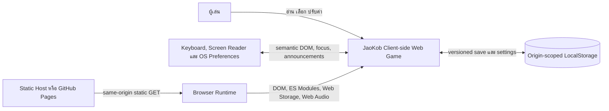

# Software Requirements Specification

## 1. การควบคุมเอกสาร

| รายการ | ค่า |
|---|---|
| โครงการ | JaoKob หรือ เจ้ากบ |
| รหัสเอกสาร | `JKB-P0-SRS-001` |
| เวอร์ชัน | `0.1.0` |
| สถานะ | Proposed Phase 0 Baseline |
| ภาษาหลัก | ภาษาไทย |
| เจ้าของเอกสาร | Senior Software Architect |
| ผู้อนุมัติ | Product Owner, Game Director, Technical Lead, QA Lead |
| มาตรฐานโครงสร้าง | ISO/IEC/IEEE 29148:2018 แบบ tailoring สำหรับโครงการขนาดเล็ก |
| มาตรฐานคุณภาพ | ISO/IEC 25010:2011 |

เอกสารนี้เป็นข้อกำหนดเชิงบรรทัดฐานของ Software System of Interest ใน Phase 1 และระยะถัดไป ไม่ใช่ Source Code และไม่ใช่คำกล่าวว่าโครงการได้รับการรับรองจาก ISO หรือ IEEE

## 2. หลักการตีความข้อกำหนด

คำว่า "ต้อง" หมายถึงข้อกำหนดบังคับ คำว่า "ควร" หมายถึงข้อเสนอที่อาจยกเว้นได้ด้วย Change Request และคำว่า "อาจ" หมายถึงทางเลือกที่ไม่บังคับ Requirement ทุกข้อใช้รหัสถาวรและห้ามนำรหัสที่ยกเลิกแล้วกลับมาใช้ด้วยความหมายใหม่

รหัส Verification Method ใช้ดังนี้

| รหัส | วิธี | ความหมาย |
|---|---|---|
| `I` | Inspection | ตรวจเอกสาร โครงสร้าง หรือ artifact โดยไม่รันระบบ |
| `A` | Analysis | วิเคราะห์กราฟ งบประมาณ ความครอบคลุม หรือผลจำลอง |
| `T` | Test | รันทดสอบที่ให้ผลผ่านหรือไม่ผ่านซ้ำได้ |
| `D` | Demonstration | สาธิตงานผ่าน UI ด้วยผู้ตรวจหรือเทคโนโลยีช่วยเหลือ |

ลำดับความสำคัญใช้ `M` สำหรับ Must และ `S` สำหรับ Should หากข้อกำหนดใน SRS ขัดกับ GDD หรือ Narrative Bible ต้องหยุดการนำไปใช้และเข้าสู่ Change Control ห้าม Agent ตัดสินเลือกเอง

## 3. วัตถุประสงค์และขอบเขต

### 3.1 วัตถุประสงค์

JaoKob เป็นเว็บเกมเล่าเรื่องภาษาไทยแบบเล่นคนเดียว ผู้เล่นติดตามการเดินทางของกบตัวเล็กผ่านการสำรวจ การตัดสินใจ และการดูแลสภาพกาย พลังใจ และความผูกพัน เป้าหมายระบบคือถ่ายทอดประสบการณ์อบอุ่น ปลอบประโลม และมีความหวัง พร้อมรักษาการตัดสินใจของผู้เล่นอย่างคาดการณ์ได้และกลับมาเล่นต่อได้

### 3.2 System of Interest

System of Interest ครอบคลุมเว็บแอปพลิเคชันฝั่งผู้ใช้ตั้งแต่โหลดหน้า Title จนถึง Cutscene, Exploration, Decision, GameOver และ Ending รวม Core Rules, Content Loading, Localization, DOM Rendering, Settings และ Local Persistence

### 3.3 อยู่ในขอบเขตผลิตภัณฑ์

- เว็บแอปพลิเคชันแบบ responsive และ mobile-first
- เนื้อเรื่องห้าองก์ ตัวเลือก เหตุการณ์ flags และ ending resolver
- ตัวแปร `hp`, `sanity` และ `bond`
- ภาษาไทยเป็นค่าเริ่มต้นและสถาปัตยกรรมรองรับ locale เพิ่มเติม
- Save, Load, Settings, Data Versioning, Migration และ Corruption Recovery ผ่าน LocalStorage
- Semantic DOM Renderer ที่เปลี่ยน adapter ได้โดยไม่แก้กติกาเกม
- Story Assist, content notice และความสามารถเข้าถึงตาม baseline
- Static deployment โดยไม่มี backend

### 3.4 อยู่นอกขอบเขต

- ระบบบัญชี Login, Cloud Save, Backend API และฐานข้อมูลฝั่ง Server
- Multiplayer, leaderboard, chat, user-generated content และ social integration
- โฆษณา การซื้อในเกม การสมัครสมาชิก หรือ monetization รูปแบบใด
- Telemetry, behavioral tracking หรือ third-party analytics ใน runtime baseline
- Native mobile package, game engine framework, Canvas หรือ WebGL renderer ใน Phase 1
- การใช้ภาพแนบหรือทรัพย์สินบุคคลที่สามเป็น production asset โดยยังไม่มีหลักฐานสิทธิ์
- Source Code ของเกมใน Phase 0

## 4. แหล่งข้อกำหนดและเอกสารสัมพันธ์

| แหล่ง | บทบาท |
|---|---|
| [Phase 0 Charter](./00-phase-0-charter.md) | ขอบเขต มาตรฐาน ลำดับอำนาจ และ exit criteria |
| [Game Design Document](./01-game-design-document.md) | Core loop, mechanics, balance, UX และ ending policy |
| [Narrative Bible](./02-narrative-bible.md) | Canon, ฉาก บทสนทนา และ continuity |
| [Architecture Blueprint](./04-architecture-blueprint.md) | การจัดสรรข้อกำหนดให้ component, port และ adapter |
| [Production Directory Plan](./05-production-directory-plan.md) | ตำแหน่ง artifact และ dependency boundary |
| `specs/schemas/*.schema.json` | Machine-readable data contracts |

มาตรฐานที่ใช้เป็น baseline ตามคำขอเจ้าของโครงการ ได้แก่ ISO/IEC/IEEE 29148:2018, ISO/IEC/IEEE 12207:2017, ISO/IEC 25010:2011, WCAG 2.2 Level AA และ JSON Schema Draft 2020-12 การใช้มาตรฐานเป็นการ tailoring ไม่ใช่ external certification

## 5. ผู้มีส่วนได้ส่วนเสียและความต้องการ

| รหัส | ผู้มีส่วนได้ส่วนเสีย | ความต้องการ | ตัวชี้วัดหลัก |
|---|---|---|---|
| `STK-001` | เจ้าของโครงการ | รักษาความหมายส่วนบุคคลและ Canon ที่อบอุ่น | Canon Ending ไม่ถูกแทนที่ด้วยเส้นทางลงโทษ |
| `STK-002` | ผู้เล่นภาษาไทย | อ่านและเล่นได้ง่ายโดยไม่ต้องรู้ศัพท์เกม | First-run comprehension และ task completion |
| `STK-003` | ผู้เล่นที่ใช้เทคโนโลยีช่วยเหลือ | ดำเนิน Core Loop ได้โดย keyboard และ screen reader | Core path ผ่าน accessibility verification |
| `STK-004` | Narrative Designer | เพิ่มและแก้เนื้อหาโดยไม่แตะ Engine Core | Content ผ่าน schema และ graph gate |
| `STK-005` | Developer และ AI Agent | ได้ข้อกำหนดที่ไม่กำกวมและตรวจสอบย้อนกลับได้ | Change ทุกชุดเชื่อม Requirement ID และ tests |
| `STK-006` | QA | ทำซ้ำ state, migration, accessibility และ ending tests ได้ | Automated gates ให้ผล deterministic |
| `STK-007` | Maintainer | เปลี่ยน renderer, locale และ schema ได้โดยไม่ทำข้อมูลเดิมเสีย | Port contracts และ migration fixtures ผ่าน |
| `STK-008` | ผู้ดูแลสิทธิ์และการเผยแพร่ | ไม่มี asset ที่สถานะสิทธิ์ไม่ชัดใน release | Asset provenance gate ผ่านทั้งหมด |

## 6. คำศัพท์และแบบจำลองแนวคิด

| คำ | ความหมาย |
|---|---|
| Content Package | หน่วยข้อมูล versioned ที่รวม characters, dialogues, events, narrative trees, flags และ asset manifest |
| Checkpoint | Snapshot ที่ผ่าน invariant และใช้เป็นจุด retry หรือ resume ได้ |
| Choice Transaction | การประเมิน guard ใช้ effects ตรวจ crisis และ commit ผลเป็นหน่วยเดียว |
| Flag | ค่าที่มี stable ID และบันทึกความรู้ เหตุการณ์ หรือเงื่อนไขเรื่อง |
| `sanity` | คีย์ภายในของพลังใจ ไม่ใช่การวินิจฉัยสุขภาพจิต UI ภาษาไทยต้องแสดงว่า "พลังใจ" |
| Story Assist | ตัวเลือก accessibility ที่ป้องกัน HP หรือ Sanity ต่ำกว่า 1 และนำเข้าสู่ recovery branch |
| Overlay | Pause หรือ Settings ซึ่งไม่ใช่ game state และห้ามเปลี่ยน domain state |
| Canon Ending | `END-HOME` ซึ่งเป็นบทสรุปหลักที่เจ้ากบได้รับที่พักพิง |
| Reflective Ending | บทสรุปที่ยังมีความหวังและไม่ตัดสินผู้เล่น แต่ไม่แทนที่ Canon |
| Semantic Validation | การตรวจ uniqueness, cross-reference, graph และกฎข้าม field หลังผ่าน JSON Schema |

## 7. System Context และ Product Perspective

ไม่มี actor ฝั่ง Server ใน gameplay ไม่มีการส่ง save หรือข้อมูลผู้เล่นออกจากอุปกรณ์ ระบบ Static Host มีหน้าที่ส่งไฟล์เท่านั้นและไม่เป็นแหล่ง business logic

## 8. สมมติฐาน การพึ่งพา และข้อจำกัด

### 8.1 สมมติฐาน

| รหัส | สมมติฐาน | ผลหากไม่เป็นจริง |
|---|---|---|
| `ASM-001` | Browser รองรับ ES6 Modules, DOM, CSS Grid/Flexbox และ LocalStorage | แสดงข้อความ browser unsupported และไม่เริ่ม session |
| `ASM-002` | JavaScript เปิดใช้งาน | แสดง fallback notice จาก HTML; ไม่รับประกัน gameplay |
| `ASM-003` | Content Package และ assets ถูกเผยแพร่จาก origin เดียวกัน | ปฏิเสธ cross-origin runtime content ใน baseline |
| `ASM-004` | ค่า baseline `hp=80`, `sanity=70`, `bond=0` ได้รับอนุมัติหรือเปลี่ยนผ่าน configuration review | หากเปลี่ยนต้องอัปเดต fixtures, balance tests และ GDD |
| `ASM-005` | สิทธิ์ใช้ชื่อและ production assets ผ่าน gate ก่อน public release | ใช้ placeholder หรือ original design จนกว่าจะผ่าน |
| `ASM-006` | ผู้ใช้ยอมรับว่า LocalStorage อาจถูกล้างจาก browser settings | ระบบแจ้งขอบเขต persistence อย่างชัดเจน |

### 8.2 ข้อจำกัดบังคับ

| รหัส | ข้อจำกัด |
|---|---|
| `CON-001` | Runtime ต้องใช้ Pure HTML5, Semantic CSS3 และ Modern Vanilla JavaScript ES6 Modules |
| `CON-002` | ต้องไม่มี framework หรือ game engine เป็น runtime dependency ใน Phase 1 |
| `CON-003` | ต้องทำงานแบบ standalone client-side ไม่มี Login, Backend หรือ Monetization |
| `CON-004` | DOM Renderer ต้องเป็น adapter และ Core ห้ามอ้าง `window`, `document`, `localStorage` หรือ CSS selector |
| `CON-005` | ข้อความแสดงผลต้องมาจาก localization data ไม่ใช้ข้อความเป็น identifier |
| `CON-006` | ผลที่กระทบ meter, flag, scene eligibility หรือ Ending ต้อง deterministic |
| `CON-007` | Runtime baseline ต้องไม่ส่ง telemetry หรือข้อมูลส่วนบุคคล |
| `CON-008` | Phase 0 ห้ามมี Source Code ของตัวเกม |

### 8.3 การพึ่งพา

- Browser Web Platform และ origin storage policy
- Static hosting และ HTTPS สำหรับ public deployment
- Content Package, JSON Schemas และ asset provenance ที่ผ่าน gate
- Human review ภาษาไทย เนื้อหาอ่อนไหว และสิทธิ์ทรัพย์สินทางปัญญา
- Dev-time validator และ test runner ซึ่งไม่เป็น runtime dependency

## 9. Operational Scenarios และ Use Cases

### UC-001 เริ่มเกมครั้งแรก

| รายการ | ข้อกำหนด |
|---|---|
| Actor | ผู้เล่น |
| Preconditions | Static files โหลดสำเร็จ ไม่มี save ที่ใช้ต่อได้ |
| Trigger | เปิดหน้าเกม |
| Main flow | แสดง Content Notice, Quick Accessibility Setup, Title, เลือก New Game, สร้าง state จาก versioned defaults, บันทึก checkpoint แรก, เข้า opening Cutscene |
| Alternate | LocalStorage ใช้ไม่ได้ ให้เริ่ม session แบบไม่ persistent หลังแจ้งข้อจำกัดและได้รับการยืนยัน |
| Postconditions | มี session ที่ invariant ถูกต้องและ locale เริ่มต้นเป็น `th` |
| Requirements | `FR-STA-001`, `FR-STA-004`, `FR-SAV-001`, `FR-SET-001`, `FR-SAFE-001` |

### UC-002 สำรวจและยืนยันทางเลือก

| รายการ | ข้อกำหนด |
|---|---|
| Actor | ผู้เล่น |
| Preconditions | อยู่ใน Exploration หรือ Decision และ Content Package ผ่าน validation |
| Trigger | ตรวจ hotspot หรือเลือก choice |
| Main flow | อ่าน snapshot, ประเมิน condition, แสดงตัวเลือกที่พร้อมใช้, ยืนยันหนึ่งรายการ, ล็อก input, ใช้ effects, clamp meters, update flags, resolve event/crisis/ending, แสดง feedback, save เมื่อถึงนโยบาย |
| Alternate | Guard ไม่ผ่าน ให้ไม่ commit และแสดงเหตุผลที่ไม่เปิดเผย spoiler; transition ผิดให้ปฏิเสธและคง snapshot เดิม |
| Postconditions | Transaction commit เพียงครั้งเดียวหรือไม่มีการเปลี่ยน state เลย |
| Requirements | `FR-ENG-002` ถึง `FR-ENG-006`, `FR-UI-002`, `FR-UI-003` |

### UC-003 เล่นต่อและย้าย Save Version

| รายการ | ข้อกำหนด |
|---|---|
| Actor | ผู้เล่น |
| Preconditions | พบ candidate save อย่างน้อยหนึ่งชุด |
| Trigger | เลือก Continue |
| Main flow | Parse, ตรวจ schema version, เลือก migration chain, สำรองข้อมูล, migrate ทีละ version, validate structure และ invariants, เขียน revision ใหม่, เริ่มจาก checkpoint/node ที่ถูกต้อง |
| Alternate | Candidate หลักเสีย ให้ลอง staging หรือ backup; migration ไม่มีเส้นทางให้เก็บข้อมูลเดิมและเสนอ New Game หรือ reset แบบยืนยัน |
| Postconditions | ใช้ save ที่ผ่าน validation หรือไม่มีการเขียนทับข้อมูลเดิม |
| Requirements | `FR-SAV-002` ถึง `FR-SAV-006` |

### UC-004 กู้คืนจากภาวะวิกฤต

| รายการ | ข้อกำหนด |
|---|---|
| Actor | ผู้เล่น |
| Preconditions | HP หรือ Sanity เป็น 0 และ Story Assist ปิด |
| Trigger | Crisis resolver ส่งเข้า GameOver |
| Main flow | แสดงเหตุผลแบบไม่กล่าวถึงความตาย, เสนอ Retry Checkpoint, Story Assist, Settings และ Title, โหลด snapshot checkpoint โดยไม่ย้อน settings |
| Alternate | เปิด Story Assist จาก GameOver แล้ว retry; transaction ถัดไป clamp HP/Sanity ที่ 1 และเข้า recovery Cutscene |
| Postconditions | กลับสู่เส้นทางเล่นได้หรือ Title โดยไม่ลบ save ทั้งหมด |
| Requirements | `FR-ENG-005`, `FR-SAV-007`, `FR-UI-006`, `FR-SET-002` |

### UC-005 ปรับภาษาและความสามารถเข้าถึง

| รายการ | ข้อกำหนด |
|---|---|
| Actor | ผู้เล่น |
| Preconditions | อยู่ที่ Title, Pause หรือ GameOver |
| Trigger | เปิด Settings |
| Main flow | ปรับ locale, font scale, motion, contrast, text speed, audio channels, Story Assist และ confirmation policy; validate; persist; render state ปัจจุบันใหม่โดยไม่แก้ story state |
| Alternate | locale key ขาด ให้ fallback ไป `th` และบันทึก diagnostic แบบไม่เปิดเผยข้อมูล |
| Postconditions | Settings ใหม่มีผลและ domain state ไม่เปลี่ยน |
| Requirements | `FR-LOC-001` ถึง `FR-LOC-003`, `FR-SET-001` ถึง `FR-SET-004` |

### UC-006 Resolve Ending และกลับ Title

| รายการ | ข้อกำหนด |
|---|---|
| Actor | ผู้เล่น |
| Preconditions | ผ่าน final resolver โดย HP และ Sanity มากกว่า 0 |
| Trigger | Commit final Decision หรือ final Cutscene สิ้นสุด |
| Main flow | ประเมิน `END-HOME`, `END-NEARBY`, `END-DAWN` ตามลำดับ, แสดง epilogue/callback, บันทึก ending completion, เสนอ replay ที่กำหนดหรือกลับ Title |
| Alternate | ขาดเพียง safe-help flag และ Bond อย่างน้อย 50 ให้แทรก repair Decision ก่อน resolve |
| Postconditions | Ending ถูกบันทึกเพียงหนึ่งรายการต่อ resolution และผู้เล่นกลับ Title ได้ |
| Requirements | `FR-ENG-006`, `FR-STA-006`, `FR-SAV-008` |

## 10. External Interface Requirements

### 10.1 User Interface

- ใช้ landmark, heading, button, list, dialog และ status semantics ของ HTML ตามหน้าที่จริง
- รองรับ viewport ตั้งแต่ 320 CSS pixels โดยไม่สูญเสีย Core Loop และไม่เกิด horizontal scroll ของเนื้อหาหลัก
- Interactive target ต้องมีพื้นที่อย่างน้อย 44 คูณ 44 CSS pixels
- HUD แสดงชื่อ ค่า และสถานะข้อความของ meter โดยไม่พึ่งสีอย่างเดียว
- Bond ต้องไม่เปิดเผยค่าก่อนจุดเรื่องที่ GDD กำหนด
- Decision แสดง prompt, choices ตามลำดับอ่าน, unavailable reason, outcome cue และ confirmation ตามระดับผลกระทบ
- Save status ต้องมีข้อความ "กำลังบันทึก", "บันทึกแล้ว" หรือ "บันทึกล้มเหลว" ที่ประกาศแก่ assistive technology อย่างเหมาะสม

### 10.2 Software Interface

| Interface | Direction | Contract |
|---|---|---|
| Content Package JSON | Data Adapter ไป Core | Draft 2020-12 schema และ semantic validation ผ่านก่อนใช้ |
| Renderer Port | Core/Application ไป UI | รับ immutable view model; ส่ง semantic intent กลับเป็น command |
| Save Repository Port | Application ไป Persistence Adapter | `load`, `stage`, `commit`, `recover`, `clearWithConsent`; ผลลัพธ์เป็น typed result |
| Localization Port | Application/UI ไป Locale Adapter | Resolve key/object ตาม locale และ fallback `th`; ห้ามคืน `undefined` |
| Clock Port | Core use case ไป adapter | เวลาสำหรับ metadata เท่านั้น ห้ามเปลี่ยนผล gameplay |
| Random Source Port | Core ไป deterministic adapter | อนุญาตเฉพาะ ambient variation; seed และ state ต้องบันทึกเมื่อใช้ |
| Browser DOM | DOM Renderer เท่านั้น | ห้าม Data/Core เข้าถึงโดยตรง |
| LocalStorage | Persistence Adapter เท่านั้น | origin-scoped, versioned keys, bounded payload |

### 10.3 Communication Interface

Runtime อนุญาตเฉพาะ static `GET` แบบ same-origin สำหรับ HTML, CSS, JavaScript modules, JSON และ assets ไม่มี gameplay `POST`, WebSocket หรือ third-party request หาก browser offline หลังโหลด resource ที่จำเป็นครบ session ปัจจุบันต้องดำเนินต่อได้ แต่ offline-first installation และ Service Worker ไม่อยู่ใน baseline

### 10.4 Hardware และ Media Interface

ระบบไม่ต้องพึ่ง hardware เฉพาะ รองรับ keyboard, touch, pointer และ audio output ตามที่ browser ให้บริการ ข้อมูลสำคัญที่ส่งด้วยเสียงต้องมี visual และ text equivalent การไม่มี audio device ต้องไม่ block progression

## 11. Functional Requirements

### 11.1 Bootstrap และ State Management

| ID | ข้อกำหนดบังคับ | Acceptance Criteria | P | V |
|---|---|---|:---:|:---:|
| `FR-STA-001` | ระบบต้องสร้าง Composition Root, โหลด settings, โหลดและตรวจ Content Package แล้วจึงเข้าสู่ `Title` โดย Core ไม่ขึ้นกับ Browser API | กรณี valid content เข้าสู่ Title หนึ่งครั้ง; invalid content ไม่เริ่ม gameplay และแสดง recovery-safe error | M | T, I |
| `FR-STA-002` | ระบบต้องมี game state ได้เพียงค่าเดียวจาก `Title`, `Cutscene`, `Exploration`, `Decision`, `GameOver`, `Ending` | State นอก enum ถูกปฏิเสธทั้ง runtime และ save validation | M | T |
| `FR-STA-003` | State Machine ต้องยอมรับเฉพาะ transition ที่ระบุใน Architecture Blueprint และปฏิเสธ transition อื่นโดยไม่เปลี่ยน snapshot | ทดสอบทุก allowed, guarded และ forbidden pair ผ่าน; forbidden command ไม่เกิด side effect | M | T |
| `FR-STA-004` | New Game ต้องสร้าง metrics จาก versioned defaults `80/70/0`, flags จาก registry และ entry node ของ entry tree | Fixture New Game เท่ากับ expected snapshot และไม่มีค่าที่ hard-code ซ้ำใน UI/content | M | T, I |
| `FR-STA-005` | Pause และ Settings ต้องเป็น overlay ที่ไม่เปลี่ยน game state, metrics, flags, node cursor หรือ RNG state | เปรียบเทียบ domain snapshot ก่อนและหลังเปิดปิด overlay เท่ากันทุก field | M | T |
| `FR-STA-006` | ทุก state ต้องมีเส้นทางออกที่กำหนด หรือเป็นระยะรอ input ที่ UI แสดงอย่างถูกต้อง; ห้าม soft lock | Graph analysis ไม่พบ reachable non-terminal node ที่ไม่มี eligible exit ภายใต้ valid path | M | A, T |

### 11.2 Content, Data และ Localization

| ID | ข้อกำหนดบังคับ | Acceptance Criteria | P | V |
|---|---|---|:---:|:---:|
| `FR-CNT-001` | ระบบต้อง parse และ validate Content Package กับ JSON Schema Draft 2020-12 ก่อนสร้าง index หรือเริ่มเกม | Valid fixtures ผ่าน; invalid type, missing Thai text และ unknown property ล้มเหลวพร้อม path | M | T |
| `FR-CNT-002` | ระบบต้องตรวจ uniqueness และ cross-reference ของ character, dialogue, event, tree, node, choice, flag, checkpoint, warning และ asset IDs | Duplicate และ dangling reference ทุกชนิดใน invalid fixtures ถูกปฏิเสธ | M | T |
| `FR-CNT-003` | ระบบต้องตรวจ narrative graph เรื่อง entry, reachability, terminal, dangling edge, forbidden cycle และเส้นทางไป Canon | ไม่พบ orphan; มี path ไป `END-HOME`; cycle ที่ไม่มี explicit exit ถูกปฏิเสธ | M | A, T |
| `FR-CNT-004` | Stable ID ต้องเป็น locale-independent และห้าม reuse ด้วยความหมายใหม่ | Review ไม่พบ display text/index เป็น ID; removed ID อยู่ใน compatibility record | M | I |
| `FR-CNT-005` | Content action/effect ต้องอยู่ใน allowlist ของ schema และห้ามบรรจุ script, HTML, URL navigation หรือ executable expression | Payload ที่มี unknown effect, markup execution หรือ path traversal ถูกปฏิเสธ | M | T, I |
| `FR-CNT-006` | Asset ทุกชิ้นใน release ต้องมี provenance, license identifier และ alt text ภาษาไทยเมื่อเป็นภาพ | Asset registry inspection ผ่าน 100 เปอร์เซ็นต์; unresolved-rights asset ไม่เข้า distributable build | M | I, T |
| `FR-LOC-001` | ทุกข้อความที่ผู้เล่นเห็นต้อง resolve ตาม locale ปัจจุบันและ fallback ไป `th` เมื่อ key/translation ขาด | ทดสอบ locale เพิ่มเติมที่ขาดบางค่าแล้วยังได้ข้อความไทย ไม่ได้ `undefined` หรือ raw key | M | T |
| `FR-LOC-002` | Locale switch ต้อง render state ปัจจุบันใหม่โดยไม่เปลี่ยน domain snapshot หรือ restart transaction | Snapshot ก่อนและหลังเท่ากัน; focus อยู่ในตำแหน่งเทียบเท่าที่ใช้งานได้ | M | T, D |
| `FR-LOC-003` | ระบบต้องรองรับการตัดบรรทัด รูปแบบตัวเลข และ font fallback ภาษาไทยโดยไม่ผูก logic กับความยาวข้อความ | Thai stress fixture ที่ยาว 200 เปอร์เซ็นต์ไม่ตัดสาระสำคัญหรือซ้อน control | M | T, D |

### 11.3 Engine Core, Metrics, Choices และ Events

| ID | ข้อกำหนดบังคับ | Acceptance Criteria | P | V |
|---|---|---|:---:|:---:|
| `FR-ENG-001` | `hp`, `sanity`, `bond` ต้องเป็น integer 0 ถึง 100 และ clamp หลัง effect ทุกชุด | Boundary tests ครอบคลุม -100, 0, 1, 99, 100, 200; state/save/UI ไม่พบค่านอกช่วง | M | T |
| `FR-ENG-002` | Choice Transaction ต้องประเมิน guard จาก pre-choice snapshot, ใช้ metric deltas พร้อมกัน, clamp, ใช้ flag effects, resolve crisis ก่อน ending, แล้วจึง commit/save | Golden tests ยืนยันลำดับและ rollback ทั้งชุดเมื่อขั้นตอนใดล้มเหลว | M | T |
| `FR-ENG-003` | Decision ต้องมี choices พร้อม condition, unavailable behavior, deterministic effects, feedback และ target; commit ได้เพียง choice เดียว | Double click/tap/Enter สร้าง revision และ history entry หนึ่งรายการ | M | T |
| `FR-ENG-004` | Event resolver ต้องเรียง event ที่ eligible ด้วย priority และ stable ID, จำกัด occurrence และใช้ผลแบบ deterministic | Input snapshot เดิมให้ผลและลำดับ event เดิมทุกครั้ง | M | T |
| `FR-ENG-005` | เมื่อ Story Assist ปิด ค่า HP 0 ต้อง resolve ก่อน Sanity 0 และเข้า GameOver; เมื่อเปิด ต้อง clamp ค่าเป้าหมายที่ 1 และเข้า recovery Cutscene | Tests ครอบคลุม HP=0, Sanity=0, ทั้งคู่=0 และ Story Assist on/off | M | T |
| `FR-ENG-006` | Ending resolver ต้องประเมิน `END-HOME`, `END-NEARBY`, `END-DAWN` ตามลำดับ GDD และแทรก repair Decision เมื่อเข้าเงื่อนไข | Truth-table tests ครอบคลุม boundary Bond 29, 30, 49, 50, 59, 60 และ flag combinations | M | T, A |
| `FR-ENG-007` | Randomness ต้องไม่เปลี่ยน metrics, flags, eligibility, crisis หรือ Ending ใน baseline และ ambient RNG ต้องใช้ seed ที่ทำซ้ำได้ | รัน seed เดิมได้ ambient sequence เดิม; critical-path result ไม่ต่างกันเมื่อเปลี่ยน seed | M | T |
| `FR-ENG-008` | ทุก checkpoint ต้องเป็น immutable valid snapshot ก่อน irreversible Decision หลังฉากยาว และอย่างน้อยทุก 8 ถึง 15 นาทีตาม content model | Content analysis แสดง checkpoint interval และ snapshot ผ่าน schema/invariants | M | A, T |
| `FR-ENG-009` | Dialogue history ใน session ต้องเก็บอย่างน้อย 50 รายการล่าสุดพร้อม speaker, scene และ locale โดยไม่ข้าม New Game | เติม 60 รายการแล้วเรียกได้ 50 รายการล่าสุดตามลำดับ; New Game ล้าง history | S | T |

### 11.4 Rendering และ Interaction

| ID | ข้อกำหนดบังคับ | Acceptance Criteria | P | V |
|---|---|---|:---:|:---:|
| `FR-UI-001` | DOM Renderer ต้องสร้าง UI จาก immutable view model และส่ง user intent เป็น command โดยไม่แก้ Domain State โดยตรง | Architecture/import test ไม่พบ Core mutation จาก UI และ renderer contract tests ผ่าน | M | T, I |
| `FR-UI-002` | ขณะ Choice Transaction ทำงาน UI ต้องล็อก action ซ้ำ แสดง busy state ที่เข้าถึงได้ และปลดล็อกหลัง commit หรือ rollback | Pointer, touch และ keyboard race test ไม่เกิด duplicate commit | M | T, D |
| `FR-UI-003` | หลัง action ระบบต้องแสดง immediate feedback และ meter change ด้วยข้อความกับภาพ ไม่ใช้สีหรือ animation เพียงอย่างเดียว | ผู้ตรวจรับรู้ direction และ amount ใน normal/accessibility UI; screen reader ได้ announcement เดียว | M | T, D |
| `FR-UI-004` | Cutscene ต้อง pause, แสดง text log, ปรับ speed, ปิด typewriter และ skip ตามข้อกำหนดเนื้อหาที่เคยดู | Controls ใช้ keyboard ได้และไม่สูญเสียข้อความเมื่อ motion/text settings เปลี่ยน | M | D, T |
| `FR-UI-005` | Bond HUD ต้องคง hidden/locked จนถึง narrative gate ที่กำหนด และ UI ต้องไม่เปิดเผย hidden morality score | Tests ก่อน/หลัง gate แสดง state ตาม GDD และ accessible label ไม่ leak ค่า | M | T |
| `FR-UI-006` | GameOver ต้องใช้ภาษาภาวะวิกฤต ไม่ยืนยันการตาย และเสนอ Retry, Story Assist, Settings, Title | Content/UI inspection พบ controls ครบและไม่มี prohibited wording | M | I, D |
| `FR-UI-007` | ระบบต้องแสดง fatal content error, storage failure และ unsupported environment ด้วยข้อความไทยที่ดำเนินการต่อได้อย่างปลอดภัย | Fault injection แต่ละประเภทให้ action ที่ถูกต้องและไม่มี blank screen | M | T, D |

### 11.5 Persistence, Versioning และ Recovery

| ID | ข้อกำหนดบังคับ | Acceptance Criteria | P | V |
|---|---|---|:---:|:---:|
| `FR-SAV-001` | ระบบต้องบันทึก Save Envelope ที่มี save format version, content version, revision, timestamps, reason, payload และ settings ตาม schema | Round-trip valid snapshot เท่ากันใน field เชิง domain และ revision เพิ่มแบบ monotonic | M | T |
| `FR-SAV-002` | ระบบต้องแยก canonical save, staging, backup และ settings ด้วย namespaced keys และห้าม parse key อื่นใน origin | Storage fixture ที่มี unrelated keys ไม่ถูกอ่านหรือแก้ | M | T |
| `FR-SAV-003` | การเขียนต้อง stage, read-back validate, สำรอง canonical เดิม, promote และ verify; failure ห้ามทำลาย valid candidate ล่าสุด | Fault injection ทุก boundary เหลือ recoverable valid candidate อย่างน้อยหนึ่งชุด | M | T |
| `FR-SAV-004` | การโหลดต้องพิจารณา canonical, staging และ backup เลือก candidate valid ที่ revision สูงสุดโดยกฎ deterministic | Matrix candidate combinations คืนผลคงที่และไม่เลือก invalid/newer-incompatible save | M | T |
| `FR-SAV-005` | Migration ต้องทำทีละ version, เป็น pure deterministic transform, ไม่ข้าม version, ไม่แก้ source object และ validate หลังแต่ละขั้น | Fixture จากทุก supported version ผ่าน chain; rerun ให้ผลเท่ากัน | M | T |
| `FR-SAV-006` | หากไม่มี migration path หรือ save เสียทั้งหมด ระบบต้องเก็บ raw data ไว้จนผู้เล่นยืนยัน reset และเสนอ New Game อย่างชัดเจน | ไม่มี destructive write ก่อน confirmation; cancel แล้ว raw candidates คงเดิม | M | T, D |
| `FR-SAV-007` | Retry ต้องคืน checkpoint metrics, flags, cursor, content version และ RNG โดยใช้ settings ล่าสุด ไม่ย้อนค่าตั้งผู้ใช้ | เปลี่ยน settings หลัง checkpoint แล้ว retry; domain ย้อนแต่ settings ไม่ย้อน | M | T |
| `FR-SAV-008` | ระบบต้องบันทึก ending completion และ replay checkpoint โดยไม่ทำ Canon/Reflective result ซ้ำจาก double input | Ending completion มี idempotency key/revision และบันทึกครั้งเดียว | M | T |
| `FR-SAV-009` | เมื่อ LocalStorage unavailable หรือ quota เต็ม ระบบต้องดำเนิน session แบบ memory-only ได้หลังแจ้ง และเตือนก่อน unload เท่าที่ browser อนุญาต | Fault injection ไม่ทำ gameplay crash; visible status แสดงข้อจำกัด | M | T, D |

### 11.6 Settings, Accessibility และ Content Safety

| ID | ข้อกำหนดบังคับ | Acceptance Criteria | P | V |
|---|---|---|:---:|:---:|
| `FR-SET-001` | Settings ต้องครอบคลุม locale, text speed, font scale, reduced motion, high contrast, Story Assist, immersive UI, confirmation, typewriter, auto-advance และ audio channels ตาม schema | Settings schema round-trip ทุก field และ invalid value ถูกปฏิเสธ | M | T |
| `FR-SET-002` | Story Assist เปิดปิดได้จาก Title, Pause และ GameOver มีผลตั้งแต่ transaction ถัดไป และไม่อยู่ใน story flags | State inspection ไม่พบ Story Assist ใน flag registry; transaction ปัจจุบันไม่เปลี่ยนกลางคัน | M | T |
| `FR-SET-003` | ระบบต้องอ่าน `prefers-reduced-motion` เป็นค่าเริ่มต้นเมื่อยังไม่มี user setting และ user override ต้องมีอำนาจสูงกว่า OS snapshot หลังบันทึก | First run สอดคล้อง OS; subsequent run ใช้ user choice | M | T |
| `FR-SET-004` | Audio ต้องมี master, music, ambience และ effects volume รวม reduced-intensity option; mute ต้องไม่ซ่อนข้อมูลสำคัญ | ตั้งทุก channel ที่ 0 แล้วยังดำเนิน Core Loop ได้ | M | T, D |
| `FR-ACC-001` | ทุก action ใน Core Loop ต้องใช้งานด้วย keyboard โดยมี focus order และ visible focus ที่คาดการณ์ได้ | Keyboard-only path จาก Title ถึงทุก Ending และ retry ผ่าน | M | D, T |
| `FR-ACC-002` | Dynamic state change ต้องจัด focus และใช้ status/live announcement โดยไม่ประกาศซ้ำหรือดึง focus โดยไม่จำเป็น | Screen-reader smoke test ครอบคลุม meter, save, error, state และ dialog | M | D |
| `FR-ACC-003` | UI ต้องรองรับ text zoom 200 เปอร์เซ็นต์, touch target 44 คูณ 44 CSS pixels, contrast Level AA และไม่ใช้ sensory cue เพียงอย่างเดียว | Automated และ manual WCAG matrix ผ่านทุก supported viewport | M | T, D |
| `FR-ACC-004` | Critical choice ต้องไม่มี timer; motion, flash, parallax, shake และ auto-advance ต้องปิดได้ | Inspection ไม่พบ critical timer; reduced mode ไม่เกิด non-essential motion | M | I, T |
| `FR-SAFE-001` | First run ต้องแสดง content notice เรื่องภัยธรรมชาติ การพลัดพราก อันตรายต่อสัตว์ และความโดดเดี่ยวก่อน New Game | Notice แสดงครบโดยไม่ spoiler และเข้าถึงรายละเอียด/ลดความเข้มข้นได้ | M | I, D |
| `FR-SAFE-002` | UI และ dialogue ต้องไม่ใช้ถ้อยคำตีตราสุขภาพจิตตาม prohibited-content rules และต้องมี decompression/recovery ตาม GDD | Content lint กับ human sensitivity review ผ่านก่อน release | M | I, A |

## 12. Non-Functional Requirements ตาม ISO/IEC 25010:2011

### 12.1 Functional Suitability

| ID | Sub-characteristic | ข้อกำหนดและเกณฑ์วัด | P | V |
|---|---|---|:---:|:---:|
| `NFR-FS-001` | Functional Completeness | Requirements coverage ต้องเชื่อม FR ทุกข้อกับ design element และ test case อย่างน้อยหนึ่งรายการก่อน Release Candidate | M | I, A |
| `NFR-FS-002` | Functional Correctness | Golden paths ทุก Ending, crisis priority, Story Assist, save recovery และ migration ต้องให้ expected result 100 เปอร์เซ็นต์ | M | T |
| `NFR-FS-003` | Functional Appropriateness | ผู้ทดสอบเป้าหมายอย่างน้อย 80 เปอร์เซ็นต์ต้องอธิบายความต่างของ HP, พลังใจ และ Bond หลัง tutorial ได้โดยไม่รับคำใบ้จากผู้ดำเนินการ | S | D, A |

### 12.2 Performance Efficiency

Performance Profile สำหรับ gate ต้องบันทึก browser version, hardware, viewport, cache state และ network shaping ใน test evidence ห้ามรายงานตัวเลขโดยไม่ระบุ profile

| ID | Sub-characteristic | ข้อกำหนดและเกณฑ์วัด | P | V |
|---|---|---|:---:|:---:|
| `NFR-PE-001` | Time Behaviour | บนอุปกรณ์อ้างอิง mobile ระดับกลาง 4 logical cores และ RAM 4 GB ภายใต้ Fast 3G หน้าแรกต้องพร้อมรับ input ภายใน 3.0 วินาทีที่ percentile 75 จาก cold cache และ 1.5 วินาทีจาก warm cache | M | T |
| `NFR-PE-002` | Time Behaviour | Choice commit ถึง immediate feedback ต้องไม่เกิน 100 ms ที่ percentile 95 โดยไม่รวมเวลารอการอ่านหรือ media decoding | M | T |
| `NFR-PE-003` | Time Behaviour | Interaction ทั่วไปต้องตอบสนองภายใน 100 ms ที่ percentile 95 และ animation ที่เปิดใช้งานควรรักษาอย่างน้อย 50 frames per second ที่ percentile 95 | S | T |
| `NFR-PE-004` | Resource Utilization | Initial critical transfer budget ต้องไม่เกิน 2 MB compressed และ HTML, CSS, JS กับ critical JSON รวมกันต้องไม่เกิน 500 KB compressed; media หลังฉากแรกโหลดแบบ demand-driven | M | A, T |
| `NFR-PE-005` | Capacity | Save candidate หนึ่งชุดต้องไม่เกิน 250 KB UTF-8 และ dialogue history/runtime cache ต้องมีขอบเขตชัดเจน | M | T, A |

### 12.3 Compatibility

| ID | Sub-characteristic | ข้อกำหนดและเกณฑ์วัด | P | V |
|---|---|---|:---:|:---:|
| `NFR-CO-001` | Co-existence | ระบบต้องอ่านและเขียนเฉพาะ LocalStorage keys ที่มี namespace ของ JaoKob และห้ามแก้ global styles/handlers นอก application root | M | T, I |
| `NFR-CO-002` | Interoperability | Content และ save data ต้องเป็น UTF-8 JSON ที่ตรวจได้ด้วย Draft 2020-12 tools มาตรฐานโดยไม่ต้องรันเกม | M | T |
| `NFR-CO-003` | Interoperability | Keyboard, touch, pointer และ assistive technology ต้องส่ง semantic intent เดียวกันและได้ domain result เท่ากัน | M | T, D |

### 12.4 Usability

| ID | Sub-characteristic | ข้อกำหนดและเกณฑ์วัด | P | V |
|---|---|---|:---:|:---:|
| `NFR-US-001` | Appropriateness Recognizability | First-run ต้องทำให้ผู้เล่นทราบ genre, content profile, save scope และ accessibility setup ก่อนเริ่มเกม | M | D, I |
| `NFR-US-002` | Learnability | ผู้ทดสอบที่ไม่คุ้นศัพท์เกมอย่างน้อย 80 เปอร์เซ็นต์ต้องทำ tutorial Exploration และ Decision สำเร็จโดยไม่ใช้ external help | S | D, A |
| `NFR-US-003` | Operability | Core Loop ต้องใช้ keyboard-only และ touch-only ได้โดยไม่มี action เฉพาะ hover | M | T, D |
| `NFR-US-004` | User Error Protection | High-impact หรือ irreversible choice ต้องมี cue และ confirmation ตาม setting; duplicate input ต้องถูก de-bounce/serialize | M | T, D |
| `NFR-US-005` | Accessibility | Target conformance คือ WCAG 2.2 Level AA สำหรับหน้าจอและ flow ใน scope พร้อม automated checks และ manual keyboard/screen-reader/zoom review | M | T, D, I |
| `NFR-US-006` | User Interface Aesthetics | UI ต้องรักษา readability ภาษาไทยและอารมณ์สงบ โดยไม่มี flashing content เกินเกณฑ์ WCAG และไม่มี FOMO/daily streak | M | I, D |

### 12.5 Reliability

| ID | Sub-characteristic | ข้อกำหนดและเกณฑ์วัด | P | V |
|---|---|---|:---:|:---:|
| `NFR-RL-001` | Maturity | Automated unit, contract, state-transition, migration และ critical E2E suites ต้องผ่าน 100 เปอร์เซ็นต์ใน Release Candidate | M | T |
| `NFR-RL-002` | Availability | หลัง assets ที่จำเป็นโหลดแล้ว network interruption ต้องไม่ยุติ session ปัจจุบันหรือทำให้ transaction ที่เริ่มแล้วเสีย | M | T |
| `NFR-RL-003` | Fault Tolerance | Invalid content, corrupt save, quota failure, missing locale และ renderer error ต้องถูกจัดประเภทและไม่ทำให้เกิด silent state corruption | M | T |
| `NFR-RL-004` | Recoverability | ผู้เล่นต้องกลับมาได้จาก valid checkpoint ล่าสุดซึ่งห่างกันไม่เกิน 15 นาทีของเวลาเนื้อหา และ failure ระหว่าง write ต้องเหลือ valid candidate | M | T, A |
| `NFR-RL-005` | Recoverability | Reset หรือทิ้งข้อมูลต้องเกิดหลัง explicit confirmation เท่านั้นและต้องระบุสิ่งที่จะสูญเสีย | M | T, D |

### 12.6 Security และ Privacy

| ID | Sub-characteristic | ข้อกำหนดและเกณฑ์วัด | P | V |
|---|---|---|:---:|:---:|
| `NFR-SE-001` | Confidentiality | Runtime baseline ต้องไม่เก็บชื่อ อีเมล device identifier หรือข้อมูลส่วนบุคคล และไม่ส่ง telemetry | M | I, T |
| `NFR-SE-002` | Integrity | ข้อมูลจาก JSON และ LocalStorage ต้องถือว่า untrusted, ผ่าน parse/schema/semantic/invariant validation ก่อนใช้ และห้าม execute เป็น code | M | T, I |
| `NFR-SE-003` | Integrity | Renderer ต้องใช้ safe text/attribute APIs; ห้าม `innerHTML` กับ content, `eval`, `Function`, inline event handlers หรือ data-driven dynamic import | M | I, T |
| `NFR-SE-004` | Authenticity Boundary | ระบบต้องระบุชัดว่า local checksum ใช้ตรวจ accidental corruption ไม่รับรองผู้ใช้หรือป้องกันเจ้าของเครื่องแก้ save | M | I |
| `NFR-SE-005` | Accountability | Release artifact ต้อง trace กลับ commit, content version, schema version และ asset provenance ได้ โดยไม่เพิ่ม player tracking | M | I, T |
| `NFR-SE-006` | Attack Resistance | Public deployment ต้องใช้ HTTPS, restrictive Content Security Policy เท่าที่ static host รองรับ, same-origin assets และไม่มี runtime secret | M | I, T |

### 12.7 Maintainability

| ID | Sub-characteristic | ข้อกำหนดและเกณฑ์วัด | P | V |
|---|---|---|:---:|:---:|
| `NFR-MA-001` | Modularity | Core ต้องไม่มี import จาก UI/Data adapters และ renderer/persistence/localization ต้องเข้าผ่าน ports | M | I, T |
| `NFR-MA-002` | Reusability | State Machine, resolver และ migrations ต้องรันใน test environment ที่ไม่มี DOM และ LocalStorage จริงได้ | M | T |
| `NFR-MA-003` | Analysability | ทุก requirement, transition, schema, migration และ production content record ต้องมี stable ID และ error ต้องมี category/path โดยไม่ log save content ทั้งชุด | M | I, T |
| `NFR-MA-004` | Modifiability | การเพิ่มฉากหรือภาษาใหม่ที่ใช้ contract เดิมต้องไม่ต้องแก้ Engine Core; การเปลี่ยน DOM เป็น test renderer ต้องไม่แก้ domain rules | M | D, T |
| `NFR-MA-005` | Testability | Domain Core ต้องมี line coverage อย่างน้อย 90 เปอร์เซ็นต์ และ branch coverage อย่างน้อย 85 เปอร์เซ็นต์; state transitions, crisis/ending resolver และ migrations ต้องครอบคลุม 100 เปอร์เซ็นต์ของกรณีที่ระบุ | M | T, A |
| `NFR-MA-006` | Change Control | Breaking schema/save change ต้องมี ADR/RFC, version bump, migration/compatibility decision, fixtures และ traceability update ใน change เดียวกัน | M | I |

### 12.8 Portability

| ID | Sub-characteristic | ข้อกำหนดและเกณฑ์วัด | P | V |
|---|---|---|:---:|:---:|
| `NFR-PO-001` | Adaptability | Release ต้องผ่าน browser matrix ที่ baseline ต่อ release ซึ่งครอบคลุม Chromium, Firefox และ Safari engines บน mobile/desktop รุ่นที่โครงการยังสนับสนุน | M | T, D |
| `NFR-PO-002` | Installability | Distributable build ต้องเป็น static files ที่ deploy ใต้ repository subpath ได้โดยไม่ใช้ absolute-root asset path หรือ server rewrite | M | T |
| `NFR-PO-003` | Replaceability | DOM Renderer ต้องเปลี่ยนเป็น mock, Canvas หรือ WebGL adapter ได้ผ่าน port โดยไม่แก้ Core, content schema หรือ save contract | M | I, T |
| `NFR-PO-004` | Adaptability | Layout ต้องรองรับ viewport หลักตั้งแต่ 320 ถึง 2560 CSS pixels, portrait/landscape และ device pixel ratio โดยไม่เปลี่ยน game logic | M | T, D |

## 13. Data Requirements และ Business Rules

### 13.1 Authoritative Schemas

| Schema | หน้าที่ | Version field |
|---|---|---|
| `common.schema.json` | IDs, localized text, conditions, effects, settings, metrics | อ้างผ่าน canonical `$id` |
| `character.schema.json` | Character catalog | `schemaVersion` |
| `dialogue.schema.json` | Dialogue line catalog | `schemaVersion` |
| `event.schema.json` | Trigger, conditions และ resolution | `schemaVersion` |
| `narrative-tree.schema.json` | Nodes, choices, effects และ graph edges | `schemaVersion` |
| `content-package.schema.json` | Aggregate manifest และ registries | `schemaVersion`, `contentVersion` |
| `save-state.schema.json` | Local save envelope | `saveFormatVersion`, `contentVersion` |

Canonical `$id` ใช้รูป `https://t3thr.github.io/JaoKob/specs/schemas/<file>` ในฐานะ identifier สำหรับ resolver ไม่ใช่คำสั่งให้ runtime fetch schema จาก network Cross-file `$ref` ใช้ relative reference เพื่อให้ validation ทำงานได้ทั้ง local repository และ canonical base

Validator ที่โครงการเลือกต้องเปิดการตรวจ `format` แบบ assertion หรือมี explicit equivalent checks สำหรับ `date-time` และ `uri` เนื่องจาก JSON Schema Draft 2020-12 อาจถือ `format` เป็น annotation ตาม configuration ของ implementation

### 13.2 Semantic Rules ที่ JSON Schema รับรองไม่ได้โดยลำพัง

| รหัส | กฎ |
|---|---|
| `DR-001` | ID ทุก namespace ที่กำหนดต้อง unique และ reference ทุกตัวต้อง resolve ได้ |
| `DR-002` | `entryTreeId` และ `entryNodeId` ต้องชี้ target ที่มีอยู่และเข้าถึงได้ |
| `DR-003` | Node ทุกตัวต้อง reachable จาก entry หรือถูกประกาศเป็น replay-only ใน schema version ที่รองรับ |
| `DR-004` | `checkpointPolicy=none` ต้องไม่มี `checkpointId`; policy อื่นต้องมี ID ที่ unique |
| `DR-005` | `disabledReason` ต้องมีเมื่อ unavailable behavior เป็น `disabled` |
| `DR-006` | Localized object ทุกตัวต้องมี `th`; locale ที่ประกาศ supported ต้องมี coverage ตาม release threshold |
| `DR-007` | Flag effect/value ต้องตรง `valueType` ของ flag definition และ ending flag ต้องอยู่ใน allowlist |
| `DR-008` | Node type map เป็น state: cutscene ไป Cutscene, exploration ไป Exploration, decision ไป Decision, game-over ไป GameOver และ ending ไป Ending |
| `DR-009` | Choice และ interaction IDs ต้อง unique ทั่ว Content Package เพื่อให้ history/event reference ไม่กำกวม |
| `DR-010` | Ending และ GameOver nodes เป็น terminal ด้านเนื้อหา ยกเว้น retry/replay command ที่ State Machine ควบคุม |
| `DR-011` | Supported save ต้องอ้าง content/tree/node/checkpoint/event IDs ที่ยังมีหรือมี migration mapping |
| `DR-012` | Asset path ต้องเป็น relative path ที่ไม่มี scheme, absolute prefix หรือ parent traversal |

### 13.3 Domain Invariants

1. มี active state เพียงหนึ่งค่า
2. Metrics เป็น integer ช่วง 0 ถึง 100
3. Transaction revision เพิ่มทีละหนึ่งเมื่อ commit และไม่เพิ่มเมื่อ reject/rollback
4. Choice เดียว commit ได้สูงสุดหนึ่งครั้งต่อ command identifier
5. Crisis priority คือ HP ก่อน Sanity เมื่อทั้งคู่ถึง 0
6. Story Assist อยู่ใน settings ไม่ใช่ story flags
7. Core gameplay result ไม่ขึ้นกับ wall-clock, frame rate, locale หรือ renderer
8. Save ที่เขียนได้ต้องผ่าน schema, semantic rules และ domain invariants
9. Settings overlay ไม่เปลี่ยน domain snapshot
10. Canon resolution ต้องไม่สร้าง Ending ที่เหนือกว่า `END-HOME`

## 14. Error Handling Requirements

| Error Category | Detection | Required response | Retry policy |
|---|---|---|---|
| `CONTENT_PARSE` | JSON parse fail | Block gameplay, ระบุไฟล์/path, ให้กลับ Title/reload | หลังเปลี่ยน artifact |
| `CONTENT_SCHEMA` | Schema fail | Block affected package, ไม่ใช้ partial content | หลังแก้ content |
| `CONTENT_REFERENCE` | Duplicate/dangling/graph fail | Block gameplay ก่อน state creation | หลังแก้ content |
| `INVALID_TRANSITION` | Transition table reject | คง snapshot, log code แบบไม่เก็บข้อมูลผู้เล่น, render safe state | Command ใหม่เท่านั้น |
| `INVARIANT_VIOLATION` | Postcondition fail | Rollback transaction, ปิด input ชั่วคราว, แสดง recovery action | ไม่ auto-retry transaction |
| `SAVE_PARSE` | Candidate parse fail | Quarantine candidate เชิงตรรกะและลอง candidate ถัดไป | Load ครั้งถัดไปได้ |
| `SAVE_MIGRATION` | Missing/failing step | เก็บ source ไม่เขียนทับ เสนอ New Game/reset | หลังมี migration |
| `STORAGE_UNAVAILABLE` | Security/Quota/API fail | Memory-only mode และ visible warning | Manual/next checkpoint |
| `LOCALIZATION_MISSING` | Locale resolution fail | Fallback `th`; หาก `th` ขาดให้ใช้ safe system message | ครั้งต่อ key จำกัดหนึ่ง diagnostic |
| `RENDER_FAILURE` | Adapter exception | คง domain snapshot แสดง minimal recovery shell | Re-render ครั้งเดียว |

Error message ต่อผู้เล่นต้องเป็นภาษาไทยที่ไม่กล่าวโทษ มี action ชัดเจน และไม่เปิดเผย stack trace, raw save หรือ path ภายใน production

## 15. Verification Strategy และ Quality Gates

| Gate | Scope | Pass criteria | Evidence owner |
|---|---|---|---|
| `REQ-GATE` | SRS quality และ traceability | ทุก FR/NFR มี acceptance, priority, verification และ source link | Requirements Lead |
| `SCHEMA-GATE` | Schema/metaschema/fixtures | Parse และ metaschema ผ่าน; valid ผ่าน; invalid ถูกปฏิเสธ | Data/QA |
| `GRAPH-GATE` | IDs, references, reachability, endings, cycles | Semantic rules `DR-001` ถึง `DR-012` ผ่าน | Narrative/QA |
| `CORE-GATE` | Metrics, choices, events, resolvers | Unit/property/boundary tests ผ่านและ coverage ถึงเกณฑ์ | Core/QA |
| `STATE-GATE` | Allowed/guarded/forbidden transitions | Transition matrix coverage 100 เปอร์เซ็นต์ | Core/QA |
| `SAVE-GATE` | Round-trip, migration, corruption, quota, crash points | Supported fixture matrix ผ่าน 100 เปอร์เซ็นต์และไม่สูญ candidate | Data/QA |
| `A11Y-GATE` | WCAG, keyboard, screen reader, zoom, motion, touch | Automated ไม่พบ serious/critical; manual core paths ผ่าน | UI/QA |
| `PERF-GATE` | Load, interaction, payload, storage budget | `NFR-PE-*` ผ่านภายใต้ recorded profiles | Performance/QA |
| `NARRATIVE-GATE` | Canon, safety, Thai editorial, callbacks | Human review และ automated continuity ผ่าน | Narrative Lead |
| `SECURITY-GATE` | Injection, CSP, data flow, dependencies | Threat cases ผ่าน; ไม่มี runtime secret/telemetry | Security/DevOps |
| `IP-GATE` | Asset rights/provenance | Asset ทุกชิ้นมี approved status | Product/IP owner |

การทดสอบอัตโนมัติไม่แทน human review สำหรับภาษาไทย ความปลอดภัยทางอารมณ์ screen reader และสิทธิ์ asset

## 16. Traceability Matrix ระดับ Baseline

| Source Need | Requirements | Architecture allocation | Verification |
|---|---|---|---|
| `STK-001`, `GDD-VIS-*`, `GDD-END-*` | `FR-ENG-005`, `FR-ENG-006`, `FR-UI-006`, `FR-SAFE-*` | Core Resolver, Narrative Repository, Renderer | Ending truth table, narrative review, E2E |
| `STK-002`, `GDD-LOOP-*`, `GDD-UX-*` | `FR-STA-*`, `FR-UI-*`, `NFR-US-*` | State Machine, Application Use Cases, DOM Adapter | Tutorial study, state/E2E tests |
| `STK-003`, `GDD-ACC-*` | `FR-ACC-*`, `FR-SET-*`, `NFR-US-005` | Accessibility Controller, DOM Adapter, Settings Repository | Keyboard, screen reader, zoom, contrast |
| `STK-004`, `GDD-CONT-*` | `FR-CNT-*`, `FR-LOC-*`, `DR-*` | Content Repository, Validators, Localization Port | Schema, semantic, graph, locale tests |
| `STK-005`, `STK-007` | `NFR-MA-*`, `NFR-PO-003` | Clean Architecture ports, Composition Root | Import rules, mock adapter tests |
| `STK-006`, `GDD-QA-*` | `NFR-FS-*`, `NFR-RL-*`, Section 15 | Automated Quality Gates | CI evidence and test reports |
| `GDD-MEC-*`, `GDD-CHO-*`, `GDD-FLG-*` | `FR-ENG-001` ถึง `FR-ENG-004`, `FR-ENG-007` | Core Domain, Transaction Resolver, Event Resolver | Unit/property/golden tests |
| `GDD-PROG-*`, `GDD-BAL-*` | `FR-ENG-008`, `FR-STA-006`, `FR-SAV-007` | Checkpoint Policy, Graph Analyzer | Path simulation, checkpoint fixtures |
| Local-only persistence constraint | `FR-SAV-*`, `NFR-RL-003` ถึง `005`, `NFR-SE-*` | LocalStorage Adapter, Migration Pipeline | Fault injection, migration matrix |
| Renderer replaceability constraint | `FR-UI-001`, `NFR-MA-001`, `NFR-PO-003` | Render Port และ adapters | Architecture/import/contract tests |
| Zero-cost/no login/no telemetry | `CON-003`, `CON-007`, `NFR-SE-001`, `NFR-SE-006` | Static Host, no network adapter | Network inspection, artifact review |

Detailed traceability ใน Phase 1 ต้องเพิ่ม Design ID, module path, test case ID, commit และ evidence URL โดยไม่แก้ Requirement ID เดิม

## 17. ISO/IEC/IEEE 12207:2017 Process Allocation

| Process ที่ tailoring | Phase 0 output | Phase 1 evidence |
|---|---|---|
| Stakeholder Needs and Requirements Definition | Charter, GDD, SRS | Approved baseline และ change log |
| Architecture Definition | Architecture Blueprint, ADRs, schemas | Port contracts และ architecture tests |
| Implementation | ยังไม่อยู่ใน Phase 0 | Traceable source changes |
| Verification | Test strategy, acceptance criteria | Automated/manual reports |
| Validation | Use cases, narrative and usability outcomes | Playtest และ owner acceptance |
| Configuration Management | Version/ID rules และ Git Runbook | Protected baseline, tags, review history |
| Quality Assurance | Quality gates | Gate evidence และ nonconformance records |
| Maintenance | Migration/compatibility policy | Supported-version matrix และ deprecation record |

## 18. Acceptance และ Phase 1 Definition of Ready

Phase 1 เริ่มได้เมื่อทุกข้อเป็นจริง

1. Product Owner อนุมัติ scope, Canon, target audience, meter defaults และ Story Assist semantics
2. Technical Lead อนุมัติ transition table, dependency rule, ports และ persistence protocol
3. QA Lead ยืนยันว่า FR/NFR ทุกข้อทดสอบหรือวิเคราะห์ได้และไม่มี acceptance criterion ที่กำกวม
4. JSON Schemas parse และผ่าน metaschema/reference resolution พร้อม valid/invalid fixture plan
5. Open decisions ที่ block Phase 1 มี decision owner และผลบันทึกใน baseline/change request
6. Rights owner ยืนยันนโยบาย original design หรือ clearance route โดยภาพอ้างอิงยังไม่เป็น production asset
7. ไม่มี Source Code ของเกมถูกเพิ่มใน Phase 0 baseline

## 19. การจัดการการเปลี่ยนแปลง

การเปลี่ยน Requirement ต้องระบุ Request ID, เหตุผล, affected GDD/Narrative/Architecture/Schema/Test IDs, compatibility impact, migration need, security/accessibility impact และผู้อนุมัติ การเปลี่ยน schema ที่เพิ่ม optional field เป็น Minor การแก้คำอธิบายที่ไม่เปลี่ยน validation เป็น Patch และการลบ เปลี่ยนชนิด หรือเปลี่ยนความหมาย field/ID เป็น Major เว้นแต่ compatibility analysis พิสูจน์เป็นอย่างอื่น

Requirement ที่ยกเลิกต้องคงรหัสและสถานะ Deprecated หรือ Superseded พร้อมลิงก์ replacement ห้ามลบหลักฐานประวัติจาก baseline

## 20. Open Decisions และเงื่อนไขก่อน Baseline

| ID | ประเด็น | ค่าเสนอ | ผลกระทบ |
|---|---|---|---|
| `SRS-OD-001` | Browser support matrix ที่ระบุ version จริง | บันทึก latest และ previous supported release ณ Phase 1 kickoff | `NFR-PO-001`, test infrastructure |
| `SRS-OD-002` | Meter defaults | `80/70/0` ตาม GDD | balance fixtures และ New Game |
| `SRS-OD-003` | ความยาวเกมและ payload budget | เนื้อหา 2.5 ถึง 4 ชั่วโมงโดย lazy-load media | `NFR-PE-004`, production planning |
| `SRS-OD-004` | Save versions ที่สนับสนุนย้อนหลัง | รองรับทุก public release ที่ยังไม่ประกาศ EOL | migration workload |
| `SRS-OD-005` | Integrity digest ใน save | Optional SHA-256 สำหรับตรวจ accidental corruption | save latency และ canonical serialization |
| `SRS-OD-006` | Public character identity และ assets | Original design จนกว่าจะผ่าน IP clearance | asset schema/provenance/release gate |

ค่าที่เสนอเป็น working baseline เพื่อให้ข้อกำหนดและ schema สอดคล้องกัน การอนุมัติหรือเปลี่ยนต้องผ่าน Change Control
