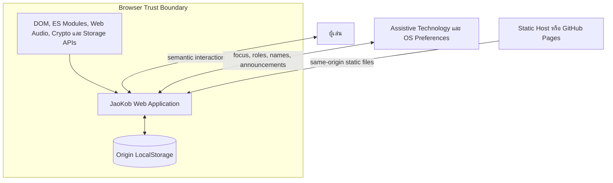
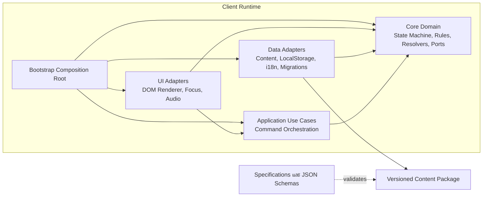
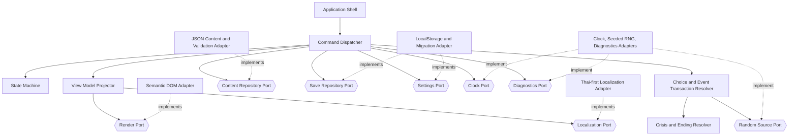
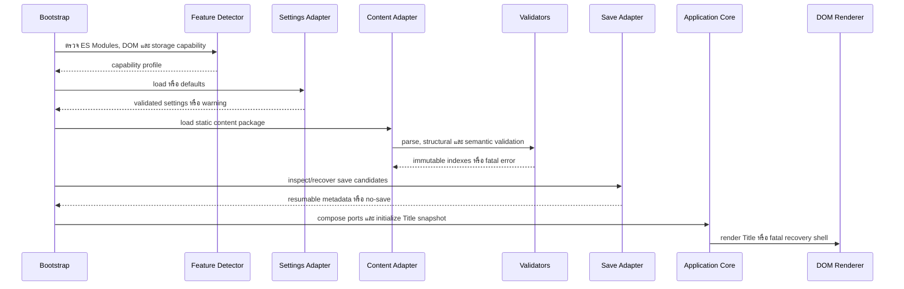
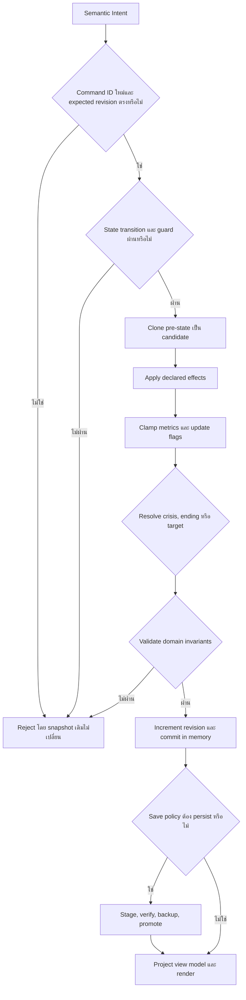
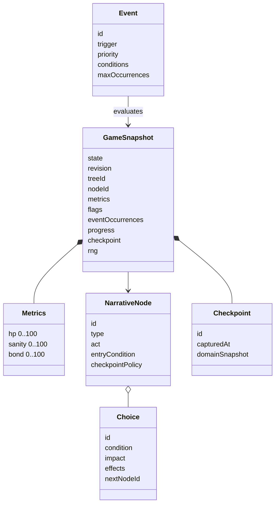
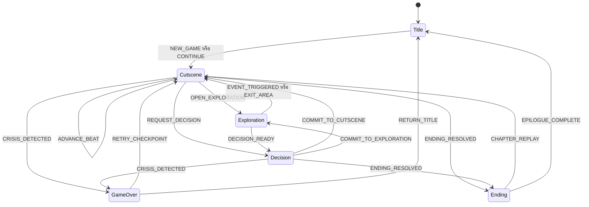
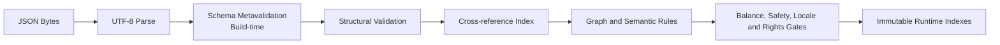
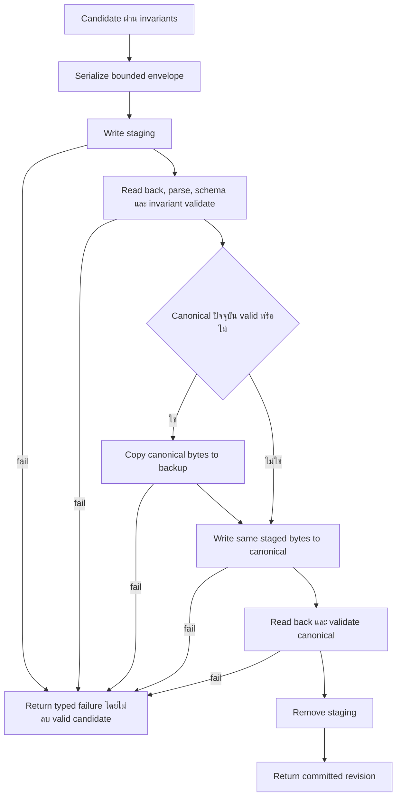

# Architecture Blueprint

## 1. การควบคุมเอกสาร

| รายการ | ค่า |
|---|---|
| โครงการ | JaoKob หรือ เจ้ากบ |
| รหัสเอกสาร | `JKB-P0-ARCH-001` |
| เวอร์ชัน | `0.1.0` |
| สถานะ | Proposed Phase 0 Baseline |
| เจ้าของเอกสาร | Senior Software Architect |
| ผู้ร่วมทบทวน | Game Design, Narrative, Accessibility, QA, Security และ DevOps |
| ขอบเขต | Target Architecture สำหรับ Phase 1 และ evolutionary boundary สำหรับระยะถัดไป |

เอกสารนี้กำหนดโครงสร้างและสัญญาการทำงาน ยังไม่อนุญาตให้สร้าง Source Code ของเกมใน Phase 0 แผน path เป็น target state ไม่ใช่คำสั่งให้สร้างไฟล์ว่าง

## 2. เป้าหมายสถาปัตยกรรม

1. ทำให้ Core Rules ทดสอบได้โดยไม่มี DOM, LocalStorage, network หรือเวลาจริง
2. ทำให้เนื้อหาและบทสนทนาเพิ่มได้ผ่าน JSON โดยไม่แก้ Engine Core
3. ทำให้ทุก transition, choice, event และ migration deterministic และตรวจสอบย้อนกลับได้
4. ให้ DOM Renderer เป็น adapter แรกและเปลี่ยนเป็น Canvas/WebGL ได้โดยไม่เปลี่ยน domain rules
5. ป้องกัน save corruption และรักษา settings ล่าสุดเมื่อลองใหม่หรือ migrate
6. ใช้ภาษาไทยเป็นฐานโดยไม่ฝังข้อความหรือ locale concern ใน logic
7. รองรับ mobile-first, accessibility, static hosting, no login และ no telemetry
8. ให้ AI Agent ทำงานใน loop ที่ schema, tests, traceability และ quality gate เป็นข้อบังคับ

## 3. Architecture Drivers

| Driver | Requirement หลัก | ผลต่อสถาปัตยกรรม |
|---|---|---|
| JSON-driven narrative | `FR-CNT-*`, `DR-*` | Content Repository, schema registry, semantic graph validator |
| Deterministic gameplay | `FR-ENG-*`, `CON-006` | Pure transaction resolver, explicit priority, seeded ambient RNG |
| Renderer replaceability | `FR-UI-001`, `NFR-PO-003` | Render Port, immutable view model, UI intents |
| Local-only persistence | `FR-SAV-*`, `NFR-RL-*` | Versioned envelope, staging/backup, sequential migrations |
| Thai-first i18n | `FR-LOC-*` | Localized objects, fallback `th`, no display text as ID |
| Accessibility | `FR-ACC-*`, `NFR-US-005` | Semantic DOM adapter, focus controller, announcement queue |
| Static deployment | `CON-001` ถึง `CON-003`, `NFR-PO-002` | Relative URLs, no server runtime, no secret |
| Spec-driven AI loop | `NFR-MA-*`, `NFR-FS-001` | Stable IDs, machine-readable contracts, mandatory traceability |

## 4. สถาปัตยกรรมที่ตัดสินใจแล้ว

รายการ `ADR-P0-*` ต่อไปนี้เป็น proposed architecture decisions ภายใน Baseline Candidate ไม่ถือว่ามีสถานะ Accepted จนกว่าผู้มีอำนาจอนุมัติ Phase 0 และบันทึกสถานะตาม change-control process ระหว่างการทบทวนให้ใช้เป็น working baseline เพื่อรักษาความสอดคล้องของเอกสาร แต่ห้ามอ้างเป็นอำนาจเริ่ม Implementation

| Decision ID | การตัดสินใจ | เหตุผล | Consequence |
|---|---|---|---|
| `ADR-P0-001` | ใช้ Clean Architecture แบบ ports and adapters | ป้องกัน Core ผูก Browser และลดผลกระทบการเปลี่ยน UI/Data | ต้องมี composition root และ import boundary tests |
| `ADR-P0-002` | ใช้ Pure HTML5, CSS3 และ ES6 Modules โดยไม่มี runtime framework | สอดคล้อง baseline, static hosting และลด supply-chain surface | ทีมต้องออกแบบ lifecycle/render orchestration เองอย่างมีขอบเขต |
| `ADR-P0-003` | Content เป็น JSON Package ที่ immutable ต่อ session | ให้ narrative/AI เปลี่ยน content โดยไม่แก้ engine และป้องกัน index เปลี่ยนกลาง transaction | Content update มีผลเมื่อเริ่ม session/load package ใหม่ |
| `ADR-P0-004` | State transition และ effect resolution เป็น deterministic pure operations | รองรับ replay, save/load, tests และ debugging | Wall-clock/locale/frame rate ห้ามมีผลต่อ gameplay |
| `ADR-P0-005` | DOM Renderer เป็น adapter แรก | Semantic HTML เหมาะกับภาษาไทยและ assistive technology | View model ต้องไม่บรรจุ DOM node หรือ CSS selector |
| `ADR-P0-006` | Persistence ใช้ LocalStorage ผ่าน adapter เดียว | Zero-cost, no login และใช้งานง่าย | ต้องยอมรับ quota/private mode/tampering และ synchronous I/O |
| `ADR-P0-007` | ใช้ staging, canonical และ backup candidate | LocalStorage ไม่มี transaction/rename แบบ atomic | Write amplification เพิ่มเล็กน้อยและต้องจำกัด payload |
| `ADR-P0-008` | ภาษาไทย `th` เป็น required fallback ในทุก localized object | ป้องกัน blank UI และรักษาภาษาต้นฉบับ | Content ที่ไม่มี `th` ไม่ผ่าน schema |
| `ADR-P0-009` | Schema canonical ID อยู่ใต้ GitHub Pages URL ของ repository | ใช้ identifier ที่มีที่มาโครงการชัดและ relative refs resolve ได้ | Runtime ไม่ต้อง fetch URL; validator ต้องมี local registry |
| `ADR-P0-010` | ไม่มี telemetry และไม่มี runtime secret | Privacy, cost และ threat surface ต่ำ | Product analytics ใช้ consented playtest แยกจาก production |
| `ADR-P0-011` | Optional save digest ตรวจ accidental corruption เท่านั้น | เพิ่มสัญญาณตรวจไฟล์เสียโดยไม่กล่าวอ้าง security เกินจริง | Local user ยังแก้ save ได้และเป็นขอบเขตที่ยอมรับ |
| `ADR-P0-012` | Pause และ Settings เป็น overlay นอก state machine หลัก | ป้องกัน state explosion และรักษา domain invariant | Overlay controller ต้องห้ามส่ง gameplay command ขณะ modal |

หลัง Baseline ได้รับอนุมัติ Decision ที่เปลี่ยน dependency direction, state set, save envelope หรือ schema compatibility ต้องสร้าง ADR/RFC ใหม่ ไม่แก้ความหมาย Decision ID เดิมย้อนหลัง

## 5. System Context

Static Host ไม่ประมวลผล business rule และไม่รับ save data Network หลังโหลด resource เป็น untrusted availability dependency แต่ไม่ใช่ state authority

## 6. Logical Architecture และ Dependency Rule

ลูกศรหมายถึง source dependency Core ห้าม import จาก Application, UI, Data, Browser API หรือ content files Application รู้จักเฉพาะ domain types และ ports UI/Data implements ports หรือเรียก application boundary เท่านั้น Bootstrap เป็นพื้นที่เดียวที่รู้จัก concrete implementations ทั้งหมด

### 6.1 Layer Responsibilities

| Layer | Target path | หน้าที่ | ห้ามทำ |
|---|---|---|---|
| Specifications | `docs/`, `specs/` | Normative requirements, schemas, contracts, decisions | มี executable gameplay logic |
| Core Domain | `src/core/domain/` | Entities, values, metrics, flags, invariants | Browser/DOM/storage/localization concern |
| State Machine | `src/core/state-machine/` | Transition table, guards, state entry/exit semantics | Render หรือ persist โดยตรง |
| Core Use-case Contracts | `src/core/ports/` | Interfaces และ typed outcomes | Import concrete adapter |
| Application | `src/core/use-cases/` | Orchestrate command, transaction, save, render intent | รู้ DOM selector หรือ LocalStorage key |
| Events | `src/core/events/` | Event eligibility, priority, occurrence, resolution | Execute content as code |
| UI Adapters | `src/ui/` | DOM render, focus, keyboard/touch, announcements, audio | Parse content หรือแก้ domain state |
| Data Adapters | `src/data/` | Content load/index, schema/semantic validation, storage, migration, locale | Import UI หรือ expose raw LocalStorage object |
| Bootstrap | `src/bootstrap/` | Feature detection, adapter selection, wiring, startup | มี game/narrative rules |

### 6.2 Dependency Matrix

| From \ To | Core | Application | UI | Data | Browser API |
|---|:---:|:---:|:---:|:---:|:---:|
| Core | ได้ | ไม่ได้ | ไม่ได้ | ไม่ได้ | ไม่ได้ |
| Application | ได้ | ได้ | ไม่ได้ | ไม่ได้โดยตรง | ไม่ได้ |
| UI | ได้ | ได้ | ได้ | ไม่ได้ | ได้เฉพาะ UI concern |
| Data | ได้ | ไม่ควร | ไม่ได้ | ได้ | ได้เฉพาะ adapter concern |
| Bootstrap | ได้ | ได้ | ได้ | ได้ | ได้ |

Application เรียก Data ผ่าน port ที่ประกาศด้านใน ไม่ import implementation การบังคับ matrix ต้องใช้ static import rule ใน Phase 1

## 7. Component View

### 7.1 Component Contracts

| Component | Input | Output | Invariants/Failure |
|---|---|---|---|
| Command Dispatcher | Intent, command ID, expected revision | Accepted result หรือ typed rejection | Serial ต่อ session; duplicate command ไม่ commit ซ้ำ |
| State Machine | Current state, event, immutable snapshot | Transition plan | Guard ไม่มี side effect; invalid pair คืน `INVALID_TRANSITION` |
| Transaction Resolver | Valid action/event และ pre-state | Candidate state กับ feedback | All-or-nothing; metrics clamp; effect conflicts ถูกปฏิเสธก่อน runtime |
| Crisis Resolver | Candidate metrics, Story Assist | Crisis, recovery หรือ continue outcome | HP priority before Sanity; Assist clamp at 1 |
| Ending Resolver | Candidate state และ final context | Ending ID, repair target หรือ continue | ลำดับ Canon ก่อน reflective ตาม truth table |
| View Model Projector | Domain snapshot, content refs, settings | Immutable localized-independent view model | ไม่ expose hidden Bond หรือ unavailable secret |
| Content Adapter | Static JSON package | Validated immutable indexes | Parse/schema/reference/graph fail ต้อง block startup |
| Storage Adapter | Save/settings command | Typed success/failure/recovery report | ไม่ throw raw browser exception ข้าม port |
| DOM Adapter | View model และ focus directive | Semantic intent events | Content เป็น text ไม่ใช่ HTML; action maps เป็น stable command |

## 8. Port Specifications

Port เป็น conceptual contract ใน Phase 0 ชื่อ operation อาจปรับตามภาษาการนำไปใช้ แต่ behavior และ failure semantics เป็น normative

| Port | Operations ที่ต้องมี | Success contract | Failure contract |
|---|---|---|---|
| `ContentRepositoryPort` | load package, get tree/node/dialogue/event/character/asset, resolve entry | คืน immutable entity/index ภายใต้ content version เดียว | `CONTENT_PARSE`, `CONTENT_SCHEMA`, `CONTENT_REFERENCE`, `CONTENT_VERSION` |
| `SaveRepositoryPort` | recover candidates, load, stage, commit, checkpoint, clear with consent | คืน cloned validated envelope และ recovery provenance | `SAVE_PARSE`, `SAVE_SCHEMA`, `SAVE_MIGRATION`, `STORAGE_UNAVAILABLE`, `STORAGE_QUOTA` |
| `SettingsRepositoryPort` | load defaults/current, validate, save | คืน settings ล่าสุดที่ผ่าน common schema | ใช้ defaults ใน memory พร้อม visible warning |
| `RenderPort` | render, set busy, announce status, apply focus directive, show fatal shell | DOM commit สำเร็จโดยไม่แก้ domain state | `RENDER_FAILURE` พร้อม preserve snapshot |
| `LocalizationPort` | resolve localized text, format number/time, check coverage | คืน requested locale หรือ fallback `th` เสมอ | `LOCALIZATION_MISSING` หาก `th` ขาด ใช้ system-safe message |
| `ClockPort` | current instant, elapsed monotonic duration | ใช้เฉพาะ metadata/performance | ห้ามใช้กำหนด choice result |
| `RandomSourcePort` | initialize seed, next ambient value, snapshot/restore | ทำซ้ำได้จาก algorithm/seed/state | ห้ามถูกเรียกจาก critical gameplay resolver |
| `DiagnosticsPort` | record category, code, requirement ID, safe context | ไม่มี PII/raw save/dialogue dump; production bounded | Failure ของ diagnostics ห้ามกระทบเกม |

ทุก port operation ที่มี side effect ต้องคืน typed result ห้ามใช้ exception เป็น expected control flow Application เป็นผู้แปลง failure เป็น recovery action และข้อความ localized

## 9. Runtime Startup และ Data Flow

### 9.1 Bootstrap Sequence

Feature Detector ห้ามเขียน browser fingerprint และห้ามส่งข้อมูลออกนอกเครื่อง Save migration ไม่ทำอัตโนมัติระหว่างเพียงแสดง Title metadata เว้นแต่จำเป็นเพื่อพิสูจน์ว่า Continue ใช้ได้ การ promote migrated save เกิดเมื่อผู้เล่นเลือก Continue หรือ policy ที่ได้รับอนุมัติ

### 9.2 Command Processing

หาก persistence ล้มเหลวหลัง in-memory commit Application ไม่ย้อนผลที่ผู้เล่นเห็น แต่ต้องตั้ง session เป็น `persistence-degraded`, แจ้งทันที และคง candidate ใน memory เพื่อ retry ที่ checkpoint ถัดไป หาก renderer ล้มเหลว domain snapshot ที่ commit แล้วต้องคงอยู่และแสดง minimal recovery shell

## 10. Domain Model

Domain objects ห้ามมี localized string, DOM node, LocalStorage key หรือ asset URL โดยตรง Domain เก็บ stable IDs และค่ากติกา View Model Projector จึง resolve content/localization ภายหลัง

## 11. State Machine Specification

### 11.1 Formal Model

กำหนด State Machine เป็น `M = (S, E, G, A, delta)` โดย

- `S = {Title, Cutscene, Exploration, Decision, GameOver, Ending}`
- `E` คือชุด semantic commands และ internal completion events ที่ระบุใน transition table
- `G(s,e,x)` คือ pure guard บน immutable snapshot `x`
- `A(s,e,x)` สร้าง candidate snapshot และ declared effects แบบ atomic
- `delta(s,e,x)` เป็น partial deterministic function หากไม่มี transition ที่ตรงให้คืน `INVALID_TRANSITION`

สำหรับ tuple `(state, event, snapshot revision)` เดียวกันต้องมี transition ได้สูงสุดหนึ่งรายการ Event priority ใช้เฉพาะ Event Resolver และไม่ใช้เลือก state transition ที่กำกวม

### 11.2 State Diagram

`CHAPTER_REPLAY` รองรับ action ที่ GDD กำหนดสำหรับ Ending และต้องโหลด approved replay checkpoint ผ่าน recovery Cutscene ก่อนเข้าสู่ node ปลายทาง หาก Product Owner ต้องการให้ Ending กลับ Title เท่านั้น ให้ปิด transition นี้ด้วย Change Request ไม่ลบ ID

### 11.3 Transition Table

| ID | Source | Event | Guard | Atomic actions | Target | Failure behavior |
|---|---|---|---|---|---|---|
| `TR-001` | Initial | `BOOT_COMPLETED` | Content valid และ application composed | สร้าง Title snapshot, render menu | `Title` | Fatal recovery shell |
| `TR-002` | `Title` | `NEW_GAME` | Confirmation complete และ entry refs valid | สร้าง defaults, checkpoint, revision 1 | `Cutscene` | คง Title และแจ้ง error |
| `TR-003` | `Title` | `CONTINUE` | มี compatible recovered save | Migrate/validate, overlay latest settings, สร้าง resume bridge | `Cutscene` | คง Title และเสนอ recovery |
| `TR-004` | `Cutscene` | `ADVANCE_BEAT` | ยังมี dialogue/timeline item และ input unlocked | Mark viewed, advance cursor, optional save | `Cutscene` | Ignore duplicate; คง cursor |
| `TR-005` | `Cutscene` | `OPEN_EXPLORATION` | Target node type exploration และ entry condition true | Complete current node, enter target, apply valid on-enter effects | `Exploration` | Rollback และ content error |
| `TR-006` | `Cutscene` | `REQUEST_DECISION` | Target node type decision มี eligible choice อย่างน้อยสองรายการตาม content rule | Complete current node, enter target, project choices | `Decision` | Rollback; no-eligible-exit error |
| `TR-007` | `Cutscene` | `CRISIS_DETECTED` | Story Assist ปิด และ HP=0 หรือ Sanity=0 | Set crisis reason โดย HP priority, persist safe state | `GameOver` | Invariant failure rollback |
| `TR-008` | `Cutscene` | `ENDING_RESOLVED` | Final context และ resolver คืน Ending ID | Mark ending, persist progress, enter ending node | `Ending` | Insert repair/continue หรือ rollback |
| `TR-009` | `Exploration` | `EVENT_TRIGGERED` | Event eligible, occurrence ต่ำกว่า max, target cutscene valid | Commit observation/event intent, enter cutscene | `Cutscene` | Reject event, remain exploration |
| `TR-010` | `Exploration` | `EXIT_AREA` | Exit interaction guard true และ target cutscene | Commit interaction effects และ target | `Cutscene` | Guard rejection ไม่มี side effect |
| `TR-011` | `Exploration` | `DECISION_READY` | Target decision valid และ entry condition true | Complete exploration node, enter decision | `Decision` | Remain exploration พร้อม safe hint |
| `TR-012` | `Decision` | `COMMIT_CHOICE` | Choice eligible, command/revision ใหม่, target cutscene, no crisis/ending | Apply choice transaction, feedback, checkpoint policy | `Cutscene` | Rollback all และ unlock input |
| `TR-013` | `Decision` | `COMMIT_CHOICE` | เหมือน `TR-012` แต่ target exploration | Apply choice transaction และ enter target | `Exploration` | Rollback all และ unlock input |
| `TR-014` | `Decision` | `CRISIS_DETECTED` | Choice transaction ทำ HP/Sanity ถึง 0 และ Assist ปิด | Commit effects, set crisis reason, save | `GameOver` | Rollback หาก postcondition fail |
| `TR-015` | `Decision` | `ENDING_RESOLVED` | Choice ผ่าน final gate หรือ repair completed | Commit effects/progress, save ending | `Ending` | Rollback/repair ตาม resolver |
| `TR-016` | `GameOver` | `RETRY_CHECKPOINT` | Checkpoint valid และ content refs compatible | Restore checkpoint domain fields, overlay latest settings, enter recovery bridge | `Cutscene` | คง GameOver และเสนอ Title |
| `TR-017` | `GameOver` | `ENABLE_ASSIST_AND_RETRY` | Settings save สำเร็จหรือ memory setting accepted | Enable Assist, restore checkpoint, enter recovery bridge | `Cutscene` | คง GameOver พร้อม storage warning |
| `TR-018` | `GameOver` | `RETURN_TITLE` | ไม่มี active transaction | Persist latest recoverable state ตาม policy, clear transient UI | `Title` | แสดง warning แต่กลับ Title ได้ |
| `TR-019` | `Ending` | `EPILOGUE_COMPLETE` | Ending progress committed | Clear active presentation, retain completion index | `Title` | Retry persistence; domain result remains |
| `TR-020` | `Ending` | `CHAPTER_REPLAY` | Approved replay checkpoint exists | Clone replay snapshot, retain completed-content index/settings, bridge entry | `Cutscene` | Remain Ending และแสดง unavailable reason |

### 11.4 Node Type Mapping

| Narrative node `type` | Game state | Entry action |
|---|---|---|
| `cutscene` | `Cutscene` | Resolve dialogue IDs และ cursor โดยไม่ replay on-enter effect จาก resume |
| `exploration` | `Exploration` | Resolve description, hotspots/interactions และ spatial reading order |
| `decision` | `Decision` | Evaluate all choice conditions จาก snapshot เดียวและ derive unavailable state |
| `game-over` | `GameOver` | ใช้ crisis reason จาก Core ไม่เชื่อ content เพื่อกำหนด priority |
| `ending` | `Ending` | Verify ending ID ตรง resolver result และ persist once |

Entry/exit state ไม่ทำซ้ำเป็น text field ใน content เพราะ derive จาก node type และ target type เพื่อลดความขัดแย้ง Semantic Validator ต้องตรวจ mapping และบันทึก derived transition เป็น evidence

### 11.5 Overlay State

Overlay model แยกเป็น `closed`, `pause`, `settings`, `content-detail`, `dialogue-history`, `confirmation` โดยเปิดได้ครั้งละหนึ่ง modal overlay หรือเป็น nested flow ที่ประกาศชัด Overlay รับเฉพาะ navigation/settings command Gameplay command ถูกปฏิเสธขณะ modal เปิด ยกเว้น command ที่เป็นการยืนยัน choice ซึ่งสร้างก่อนเปิด confirmation และยังไม่ commit

## 12. Transaction, Guard และ Effect Semantics

### 12.1 Choice Transaction Order

1. ตรวจ command ID, expected revision, active state และ input lock
2. อ่าน immutable pre-choice snapshot
3. ประเมิน choice condition จาก snapshot นี้เท่านั้น
4. สร้าง candidate copy และรวบรวม effects
5. ใช้ metric effects แบบพร้อมกันและ clamp ที่ 0 ถึง 100
6. ใช้ flag effects ที่ผ่าน type registry
7. หาก Story Assist ปิด ให้ resolve HP=0 ก่อน Sanity=0; หากเปิดให้ clamp ทั้งสองที่อย่างน้อย 1 และเลือก recovery Cutscene
8. หากไม่ crisis ให้ resolve ending gate หรือ declared next node
9. ตรวจ domain invariants และ target entry condition
10. เพิ่ม revision, append bounded history, update checkpoint/progress ตาม policy และ commit in memory
11. Persist ตาม save policy แล้วส่ง feedback/view model

Effect conflict rules เป็น Semantic Validation ดังนี้

- ใน transaction เดียวกันห้ามมี `set-metric` มากกว่าหนึ่งรายการต่อ metric
- ห้ามผสม `set-metric` กับ `adjust-metric` บน metric เดียวกัน หากไม่มี Decision ใหม่กำหนด precedence
- `adjust-metric` หลายรายการรวมผลก่อน clamp และไม่ขึ้นกับลำดับ array
- ห้ามมี `set-flag`, `clear-flag` หรือ `adjust-flag` ที่ขัดกันบน flag เดียวกันใน transaction เดียว
- `adjust-flag` ใช้ได้เฉพาะ flag definition ชนิด integer
- `set-checkpoint` มีได้สูงสุดหนึ่งรายการและต้องตรง checkpoint policy ของ node

### 12.2 Event Resolution

Event ถูกประเมินเมื่อเกิด trigger boundary ที่ประกาศ เช่น state entered, node entered, choice committed, metric threshold หรือ flag changed Eligible events เรียงด้วย `priority` จากมากไปน้อย แล้ว stable `event.id` แบบ code-point ascending เมื่อ priority เท่ากัน

Critical gameplay event ใช้ transaction แยกหลัง command ก่อนหน้าคอมมิตสำเร็จแล้วและห้ามย้อนกลับไปเปลี่ยน guard ของ choice เดิม Event ที่อาจทำ crisis ต้องประกาศผลและผ่าน crisis resolver ใน event transaction ของตน ไม่มี event ลับที่ intercept GameOver หลังค่า 0 เว้นแต่ Story Assist policy

### 12.3 Invariants

| ID | Invariant |
|---|---|
| `INV-001` | Active game state มีค่าเดียวและอยู่ใน enum หกค่า |
| `INV-002` | `hp`, `sanity`, `bond` เป็น integer 0 ถึง 100 |
| `INV-003` | Current tree/node และ checkpoint references resolve ภายใต้ content version เดียว |
| `INV-004` | Flag ID unique และ value type ตรง registry |
| `INV-005` | Revision เพิ่มเมื่อ commit เท่านั้นและไม่ลดภายใน session |
| `INV-006` | Event occurrence ไม่เกิน `maxOccurrences` |
| `INV-007` | RNG algorithm/seed/state valid และไม่ใช้กับ critical result |
| `INV-008` | Story Assist และ UI settings ไม่อยู่ใน story flags |
| `INV-009` | GameOver มี crisis provenance; Ending มี resolver provenance |
| `INV-010` | Save/checkpoint ทุกชุด validate ได้ก่อน publish เป็น canonical |
| `INV-011` | Renderer และ locale switch ไม่เปลี่ยน domain snapshot |
| `INV-012` | Terminal resolution idempotent ต่อ command/revision |

Invariant ตรวจหลัง transaction และหลัง load/migration หาก fail ต้องไม่ commit candidate

## 13. Content และ Schema Architecture

### 13.1 Schema Catalog

| File | Canonical `$id` suffix | Aggregate/Entity |
|---|---|---|
| `common.schema.json` | `/common.schema.json` | Shared definitions |
| `character.schema.json` | `/character.schema.json` | Character catalog |
| `dialogue.schema.json` | `/dialogue.schema.json` | Dialogue catalog |
| `event.schema.json` | `/event.schema.json` | Event catalog |
| `narrative-tree.schema.json` | `/narrative-tree.schema.json` | One narrative tree |
| `content-package.schema.json` | `/content-package.schema.json` | Aggregate package |
| `save-state.schema.json` | `/save-state.schema.json` | Save envelope |

Canonical prefix คือ `https://t3thr.github.io/JaoKob/specs/schemas/` และเป็น identifier ไม่ใช่ runtime download location Dev-time/runtime validator ต้อง register local schema documents ตาม `$id` ก่อน resolve relative `$ref`

ทุก domain object ปิด unknown property ด้วย `additionalProperties: false` Dynamic locale keys ใช้ constrained `patternProperties` ร่วมกับ `additionalProperties: false` และต้องมี `th` Dynamic flag values ไม่ใช้ arbitrary object map แต่เป็นรายการ strict `{id,value}` เพื่อรักษาสัญญา

Validator configuration ต้องเปิด `format` assertion หรือใช้ explicit equivalent checks สำหรับ `date-time` และ `uri` ห้ามถือว่าการมี keyword `format` รับรองค่าดังกล่าวโดยอัตโนมัติในทุก implementation ของ Draft 2020-12

### 13.2 Validation Pipeline

| Stage | Environment | Failure consequence |
|---|---|---|
| Parse | Build และ runtime startup | Reject package |
| Schema metaschema และ `$ref` resolution | Build/CI | Block merge/release |
| Structural validation | Build และ runtime startup | Reject package/save |
| Semantic reference/uniqueness | Build และ runtime startup | Reject package/save |
| Graph/balance/locale/rights | Build/CI; critical subset runtime | Block release; runtime blocks incompatible package |
| Immutable index construction | Runtime startup | Fatal content error โดยไม่เริ่ม state |

JSON Schema ไม่สามารถพิสูจน์ว่า string ID ชี้ entity ที่มีอยู่หรือ node reachable ได้ จึงใช้ annotation `x-jaokob-reference` เป็น machine-readable target namespace Semantic Validator ต้องเดิน schema/result และตรวจ target registry ตาม annotation รวมกับกฎ `DR-001` ถึง `DR-012` ใน SRS

### 13.3 Version Model

| Version | Owner | เปลี่ยนเมื่อ | Compatibility |
|---|---|---|---|
| Schema Version | Data contract | field/type/validation semantics เปลี่ยน | Semantic Versioning |
| Content Version | Narrative package | dialogue, balance, graph หรือ asset manifest เปลี่ยน | Save compatibility table |
| Save Format Version | Persistence contract | serialized envelope/payload เปลี่ยน | Integer sequential migration |
| Application Version | Release artifact | shipped behavior/artifact เปลี่ยน | Trace ถึง schema/content versions |

Schema Major ไม่จำเป็นต้องเท่ากับ Save Format Version Migration mapping ต้องระบุ source save, source content, target save, target content และ ID remaps โดยชัดเจน

### 13.4 Content Authoring Rules สำหรับ AI Agent

1. โหลด GDD, Narrative Bible, SRS, Architecture และ schemas เวอร์ชัน baseline ก่อนเสนอ content
2. ใช้ ID registry เดิมและห้ามสร้าง effect/flag/ending type ใหม่โดยไม่มี Change Request
3. สร้างหรือแก้ fixture และ traceability พร้อม content record
4. รัน structural, semantic, graph, balance, locale และ safety gates
5. Human review ภาษาไทย callback ความอ่อนไหว และ Canon เป็นเงื่อนไข merge
6. Content ที่ schema-valid แต่ graph/balance/safety fail ถือว่าใช้ไม่ได้

## 14. Persistence Architecture

### 14.1 Storage Keys

Persistence Adapter เป็นผู้เดียวที่รู้ key ต่อไปนี้

| Key | Content | Retention |
|---|---|---|
| `jaokob:save:canonical` | Save Envelope ล่าสุดที่ promote แล้ว | จนผู้เล่นยืนยัน reset/ล้าง site data |
| `jaokob:save:staging` | Candidate ระหว่าง write | ลบหลัง verify/promote; ใช้ recovery เมื่อ crash |
| `jaokob:save:backup` | Canonical valid ก่อนหน้าการ promote | หมุนหนึ่งรุ่น baseline |
| `jaokob:settings` | Settings envelope ล่าสุด | ไม่ย้อนเมื่อ retry checkpoint |

ห้าม enumerate แล้วแก้ทุก LocalStorage key ห้ามใช้ locale, user input หรือ content ID ประกอบ key และห้ามเก็บ raw DOM/UI cache ใน save

### 14.2 Save Envelope

Root เก็บ save format version, content version, revision, timestamps, reason, payload, settings snapshot และ optional integrity digest Payload เก็บ current state/tree/node, metrics, flags, occurrences, progress, bounded action history, checkpoint snapshot และ seeded RNG

`settings` ใน save เป็น compatibility snapshot ไม่ใช่ authority เมื่อตอน load/retry Adapter ต้องใช้ `jaokob:settings` ที่ valid และ revision ใหม่กว่าเป็นค่าปัจจุบัน หาก settings key เสียจึง fallback ไป save snapshot แล้ว defaults ตามลำดับ

Checkpoint ต้องสำเนา domain fields ที่ต้องย้อน ได้แก่ tree/node/state, metrics, flags, event occurrences และ RNG Progress completion index แยกจาก checkpoint เพื่อให้ chapter replay/retry ไม่ลืมเนื้อหาที่ดูแล้วตาม policy Settings ไม่อยู่ใน checkpoint

### 14.3 Crash-tolerant Write Protocol

LocalStorage operation เป็น synchronous และแต่ละ `setItem` อาจ throw ขั้นตอนจึงต้องแยก fault injection ได้ หากเขียน staging ไม่ได้ ห้ามแตะ canonical หาก backup เขียนไม่ได้ ห้าม promote candidate baseline นี้ให้ความสำคัญกับ recoverability มากกว่าการบันทึกล่าสุด

### 14.4 Recovery Selection

1. อ่าน canonical, staging และ backup แบบแยก exception
2. Parse แต่ละ candidate โดยไม่ mutate
3. Reject candidate ที่ schema invalid, invariant invalid, future format unsupported หรือ content mapping ไม่มี
4. Migrate candidate ใน memory ทีละ version และ validate หลังแต่ละ step
5. เลือก revision สูงสุด; เมื่อเท่ากันใช้ priority canonical, staging, backup
6. แสดง provenance ของ candidate ใน diagnostic ที่ปลอดภัย
7. Promote recovered candidate ด้วย write protocol ปกติหลังผู้เล่น Continue สำเร็จ ห้ามลบ raw candidates ก่อนนั้น

Timestamp ไม่ใช้ตัดสินแทน revision เพราะนาฬิกาเครื่องอาจย้อนหรือถูกแก้ Optional digest ใช้คัด candidate ที่เสียโดยอุบัติเหตุ แต่ digest mismatch ไม่ให้สิทธิ์ลบข้อมูลอัตโนมัติ

### 14.5 Migration Contract

Migration `n -> n+1` ต้องเป็น pure deterministic transform รับ cloned source และ context version map คืน new object หรือ typed failure ห้ามข้าม version ห้าม downgrade และห้ามเขียน LocalStorage ระหว่าง step

แต่ละ step ต้องมี

- source/target save format และ content compatibility
- field defaults พร้อมเหตุผล
- renamed/removed ID map
- invariant/schema validation
- valid legacy, boundary, corrupt และ idempotence fixtures
- rollback policy ซึ่ง baseline คือเก็บ raw source และ canonical เดิม

Future unsupported version ต้องไม่ถูก parse แบบ best effort หรือ overwrite

### 14.6 Storage Failure Modes

| Failure | Required behavior |
|---|---|
| API unavailable/private restriction | ใช้ memory-only repository และแจ้ง persistence limitation |
| Quota on staging | คง canonical, ลด nonessential in-memory history สำหรับ candidate ถ้านโยบายอนุญาต แล้วให้ retry |
| Quota on backup | ไม่ promote; คง canonical และ staging valid |
| Canonical corrupt | ลอง staging/backup; ไม่ลบ raw canonical |
| All candidates corrupt | เสนอ New Game, reset แบบยืนยัน และ diagnostic summary |
| Settings corrupt | fallback save snapshot แล้ว defaults; story state ไม่เปลี่ยน |
| Page closes mid-write | startup recovery เลือก candidate ตาม revision/priority |

## 15. Error Architecture และ Resilience

### 15.1 Error Envelope

Typed error ต้องมี `category`, stable `code`, safe `messageKey`, `requirementId`, optional data path, recoverability และ cause class ที่ไม่ serialize raw secret/content ผู้ใช้เห็น localized action message ส่วน developer diagnostics แยกจาก UI

### 15.2 Error Boundaries

| Boundary | Catches | Safe state |
|---|---|---|
| Bootstrap | feature/content/composition failure | Fatal recovery shell นอก gameplay state |
| Command | guard/effect/invariant failure | Pre-command snapshot |
| Persistence | storage/parse/migration failure | In-memory snapshot และ latest valid candidate |
| Renderer | DOM/focus/audio failure | Committed domain snapshot และ minimal shell |
| Localization | missing locale/text | Thai fallback หรือ built-in system-safe message |

Fatal recovery shell ไม่เพิ่ม state ที่เจ็ด เป็น presentation mode รอบ snapshot ล่าสุด ผู้ใช้ทำได้เฉพาะ retry render, return/reload และอ่านข้อความช่วยเหลือ ห้ามรับ gameplay intent

### 15.3 Idempotency และ Concurrency

Browser main thread ยังเกิด re-entrant input, lifecycle event และ async asset completion ได้ Command Dispatcher ต้อง serialize gameplay command หนึ่งรายการ ใช้ `commandId` กับ `expectedRevision`, lock UI และ ignore duplicate delivery Save commit หนึ่งรายการต่อ revision การเปลี่ยน tab visibility อาจขอ lifecycle save แต่ห้ามแทรกระหว่าง transaction

## 16. Security, Privacy และ Threat Model

### 16.1 Trust Boundaries

- Static files อาจเสียหายจาก deployment/supply chain จึงตรวจ content ก่อนใช้
- LocalStorage ผู้ใช้และ extension แก้ได้ จึงเป็น untrusted input
- Narrative/localization string เป็น untrusted display data ไม่ใช่ trusted HTML
- Asset paths ต้องผ่าน manifest allowlist และ same-origin resolution
- Browser/host availability เป็น external dependency แต่ไม่มี runtime secret

### 16.2 Threats และ Controls

| Threat | Attack/Failure path | Preventive control | Detective/Recovery control |
|---|---|---|---|
| Content XSS | Dialogue มี HTML/script/URL | Render ด้วย text APIs, CSP, no `innerHTML`, no executable effect | Injection fixtures และ DOM security tests |
| Data-driven code execution | Unknown effect หรือ expression | Effect enum/allowlist, `additionalProperties:false`, no eval/dynamic import | Schema/semantic gate blocks package |
| LocalStorage tampering | Metrics/flags/node ถูกแก้ | Full schema/reference/invariant validation | Reject candidate, recover backup, explicit reset |
| Path traversal/external fetch | Asset path มี `../` หรือ scheme | Schema path pattern, same-origin asset resolver | Manifest/Network inspection |
| Storage exhaustion | Oversized save/history | 250 KB budget, bounded arrays, stage first | Quota handling และ memory-only mode |
| Supply-chain compromise | Runtime dependency/action เปลี่ยน | No runtime packages baseline; reviewed/pinned CI tools | SBOM/tool lock review เมื่อมี dev dependencies |
| UI redress/clickjacking | เกมถูก embed | Hosting headers/CSP `frame-ancestors` เมื่อ host รองรับ; ไม่มี high-value action | Deployment header review |
| Privacy leakage | Telemetry, logs, URL query | No telemetry, no PII, safe diagnostics, no save in URL | Network test ต้องไม่มี third-party request |
| Asset rights failure | Reference image เข้า build | Provenance manifest และ IP gate | Release scan blocks unapproved asset |

### 16.3 Privacy Model

ข้อมูลที่เก็บมีเฉพาะ game state, settings, progress และ technical version metadata ใน origin LocalStorage ไม่มี user identifier, account, contact, precise device data หรือ cross-site identifier ระบบไม่มี consent banner สำหรับ analytics เพราะไม่มี analytics หากเพิ่ม export/import หรือ telemetry ในอนาคตต้องมี threat/privacy review และ SRS Change Request

LocalStorage ไม่เข้ารหัสและผู้ใช้ที่เข้าถึง browser profile อ่านได้ จึงห้ามเก็บข้อมูลลับหรือข้อมูลส่วนบุคคล การล้าง site data อาจลบ save และต้องอธิบายในหน้า Help/Settings

## 17. Accessibility Architecture

| Concern | Architecture mechanism | Verification |
|---|---|---|
| Semantic structure | DOM Adapter ใช้ landmarks, headings, lists, buttons, dialogs ตามหน้าที่ | DOM inspection และ accessibility tree |
| Input equivalence | Intent mapper รวม keyboard, touch, pointer เป็น command เดียว | Contract/E2E tests เปรียบเทียบ result |
| Focus | Focus directive เป็นส่วนของ render result; restore logical focus หลัง overlay | Keyboard และ screen-reader manual tests |
| Announcements | Bounded status queue แยก polite save/meter จาก assertive fatal error | Announcement count/order tests |
| Text scale/Thai | CSS logical properties, responsive grid, system font fallback, no fixed text height | 200 percent zoom และ Thai stress fixtures |
| Contrast | Semantic design tokens และ high-contrast theme | Automated contrast plus visual review |
| Motion | Motion policy อ่าน OS default และ user override; renderer เคารพ reduced mode | Screenshot/timing tests |
| Audio | Channel mixer adapter และ equivalent text/visual cue | Muted E2E path |
| Choice accessibility | Disabled choice ยังมี accessible name/reason และไม่เป็น action | Keyboard/screen-reader tests |

DOM replacement ด้วย Canvas/WebGL ในอนาคตยังต้องมี semantic companion DOM หรือ accessibility adapter ที่ให้ feature parity ก่อนเปิดใช้เป็น default Renderer Port เพียงอย่างเดียวไม่รับรอง accessibility จึงต้องผ่าน `A11Y-GATE` ใหม่

## 18. Performance Architecture

### 18.1 Budgets

| Budget | Target | Control |
|---|---:|---|
| Critical compressed transfer | ไม่เกิน 2 MB | Asset manifest และ bundle/report gate |
| HTML, CSS, JS, critical JSON compressed | ไม่เกิน 500 KB | Build artifact measurement |
| Choice feedback latency P95 | ไม่เกิน 100 ms | Pure resolver, bounded event set, render batching |
| Save candidate UTF-8 | ไม่เกิน 250 KB | Bounded history/progress และ size check ก่อน stage |
| Dialogue runtime history | 50 รายการล่าสุดขั้นต่ำและมี upper bound ที่กำหนด | Ring buffer ใน memory |
| Dynamic announcement queue | Bounded และ deduplicated | Drop superseded polite status ไม่ drop fatal message |

### 18.2 Strategies

- โหลด critical content ของ opening flow ก่อน และ media องก์ถัดไปเมื่อใกล้ใช้งาน
- สร้าง ID indexes ครั้งเดียวหลัง validation ไม่ scan arrays ทุก render
- ใช้ immutable snapshot แบบ structural sharing หรือ bounded copy โดยไม่ expose mutation
- รวม DOM writes ต่อ render pass และหลีกเลี่ยง layout read/write สลับกัน
- LocalStorage write เฉพาะ checkpoint, committed choice, settings, ending และ lifecycle boundary ตาม policy
- ไม่ใช้ timer/polling เพื่อ progression และหยุด nonessential animation เมื่อ page hidden
- Performance evidence ต้องระบุ device, browser, viewport, network, cache และ content version

## 19. Observability โดยไม่ใช้ Telemetry

Production diagnostics อยู่ใน memory แบบ bounded และ console เฉพาะระดับที่ policy อนุญาต ประกอบด้วย error code, requirement/transition ID, revision และ component category ห้ามเก็บ dialogue text, full flags/save, URL history หรือ device fingerprint

Test harness อาจเปิด deterministic trace ของ transition, guard, effects และ migration ด้วย fixture ที่ไม่มีข้อมูลบุคคล Trace ต้องปิดใน distributable production หรือเปิดเฉพาะ local debug configuration ที่ไม่ถูกควบคุมจาก content

## 20. Verification Architecture และ Automated Quality Gates

| Test class | Isolation | Coverage requirement |
|---|---|---|
| Domain unit/property | No DOM/storage | Metrics, flags, guard/effect boundaries; Core line 90 percent, branch 85 percent |
| State transition | In-memory ports | `TR-001` ถึง `TR-020`, allowed/guarded/forbidden 100 percent |
| Schema contract | JSON fixtures | ทุก schema valid/invalid และ unknown property |
| Semantic/graph | Content indexes | `DR-001` ถึง `DR-012`, all endings, no soft lock |
| Persistence | Fake/faulting storage | Round trip, every crash point, quota, candidates, versions |
| Migration | Pure fixtures | ทุก supported `n -> n+1`, source immutability, deterministic result |
| UI contract | Fake core/real DOM | View model mapping, input equivalence, focus, announcements |
| Accessibility | Real browser plus manual AT | Keyboard, screen reader smoke, zoom, contrast, reduced motion, touch |
| E2E | Static serving/browser | New Game, Continue, every Ending, GameOver/Assist/retry, locale/settings |
| Performance | Recorded profile | `NFR-PE-*` budgets |
| Security | Static/dynamic | XSS payload, path traversal, network, CSP, storage tamper |

Flaky test ห้าม retry จนเขียวโดยไม่มี nonconformance record Deterministic Core test ต้องไม่มี flaky allowance

## 21. Static Deployment Architecture

Release artifact ต้องใช้ relative หรือ base-aware URLs เพื่อทำงานใต้ `https://t3thr.github.io/JaoKob/` โดยไม่พึ่ง root path ไม่มี server rewrite ดังนั้น navigation baseline เป็น single document ไม่ใช้ deep-link route ที่ต้อง fallback server

Runtime ไม่มี environment secret Build/deployment workflow มีสิทธิ์อ่าน repository และ deploy Pages เท่าที่จำเป็นตาม Runbook Schema canonical URL ใช้เป็น identifier แม้ artifact ทดสอบใน localhost และ local resolver ต้องไม่บังคับ network fetch

Cache policy ต้องทำให้ HTML/manifest ตรวจ version ใหม่ได้และ versioned assets cache ระยะยาวได้ตาม capability ของ host Content/save compatibility ถูกตรวจเมื่อ startup ก่อน Continue ห้ามให้ stale content ใช้กับ save โดยไม่ผ่าน matrix

## 22. Evolution Paths

### 22.1 Canvas/WebGL Renderer

คง Core, Application, Content Package, Save และ Localization contracts แล้วสร้าง adapter ใหม่ที่ implement Render Port Input intent ยังต้อง map เป็น semantic command และมี DOM accessibility companion Feature flag เลือก renderer อยู่ที่ Bootstrap ไม่อยู่ใน Core

### 22.2 Locale เพิ่มเติม

เพิ่ม locale tag และ translations ใน localized objects, รัน coverage/Thai fallback gate และทดสอบ layout ไม่เปลี่ยน IDs, conditions, effects หรือ save ภาษาใน dialogue history เป็น presentation concern ส่วน settings locale persist แยก

### 22.3 Alternative Persistence

หาก LocalStorage ไม่พอ สามารถเพิ่ม IndexedDB adapter หลัง ADR โดยคง Save Repository Port และ Save Envelope Migration ต้องพิสูจน์ dual-read/single-write, rollback และ data export policy ก่อนเปลี่ยน default

### 22.4 Offline Installation

Service Worker/PWA ไม่อยู่ baseline การเพิ่มต้องมี cache invalidation, content/save compatibility, update prompt, storage quota และ security review ห้าม register service worker โดยเพียงหวังให้ offline ทำงาน

## 23. Risks และ Technical Debt Policy

| Risk ID | ความเสี่ยง | Control | Residual decision |
|---|---|---|---|
| `ARCH-RSK-001` | LocalStorage synchronous และ quota ไม่แน่นอน | Bounded payload, staged write, fault tests | ยอมรับสำหรับ baseline; monitor size |
| `ARCH-RSK-002` | JSON Schema ไม่ตรวจ graph/reference | Semantic validator และ `x-jaokob-reference` | Validator เป็น release-critical tool |
| `ARCH-RSK-003` | Branching content โตเกินทดสอบ | Convergence, path analysis, node budget | GDD/Production review ทุก act |
| `ARCH-RSK-004` | DOM rendering ผูกกับ state ผ่าน shortcut | Render port, immutable VM, import tests | ห้าม temporary bypass เข้า main |
| `ARCH-RSK-005` | Save/content version drift | Compatibility matrix, migrations, candidate recovery | Future version ไม่ auto-overwrite |
| `ARCH-RSK-006` | Thai layout และ screen reader แตกต่างตาม platform | System fonts, semantic DOM, manual matrix | Browser matrix ต้อง baseline ต่อ release |
| `ARCH-RSK-007` | Reference image/IP ถูกนำเข้าโดย Agent | Asset schema provenance และ IP gate | Original design เป็น default |
| `ARCH-RSK-008` | Overengineering ใน vanilla runtime | Narrow ports, no speculative adapters, vertical slice | ADR ทุก new abstraction |

Technical debt ที่ละเมิด dependency rule, accessibility path, save recoverability, security control หรือ traceability ห้าม defer ข้าม Release Candidate ส่วน debt อื่นต้องมี ID, owner, impact และ milestone

## 24. Architecture Conformance Matrix

| Requirement group | Components/decisions | Evidence |
|---|---|---|
| `FR-STA-*` | State Machine, `TR-001` ถึง `TR-020`, `ADR-P0-012` | Transition matrix tests |
| `FR-CNT-*`, `DR-*` | Content Adapter, schema registry, semantic/graph validators | Schema/graph fixtures |
| `FR-LOC-*` | Localization Port, Thai adapter, localized schemas | Locale fallback/layout tests |
| `FR-ENG-*` | Transaction, Event, Crisis, Ending resolvers | Unit/property/truth-table tests |
| `FR-UI-*`, `FR-ACC-*` | Render Port, DOM Adapter, Focus/Announcement controllers | UI/accessibility tests |
| `FR-SAV-*` | Save Port, write/recovery/migration pipeline | Fault and migration matrix |
| `NFR-PE-*` | Lazy media, indexes, bounded structures, render batching | Performance report |
| `NFR-SE-*` | Strict schemas, safe render, CSP/network policy, privacy model | Security and network tests |
| `NFR-MA-*` | Clean dependency rule, ports, stable IDs, gates | Import/coverage/traceability reports |
| `NFR-PO-*` | Static relative paths, adapters, browser matrix | Static deploy and browser tests |

## 25. Architecture Review Checklist

ก่อน Phase 1 baseline approval ต้องตอบ "ผ่าน" ทุกข้อ

1. Core dependency ไม่มี Browser/UI/Data implementation
2. Transition table ไม่มี ambiguous guard และครอบคลุม GDD action ทุก state
3. Choice/Event transaction order และ conflict rules ได้รับ Game Design approval
4. Schema `$id`, relative `$ref`, strict object และ semantic rules validate ได้ด้วย tool ที่เลือก
5. Save schema มี current state, full checkpoint, progress, settings snapshot, version และ recovery candidates ครบ
6. Retry overlay settings ล่าสุดและไม่ย้อน accessibility preference
7. Error path ทุก boundary มี safe state และ action ต่อผู้ใช้
8. Threat model ครอบคลุม content, storage, render, assets, deployment และ privacy
9. DOM adapter plan ครอบคลุม keyboard, focus, screen reader, zoom, motion, contrast และ audio equivalence
10. Performance/storage budgets มี test profile และ owner
11. Content/AI loop บังคับ traceability, fixtures, validation และ human review
12. ไม่มี Source Code ของเกมใน Phase 0

## 26. Open Architecture Decisions

| ID | ประเด็น | Working baseline | Owner/Gate |
|---|---|---|---|
| `ARCH-OD-001` | Dev-time JSON Schema validator | รองรับ Draft 2020-12, local registry และ custom annotation | Technical Lead, `SCHEMA-GATE` |
| `ARCH-OD-002` | Optional save digest canonicalization | `jaokob-canonical-json-v1` พร้อม SHA-256 หรือไม่ใช้จน contract พร้อม | Data/Security Lead |
| `ARCH-OD-003` | Settings envelope format | versioned wrapper ที่ validate `common/$defs/settings` | Data Lead ก่อน persistence implementation |
| `ARCH-OD-004` | Browser matrix versions | Baseline ณ Phase 1 kickoff และทบทวนต่อ release | QA/Product |
| `ARCH-OD-005` | Chapter replay transition | เปิด `TR-020` ตาม GDD โดยใช้ approved checkpoint | Game Director |
| `ARCH-OD-006` | Renderer error minimal shell | Semantic HTML ใน application shell โดยไม่เพิ่ม game state | UI/Accessibility Lead |

Open Decision ที่ block implementation ต้องปิดด้วย ADR หรือ approved note ก่อน Agent สร้าง module ที่เกี่ยวข้อง
