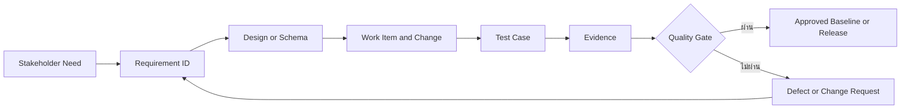
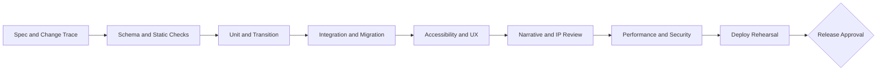

# JaoKob Verification, Traceability และ Quality Gates

รหัสเอกสาร: `JKB-P0-VVP-001`

เวอร์ชัน: `0.1.0`

สถานะ: Proposed Baseline for Owner Review

## 1. วัตถุประสงค์

เอกสารนี้เป็น Verification and Validation Plan ระดับโครงการ กำหนดว่าข้อกำหนด การออกแบบ เนื้อหา โค้ดในอนาคต และ release artifact ต้องมีหลักฐานใดจึงถือว่าผ่าน โดยแยกความหมายดังนี้:

- Verification: ตรวจว่าสิ่งที่สร้างตรงตามสเปก สัญญาข้อมูล และสถาปัตยกรรมหรือไม่
- Validation: ตรวจว่าสิ่งที่สร้างตอบโจทย์ผู้เล่นและรักษา emotional promise ของ JaoKob หรือไม่

Automated gate ลดข้อผิดพลาดที่ตรวจซ้ำได้ แต่ไม่แทน narrative review, usability playtest, assistive-technology test, IP clearance หรือการอนุมัติของเจ้าของโครงการ

## 2. Traceability Model



### 2.1 รหัสหลักฐาน

| Artifact | รูปแบบรหัส | ตัวอย่าง |
|---|---|---|
| Stakeholder need | `NEED-<DOMAIN>-NNN` | `NEED-NAR-001` |
| Functional requirement | `FR-NNN` หรือรูปแบบที่ SRS ประกาศ | `FR-012` |
| Non-functional requirement | `NFR-<QUALITY>-NNN` | `NFR-USA-003` |
| Architecture decision | `ADR-NNNN` | `ADR-0001` |
| Test case | `TC-<LEVEL>-NNN` | `TC-STATE-014` |
| Defect | `DEF-<DOMAIN>-NNN` | `DEF-DATA-004` |
| Change request | `CR-NNNN` | `CR-0012` |
| Evidence bundle | `EVD-<RELEASE>-<GATE>` | `EVD-0.2.0-A11Y` |

หาก SRS กำหนดรูปแบบ ID ละเอียดกว่านี้ ให้ SRS เป็น authoritative source และอัปเดตตัวอย่างในเอกสารนี้โดยไม่เปลี่ยนความหมายของ traceability chain

### 2.2 กฎ Traceability บังคับ

1. Requirement ทุกข้อต้องย้อนถึง stakeholder need, constraint หรือ risk อย่างน้อยหนึ่งรายการ
2. Requirement ทุกข้อต้องมี verification method อย่างน้อยหนึ่งวิธีจาก Test, Analysis, Inspection หรือ Demonstration
3. การแก้ implementation, content, schema, workflow หรือ production asset ต้องระบุ Requirement ID ที่ได้รับผลกระทบ
4. Test case ต้องระบุ precondition, input, expected result, requirement links และ evidence location
5. Requirement ที่ถูกยกเลิกต้องคง record พร้อมเหตุผล ผู้อนุมัติ และ replacement ID หากมี ห้ามนำ ID เดิมกลับมาใช้
6. การเปลี่ยน schema หรือ state transition ต้องแนบผล impact analysis ต่อ save compatibility, narrative reachability และ tests
7. Requirement ที่ไม่มี test เพราะยังไม่ถึง phase ต้องมี planned verification phase และ owner ไม่ถือว่าผ่านเพียงเพราะยังไม่มีโค้ด

## 3. Master Traceability Matrix ระดับ Capability

| Need หรือ Constraint | Design Authority | Requirement Family | Planned Verification | Gate |
|---|---|---|---|---|
| เกมเล่าเรื่องภาษาไทยที่อบอุ่นและมี happy ending | GDD, Narrative Bible | Narrative flow, ending, localization FRs | graph analysis, narrative rubric, owner playthrough | `NARRATIVE-GATE` |
| Choice-driven survival ที่ผลลัพธ์คาดการณ์ได้ | GDD, SRS, State Machine | choice, meters, flags, transitions FRs | unit, decision table, model-based transition tests | `CORE-GATE`, `STATE-GATE` |
| Mobile-first ทุกขนาดจอ | SRS, Architecture | usability, portability NFRs | viewport matrix, zoom/reflow, device demonstration | `UX-GATE` |
| ใช้ keyboard และ assistive technology ได้ | SRS, UI contracts | accessibility NFRs | automated scan และ manual screen-reader/keyboard test | `A11Y-GATE` |
| ไม่มี backend, login, monetization หรือ telemetry | Charter, SRS | constraints, privacy/security NFRs | architecture inspection, network observation, artifact scan | `SECURITY-GATE` |
| Save/Load ด้วย LocalStorage และ migration | SRS, Architecture, SaveState schema | persistence and recovery FRs | migration fixtures, quota/corruption fault injection | `SAVE-GATE` |
| JSON-driven content สำหรับ AI Agent | Schemas, Agent Guide | content validation FRs | metaschema, instance validation, reference and graph checks | `SCHEMA-GATE`, `GRAPH-GATE` |
| เปลี่ยน DOM renderer เป็น Canvas/WebGL ได้ | Architecture Blueprint | maintainability and portability NFRs | dependency inspection, adapter contract test | `ARCH-GATE` |
| GitHub Pages แบบ zero-cost | Deployment Runbook | deployment and operational requirements | clean-room deployment rehearsal, smoke and rollback test | `DEPLOY-GATE` |
| ไม่เผยแพร่ asset ที่ไม่มีสิทธิ์ | Charter, Narrative Bible, asset policy | legal and provenance constraints | manifest inspection and written approval | `IP-GATE` |
| AI Agent ทำงานตามสเปกเดียวกัน | AGENTS.md, Agent Guide, repo-local skill | process requirements | prompt simulation, diff inspection, traceability audit | `AI-GATE` |

## 4. Verification Levels

### 4.1 Specification Verification

ก่อนเริ่ม Source Code ต้องตรวจ:

- ทุกเอกสารมี identifier, version, status และ scope
- normative term ใช้สม่ำเสมอ
- ไม่มี requirement ที่รวมหลายพฤติกรรมจนทดสอบแยกไม่ได้
- acceptance criteria ระบุผลที่สังเกตได้และไม่ผูกกับ implementation โดยไม่จำเป็น
- state names, meter ranges, flag convention และ node types ตรงกันทุกเอกสาร
- local links และ Mermaid blocks ไม่เสีย
- Open Decisions ที่เป็น blocking มี owner
- เอกสารไม่อ้างว่าภาพแนบหรือ third-party asset ได้รับสิทธิ์แล้ว

### 4.2 Schema and Content Contract Verification

Pipeline ที่ต้องทำอัตโนมัติใน Phase 1:

1. ตรวจ JSON syntax
2. ตรวจ schema document กับ Draft 2020-12 metaschema
3. ตรวจทุก content instance กับ schema ที่ประกาศ
4. ตรวจ `$id` ไม่ซ้ำและ `$ref` resolve ได้จาก catalog โดยไม่พึ่ง network
5. ตรวจ identifier ไม่ซ้ำใน namespace เดียวกัน
6. ตรวจ reference integrity ของ character, dialogue, event, scene และ flag
7. ตรวจ narrative graph ว่า entry node มีจริง ทุก node เข้าถึงได้ edge ไม่ dangling และ terminal node ถูกชนิด
8. ตรวจ cycle ว่ามี exit และอยู่ใน policy ที่อนุมัติ
9. ตรวจทุก localized object มี `th` และ locale tags ถูกต้อง
10. ตรวจ choice ทุกข้อมี feedback และผลลัพธ์หรือปลายทางที่ชัดเจน

### 4.3 Unit Logic Verification

ขอบเขต unit tests:

- meter clamping ที่ช่วง 0 ถึง 100
- condition operators และ compound guards
- effect ordering และ flag mutation
- choice eligibility และ deterministic outcome
- trigger priority และ deduplication
- state transition guards และ invalid transition
- checkpoint selection และ GameOver retry
- serialization, deserialization และ validation
- migration ทีละ version และ migration ซ้ำโดยไม่เปลี่ยนผล
- localization fallback `requested locale -> th -> controlled missing-text result`

เกณฑ์ baseline สำหรับ Domain Core ใน Phase 1 คือ line coverage ไม่น้อยกว่า 90 เปอร์เซ็นต์และ branch coverage ไม่น้อยกว่า 85 เปอร์เซ็นต์ โดย transition, crisis/ending resolver และ migration cases ที่ประกาศต้องครอบคลุม 100 เปอร์เซ็นต์ พร้อม mutation หรือ boundary tests สำหรับกฎที่มีความเสี่ยงสูง Coverage ไม่ใช้แทน assertion quality

### 4.4 State Transition Verification

ต้องสร้าง transition matrix จาก state specification และทดสอบอย่างน้อย:

- ทุก allowed transition อย่างน้อยหนึ่งเส้นทาง
- ทุกคู่ state ที่ไม่อนุญาตต้องไม่เปลี่ยน state
- guard boundary ที่ 0, 1, threshold - 1, threshold, threshold + 1, 99 และ 100 ตามที่เกี่ยวข้อง
- priority เมื่อมี trigger มากกว่าหนึ่งรายการพร้อมกัน
- save point เกิดหลัง transition สำเร็จเท่านั้น
- reload จากทุก resumable state ให้ state และ context เท่าเดิม
- GameOver ไม่สามารถถูก serialize เป็น canonical ending
- Ending ต้องเข้าถึงได้จากเส้นทางที่ระบุในทุก narrative profile ที่อนุมัติ

### 4.5 Integration Verification

ทดสอบ port กับ adapter โดยใช้ contract เดียวกัน:

- Content repository ส่งข้อมูลที่ validate แล้วเท่านั้น
- Engine ส่ง ViewModel โดยไม่อ้าง DOM
- DOM renderer แสดง ViewModel และส่ง semantic intent กลับ application layer
- LocalStorage adapter แยก active, staging และ backup record
- Localization manager ไม่เปลี่ยน stable ID หรือ game rule
- composition root เป็นจุดเดียวที่ผูก concrete adapter
- module import graph ไม่ฝ่าฝืน dependency direction

### 4.6 Accessibility Verification

เป้าหมายคือ WCAG 2.2 Level AA สำหรับ game UI ที่อยู่ในขอบเขต ต้องมีทั้ง automation และ manual test:

| พื้นที่ | เกณฑ์ขั้นต่ำ |
|---|---|
| Keyboard | เริ่มเกม อ่านต่อ สำรวจ เลือก ติดตั้งค่า retry และกลับ Title ได้โดยไม่ใช้ pointer |
| Focus | ลำดับมีเหตุผล มองเห็นชัด ไม่สูญหายหลัง DOM update และถูกย้ายเมื่อเปิดหรือปิด overlay |
| Semantics | ใช้ native HTML ก่อน ARIA, meter มีชื่อ ค่า และคำอธิบาย, heading/landmark ถูกลำดับ |
| Dynamic update | สถานะสำคัญประกาศผ่าน live region ที่เหมาะสมโดยไม่อ่านซ้ำเกินจำเป็น |
| Visual | contrast ผ่านเกณฑ์ AA, ไม่ใช้สีอย่างเดียว, zoom 200 เปอร์เซ็นต์และ reflow ที่ 320 CSS pixels ใช้งานได้ |
| Motion | รองรับ `prefers-reduced-motion`; ไม่มี flash ที่เสี่ยงและตัด animation ที่ไม่จำเป็นได้ |
| Touch | เป้าหมาย interactive ของ JaoKob ต้องมีขนาดอย่างน้อย 44 by 44 CSS pixels ตาม SRS ซึ่งเข้มกว่าขั้นต่ำบางกรณีของ WCAG 2.2 AA |
| Language | document และข้อความเปลี่ยนภาษาระบุภาษาอย่างถูกต้อง; Thai line wrapping ไม่บดบังข้อมูล |
| Audio | ข้อมูลสำคัญไม่พึ่งเสียงอย่างเดียว; subtitle/transcript เมื่อมีเสียงพูดในอนาคต |

Manual matrix ขั้นต่ำต้องครอบคลุม keyboard-only, VoiceOver กับ Safari, NVDA กับ Firefox หรือคู่เทียบเท่าที่อนุมัติ และ mobile screen reader อย่างน้อยหนึ่งระบบใน release candidate

### 4.7 Responsive and Compatibility Verification

ทดสอบ portrait และ landscape ที่ความกว้างอ้างอิง 320, 360, 390, 768, 1024, 1440 และ 2560 CSS pixels พร้อม 200 เปอร์เซ็นต์ zoom จุดอ้างอิงไม่ใช่การอนุญาตให้ hard-code layout เฉพาะขนาด

Browser release matrix ต้องบันทึกเวอร์ชันจริง ณ วันที่ทดสอบและครอบคลุม engine ตระกูล Chromium, Firefox และ WebKit บน desktop รวมถึง Safari บน iOS และ Chrome บน Android ตาม support policy ใน SRS

### 4.8 Performance Verification

ใช้ cold-load, warm-load และ representative scene อย่างน้อยหนึ่งฉากต่อ node type เก็บค่า median และ percentile ที่ SRS กำหนด ตรวจ:

- initial transferred bytes แยก HTML, CSS, JS, JSON, image และ audio
- Largest Contentful Paint, Interaction to Next Paint และ Cumulative Layout Shift เมื่อเกี่ยวข้อง
- input-to-feedback latency ของ choice และ exploration
- transition time ระหว่าง scene
- long task และ memory growth หลังเล่นครบหนึ่งองก์
- save serialization/write latency และขนาด record
- asset ที่โหลดโดยไม่ใช้หรือข้าม content budget

Performance gate ต้องใช้ threshold ใน SRS เป็นเกณฑ์ ไม่ใช้คะแนนรวมจากเครื่องมือเพียงตัวเดียว

### 4.9 Save and Migration Verification

Fixture set ต้องมี:

- save ถูกต้องของทุก version ที่ยัง support
- ค่า meter ที่ขอบเขต
- flag collection ว่างและขนาดสูงสุด
- save ระหว่างแต่ละ resumable state
- unknown future version
- malformed JSON, missing field, unknown field และ invalid reference
- simulated quota exceeded, storage denied และ interrupted staged write
- content version ที่ node เดิมถูกย้ายหรือยกเลิก

Expected behavior ต้องไม่เขียนทับ active save จนกว่า migrated candidate จะ parse, validate และอ่านกลับสำเร็จ Failure ต้องแจ้งผู้เล่นด้วยภาษาที่เข้าใจได้ พร้อม retry, reset หรือ export/recovery option ตาม SRS โดยห้าม reset อัตโนมัติ

### 4.10 Narrative Validation

Narrative review ใช้ rubric 1 ถึง 5 และต้องได้อย่างน้อย 4 ในทุกแกน:

| แกน | คำถามตรวจ |
|---|---|
| Emotional coherence | ฉากยังสื่อความสูญเสีย ความหวัง และความอบอุ่นโดยไม่หักล้างกันหรือไม่ |
| Character integrity | การกระทำและเสียงของตัวละครสอดคล้องกับ Bible หรือไม่ |
| Player agency | ตัวเลือกแตกต่างเชิงความหมายและมี feedback โดยไม่สร้างทางเลือกหลอกหรือไม่ |
| Compassion | ระบบไม่ลงโทษความเมตตาอย่างไร้เหตุผลและมีทางฟื้นตัวหรือไม่ |
| Thai naturalness | ภาษาเป็นธรรมชาติ ระดับภาษาสม่ำเสมอ อ่านบนมือถือได้หรือไม่ |
| Continuity | flags, memory callbacks, act chronology และ transformation logic ไม่ขัดกันหรือไม่ |
| Content safety | คำเตือนและระดับรายละเอียดเหมาะกับกลุ่มอายุหรือไม่ |
| Ending promise | เส้นทางที่อนุมัติรักษา canonical sanctuary ending หรือไม่ |

ต้องทำ graph report แสดงจำนวน node/edge ต่อองก์ จุดแตกแขนง จุดรวม เส้นทางสั้นสุด/ยาวสุด orphan และ cycle รวมทั้งสุ่ม playthrough ตาม boundary profile: survival-low, sanity-low, bond-low, balanced และ high-bond

### 4.11 Privacy and Security Verification

- ตรวจ network log ว่าไม่มี analytics, tracker, ad, login หรือข้อมูล save ถูกส่งออก
- ตรวจ artifact ว่าไม่มี secret, token, private path หรือข้อมูลส่วนบุคคล
- ตรวจ content rendering ป้องกัน script/HTML injection และไม่ใช้ localized text เป็น markup ที่เชื่อถือได้
- ตรวจ URL และ asset reference ไม่ออกนอก allowlist ที่กำหนด
- ตรวจ LocalStorage ไม่เก็บข้อมูลที่ระบุตัวบุคคลและ settings มีเฉพาะข้อมูลจำเป็น
- ตรวจ GitHub Actions ใช้ least privilege และ reviewed immutable reference ตาม runbook
- ตรวจ dependency หรือ dev tool แยกจาก runtime และบันทึก license/provenance

### 4.12 Deployment and Rollback Verification

Deployment rehearsal ต้องเริ่มจาก clean checkout และทำตาม runbook เท่านั้น เกณฑ์ผ่าน:

1. build หรือ static verification ไม่อาศัยไฟล์นอก repository
2. artifact ไม่มี test fixtures, private notes หรือ source map ที่ไม่อนุมัติ
3. subpath ของ GitHub Project Pages โหลด asset และ JSON ได้ถูกต้อง
4. deep browser refresh ตาม routing policy ไม่เกิด 404 ที่ไม่ตั้งใจ
5. HTTPS, cache behavior และ MIME type ถูกต้อง
6. smoke test ครบ Title, New Game, one choice, save/reload, GameOver retry และ Ending fixture
7. rollback rehearsal ด้วยการ revert release commit และ redeploy สำเร็จ
8. deployment evidence บันทึก commit SHA, workflow run, artifact digest, URL, approver และ timestamp

## 5. Quality Gate Pipeline



Gate IDs ในตารางนี้ใช้ชื่อเดียวกับ SRS หมวด 15 ส่วน `ARCH-GATE`, `UX-GATE`, `AI-GATE` และ `DEPLOY-GATE` เป็น process gates เพิ่มเติมที่ไม่แทน product verification gate ใน SRS

| Gate | Automation | Human approval | Blocking condition |
|---|---|---|---|
| `REQ-GATE` | links, JSON, ID, requirement quality และ lint checks | Requirements Lead และ Product Owner | requirement กำกวม ขัดกัน หรือ blocking decision ยังเปิด |
| `ARCH-GATE` | import boundary และ contract tests | Architect | core ผูก DOM/storage/locale adapter โดยตรง |
| `SCHEMA-GATE` | metaschema, instance และ strict-contract checks | Data owner และ QA | invalid schema, unknown field หรือ missing Thai |
| `GRAPH-GATE` | reference, reachability, cycle และ ending path checks | Narrative owner และ QA | dangling reference, orphan หรือ canonical path ใช้ไม่ได้ |
| `CORE-GATE` | unit, boundary, property และ deterministic replay | Game Designer และ QA | rule mismatch หรือ nondeterminism |
| `STATE-GATE` | allowed, guarded และ forbidden transition tests | Architect และ QA | ambiguous หรือ invalid transition |
| `SAVE-GATE` | round-trip, migration และ fault fixtures | Architect และ QA | data loss, overwrite-before-validation หรือไม่มี recovery path |
| `UX-GATE` | viewport และ usability probes | UX reviewer | core flow ใช้งานไม่ได้ใน supported viewport |
| `A11Y-GATE` | accessibility scanner | accessibility reviewer | WCAG 2.2 AA defect ที่ block core journey |
| `PERF-GATE` | load, latency, payload และ storage measurements | Performance owner และ QA | ไม่ผ่าน `NFR-PE-*` ใน recorded profile |
| `NARRATIVE-GATE` | continuity, Thai editorial และ tone checks | Narrative Lead และ owner | tone rubric ต่ำกว่า 4 หรือ canonical promise เสีย |
| `IP-GATE` | asset manifest completeness | authorized owner | ไม่มี written clearance หรือ approved original replacement |
| `SECURITY-GATE` | injection, artifact, CSP และ network scan | QA/Security | telemetry, secret, executable content หรือข้อมูลส่วนบุคคลนอกสเปก |
| `AI-GATE` | trace and changed-files policy | human reviewer | Agent เปลี่ยน scope/spec โดยไม่มี CR หรือไม่มี evidence |
| `DEPLOY-GATE` | clean deploy and smoke test | Release owner | artifact ไม่ reproducible, permission กว้าง, rollback ไม่ผ่าน |

Gate ที่ fail ต้องหยุด promotion แต่ไม่อนุญาตให้ลบหรือปิดบังหลักฐาน ผู้แก้ต้องสร้าง defect หรือ change request เชื่อมกับ requirement และแนบผล retest

## 6. Definition of Ready สำหรับงาน Phase 1

Work item พร้อมเริ่มเมื่อ:

- ระบุ Requirement ID และ source document
- acceptance criteria เป็นผลสังเกตได้
- schema/state/interface ที่เกี่ยวข้อง baseline แล้ว
- dependencies และ affected files ถูกระบุ
- test level และ evidence ที่ต้องส่งกำหนดแล้ว
- open decision ที่ block งานถูกปิด
- asset/content มี provenance หรือใช้ approved placeholder
- งานมีขนาดเล็กพอให้ review ได้ในหนึ่ง change set

## 7. Definition of Done สำหรับ Change Set

Change set เสร็จเมื่อ:

- implementation และ tests ตรง acceptance criteria โดยไม่ขยาย scope
- automated gates ที่เกี่ยวข้องผ่านจาก clean environment
- manual verification ที่จำเป็นมีผู้ตรวจและหลักฐาน
- requirement-to-test links อัปเดต
- schema/content/save compatibility impact ถูกประเมิน
- accessibility, localization, security และ privacy impact ถูกบันทึกแม้ผลเป็น "ไม่มีผล"
- เอกสารและ ADR อัปเดตใน change เดียวกันเมื่อ contract เปลี่ยน
- ไม่มี placeholder, skipped test หรือ warning ใหม่ที่ไม่ถูกติดตาม
- reviewer ที่ไม่ใช่ผู้สร้าง change อนุมัติ high-risk areas

## 8. Evidence Management

Evidence bundle ต่อ release candidate ควรประกอบด้วย:

```text
evidence/<release-id>/
  manifest.json
  requirements-summary.json
  schema-report.json
  unit-and-transition-report/
  migration-report/
  accessibility-report/
  performance-report/
  narrative-review.md
  ip-clearance-summary.md
  deployment-smoke.md
```

โครงสร้างนี้เป็นแผนสำหรับ Phase 1 และไม่ต้อง materialize ใน Phase 0 `manifest.json` ต้องบันทึก tool version, browser version, platform, commit SHA, timestamps, result และ digest ของ artifact โดยไม่เก็บข้อมูลส่วนบุคคลของผู้ทดสอบเกินจำเป็น

## 9. Phase 0 Baseline Review Checklist

- [ ] Charter ระบุ scope, exclusions, sources, standards และ risks
- [ ] GDD ระบุ pillars, loop, audience, mechanics, balance และ UX flow
- [ ] Narrative Bible ระบุ 5 acts, characters, dialogue matrix, branches และ content boundaries
- [ ] SRS มี context, use cases, FR, NFR, interfaces, acceptance และ verification
- [ ] Architecture Blueprint มี dependency direction, ports, state machine, persistence และ error model
- [ ] JSON Schemas parse และ cross-reference ได้
- [ ] Directory Plan และ ownership rules ไม่ขัดกับ Architecture
- [ ] Agent Guide, AGENTS.md และ repo-local skill สอดคล้องกับ spec hierarchy
- [ ] Git/Pages runbook ไม่มีการอ้างว่าดำเนินการจริงแล้ว
- [ ] standards edition status และ IP risk ถูกเปิดเผย
- [ ] ทุก blocking open decision มี owner
- [ ] ไม่มี Source Code ของเกมใน baseline

การทำเครื่องหมายครบใน checklist เป็นหลักฐานการตรวจความครบถ้วนเท่านั้น Phase 0 ผ่านเมื่อผู้มีอำนาจในหัวข้อ 10 ลงนามหรือบันทึกการอนุมัติที่ตรวจสอบย้อนกลับได้

## 10. Approval Roles

| Area | Accountable | Required reviewers |
|---|---|---|
| Product scope และ emotional promise | Project Owner | Game Design, Narrative |
| SRS และ Architecture | Software Architect | QA, UI/Data owners |
| Narrative canon และ dialogue | Narrative Lead | Project Owner, sensitivity reviewer |
| Quality gates และ release evidence | QA/DevOps Lead | Architect, Product Owner |
| IP clearance | Project Owner หรือผู้ได้รับมอบอำนาจ | ผู้เชี่ยวชาญด้านสิทธิ์เมื่อจำเป็น |
| Production deployment | Release Owner | QA/DevOps, Project Owner |

การระบุบทบาทไม่แสดงว่าบุคคลดังกล่าวได้รับการแต่งตั้งแล้ว ต้องบันทึกชื่อผู้รับผิดชอบจริงก่อน gate ที่เกี่ยวข้อง
