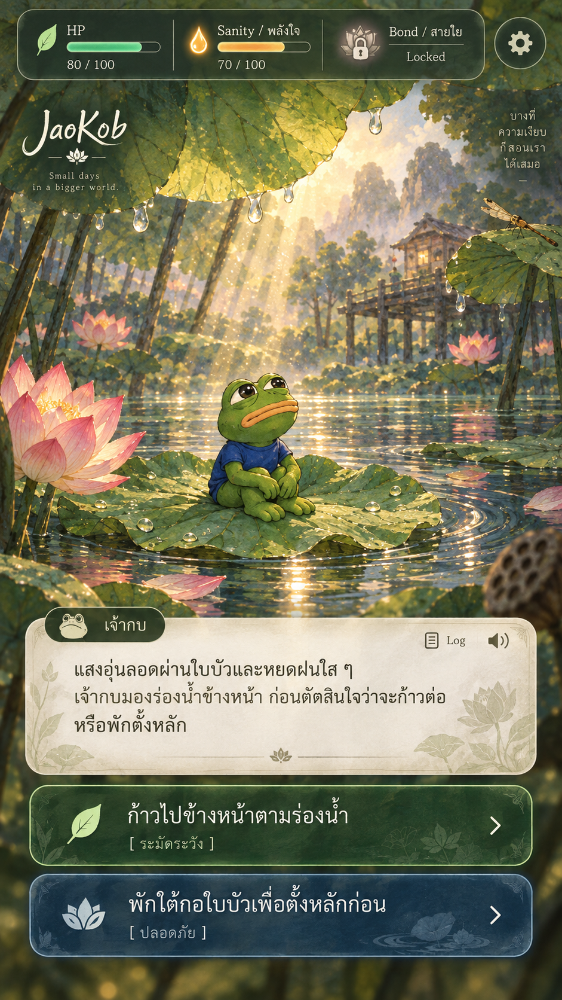
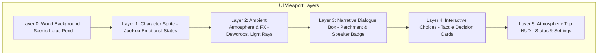
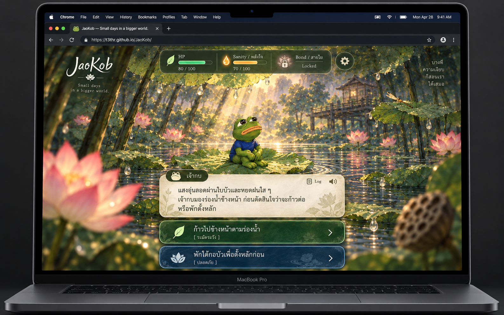
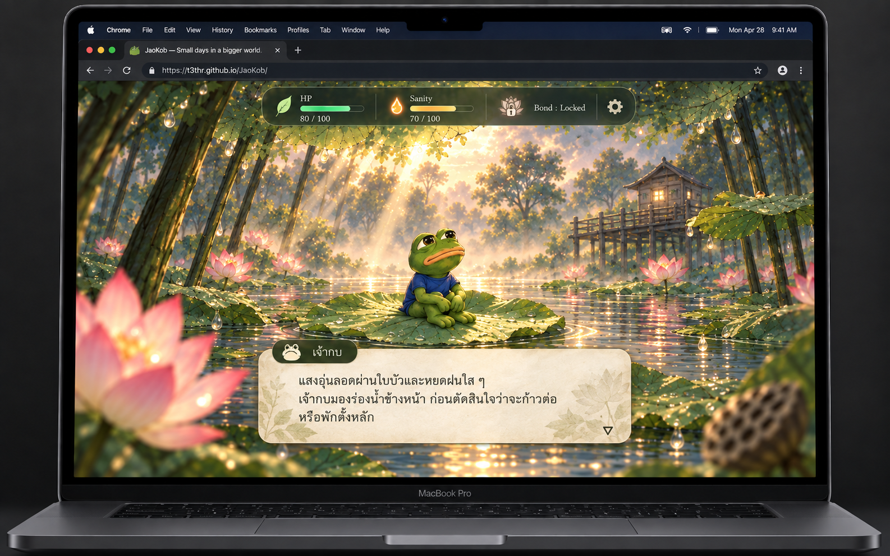
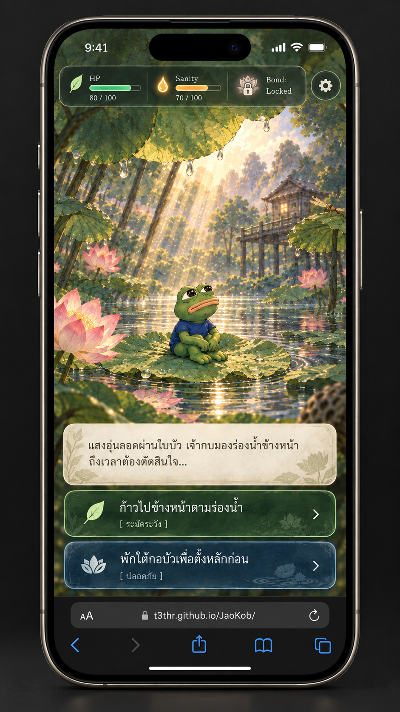
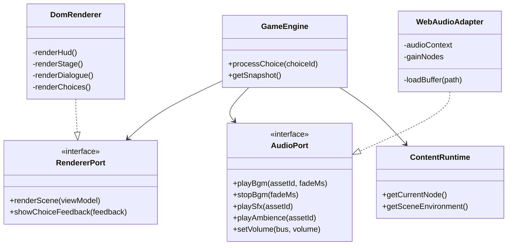

# Phase 2 Architecture & Design Proposal: Interactive Light Novel RPG Transformation

> Historical proposal. Decisions are now recorded in [APPROVED CR-0003](../../rfc/CR-0003-interactive-light-novel-presentation.md), [Sprint 3 SSOT](../../sprints/sprint-03-ssot.md) and [ADR-P0-015](../../adr/ADR-P0-015-interactive-light-novel-presentation.md), approved 2026-09-07. Original examples below remain proposal history; use approved contracts for implementation, particularly life stage, Bond gate and choice count. Reference images are documentation, not production assets.

## 1. Document Control & Governance

| Attribute | Value |
|---|---|
| **Document ID** | JKB-PROP-P2-001 |
| **Title** | JaoKob Phase 2 Interactive Light Novel RPG Architecture & Asset Customization Pipeline |
| **Version** | 0.1.0 (Draft for Architecture Review & Brainstorming) |
| **Date** | 2026-09-06 |
| **Author (Tech Lead)** | Gemini 3.8 Flash (Technical Lead & System Architect) |
| **Reviewers & Collaborators** | CEO / Product Owner (Project Originator), Senior Software Engineer (GPT-6 Astra) |
| **Reference Images** | 1. [`jaokob-visual-target-desktop-reading-state.png`](./jaokob-visual-target-desktop-reading-state.png) (**Approved Target A:** Desktop Narrative Reading State)<br>2. [`jaokob-visual-target-mobile-decision-state.png`](./jaokob-visual-target-mobile-decision-state.png) (**Approved Target B:** Mobile Decision Crossroads State)<br>3. [`jaokob-visual-draft-v2-desktop.png`](./jaokob-visual-draft-v2-desktop.png) (Desktop Draft 1 - Critiqued AI Slop Anti-pattern)<br>4. [`jaokob-visual-target-act1.png`](./jaokob-visual-target-act1.png) (Early Phase 0/1 Concept Art) |
| **Target Baseline** | Phase 2 / Sprint 3 Planning (Building on Integrated Sprint 2 Baseline `develop@70bac18`) |
| **Compliance & Standards** | ISO/IEC/IEEE 12207:2017, ISO/IEC/IEEE 29148:2018, ISO/IEC 25010:2011, WCAG 2.2 AA |

---

## 2. Executive Summary & Vision Alignment

### 2.1 Context & Project Evolution
โครงการ **JaoKob (เจ้ากบ)** ได้ผ่านการพัฒนาและทดสอบอย่างเข้มงวดใน Phase 0 และ Phase 1 (Sprint 1 และ Sprint 2) จนบรรลุ **Core Functional Vertical Slice** ที่สมบูรณ์แบบ:
- **Clean Architecture & Invariant Enforcement:** แยก Core Domain, Port Interfaces, State Machine และ Data Adapters เด็ดขาด พร้อมชุดทดสอบอัตโนมัติ 444/444 Unit Tests ผ่าน 100% (อ้างอิง: [`docs/changelog/2026-09/2026-09-05-0128-sprint-02-merge-closeout.md`](../../changelog/2026-09/2026-09-05-0128-sprint-02-merge-closeout.md))
- **Canonical Act 1 Content Engine:** รองรับโครงข่ายเรื่องเล่า 7 ฉาก, 14 โหนด, 21 เส้นทาง, และ 12 Outcome Combinations ตาม [Sprint 2 SSOT](../../sprints/sprint-02-ssot.md) พร้อมระบบ Resume และ Storage Consent ตาม [ADR-P0-013](../../adr/ADR-P0-013-content-validation-contract.md) และ [ADR-P0-014](../../adr/ADR-P0-014-content-orchestration-and-resume.md)

อย่างไรก็ตาม ในทางประสบการณ์ผู้ใช้ (UX) ตัวเกมในปัจจุบันยังแสดงผลแบบ **Text-heavy Minimalist Web Reader** ซึ่งแม้จะถูกต้องตามข้อกำหนดเชิงโครงสร้าง แต่ยังไม่สามารถถ่ายทอด **อารมณ์ ความอบอุ่น ความเหงา และความหวัง** ตามวิสัยทัศน์ของผู้สร้างได้อย่างเต็มศักยภาพ

### 2.2 The Phase 2 Leap: "Interactive Light Novel RPG"
จากวิสัยทัศน์ของ CEO/PO เจ้ากบไม่ใช่แค่เกมตอบคำถาม แต่คือ **เรื่องเล่าที่มีชีวิต (Living Interactive Tale)** ซึ่งมีจุดกำเนิดมาจากตุ๊กตากบสีเขียวใส่เสื้อยืดสีน้ำเงินที่มอบให้คนรัก ท่ามกลางบรรยากาศการเดินทางในสายฝนและธรรมชาติที่กว้างใหญ่

เป้าหมายสูงสุดของ **Phase 2** คือการยกระดับ JaoKob ให้กลายเป็น **"Interactive Light Novel RPG"** ระดับพรีเมียมที่มีจุดเด่นดังนี้:
1. **Handcrafted Indie Atmosphere (ไม่ใช่งาน AI เกรดต่ำ):** งานภาพและ UI ต้องให้ความรู้สึกเหมือนงานคราฟต์ที่ออกแบบโดยมนุษย์อย่างประณีต มีความนุ่มนวล อบอุ่น สบายตา ผสมผสานกลิ่นอายของ Studio Ghibli, Makoto Shinkai เข้ากับความเรียบง่ายแต่สะเทือนอารมณ์แบบ *A Short Hike* และ *Coffee Talk*
2. **Customization Asset Pipeline:** รองรับการปรับเปลี่ยนและต่อยอด Asset มัลติมีเดีย (ตัวละครหลายอารมณ์, ฉากหลังตามสภาพอากาศ, ดนตรีบรรเลง BGM, เสียงบรรยากาศ Ambience, และเสียงประกอบ SFX) ได้อย่างเป็นระบบผ่าน Data Contracts
3. **Pure Web Standard & Zero Runtime Bloat:** บรรลุสุนทรียภาพระดับพรีเมียมโดยยังคงสถาปัตยกรรม **Vanilla HTML5, Modern CSS3, และ Pure ES Modules** โดยไม่พึ่งพา Framework หรือ External CDN หนักๆ เพื่อให้รันได้รวดเร็วบน GitHub Pages แบบ Mobile-first

---

## 3. Visual Target Deconstruction (การวิเคราะห์ภาพเป้าหมายอย่างละเอียด)

เอกสารนี้อ้างอิงภาพเป้าหมายเชิงทัศนศิลป์ที่ PO ได้จัดเตรียมไว้:\


จากการวิเคราะห์เชิงวิศวกรรม UI/UX และ Game Feel ของ Tech Lead องค์ประกอบในภาพเป้าหมายแบ่งออกเป็น 5 ชั้น (Layers) หลักที่ต้องแปลงเป็นสถาปัตยกรรมจริง:



### 3.1 Layer 5: Atmospheric Top HUD (แถบสถานะและควบคุมชั้นบน)
- **Visual Design:** แคปซูลกระจกฝ้าสีเขียวป่าเข้มกึ่งโปร่งใส (`backdrop-filter: blur(12px)`) ลอยอยู่ขอบบนของจอ ไม่กินพื้นที่สายตา
- **Component Breakdowns:**
  1. **HP Metric:** สัญลักษณ์ใบไม้สีเขียวอ่อน พร้อมแถบความยาวหลอด 80/100 (mint-green progress fill) บ่งบอกพลังกายในการก้าวข้ามอุปสรรค ([`GDD-MET-001`](../../phase-0/01-game-design-document.md))
  2. **Sanity Metric (พลังใจ):** สัญลักษณ์เปลวไฟหรือหยดน้ำสีเหลืองอำพัน พร้อมแถบ 70/100 (warm amber fill) สะท้อนความเข้มแข็งทางอารมณ์ ([`GDD-MET-002`](../../phase-0/01-game-design-document.md))
  3. **Bond Metric (สายใย):** สัญลักษณ์ดอกบัวพร้อมแม่กุญแจล็อค แสดงสถานะ `"Locked"` ชัดเจน สอดคล้องกับข้อกำหนดทางเนื้อเรื่องที่ว่าสายใยจะถูกปลดล็อคใน Act 3 เมื่อพบกับแม่มะลิ ([`GDD-MET-003`](../../phase-0/01-game-design-document.md) และ [`GDD-MET-004`](../../phase-0/01-game-design-document.md))
  4. **Settings Cog Button:** ปุ่มเฟืองสไตล์มินิมอลทางมุมขวาบน สำหรับเปิดหน้าต่างตั้งค่า (เสียง, ภาษา, Accessibility, Resume/Restart)

### 3.2 Overlay: Atmospheric Branding & Epigraph (อัตลักษณ์และบทกวีนำ)
- **Top-Left Branding:** โลโก้ลายมือประดิษฐ์ `"JaoKob"` พร้อมไอคอนดอกบัวและคำโปรย *"Small days in a bigger world."* ตอกย้ำธีม Existentialism ของสิ่งมีชีวิตตัวเล็กในโลกกว้าง
- **Top-Right Epigraph:** ข้อความบทกวีภาษาไทยจัดวางแนวดิ่งอันเงียบสงบ:
  > *"บางที ความเงียบ ก็สอนเรา ได้เสมอ —"*
  สะท้อน Sensory Rules ใน [Narrative Bible 02-narrative-bible.md](../../phase-0/02-narrative-bible.md) ที่เน้นความเงียบและเสียงธรรมชาติเป็นเครื่องมือนำพาอารมณ์

### 3.3 Layer 0-2: World Stage & Dynamic Atmosphere (เวทีภาพ สไปรต์ และบรรยากาศ)
- **Layer 0 (Background):** ภาพวาดทิวทัศน์บึงบัวยามเช้า มีบ้านไม้ริมน้ำ แสงอาทิตย์ยามเช้าส่องผ่านม่านหมอก (God Rays) และดอกบัวสีชมพูบานสะพรั่ง
- **Layer 1 (Character Sprite):** เจ้ากบ (Jao Kob) นั่งคุดคู้อยู่บนใบบัว สวมเสื้อยืดสีน้ำเงินเข้ม ดวงตากลมโตแฝงความเหงาและใคร่ครู้ (Melancholic yet endearing)
- **Layer 2 (Ambient FX):** หยดน้ำฝนกลิ้งบนใบบัว ละอองแดด แสงสะท้อนผิวน้ำที่พลิ้วไหวอย่างช้าๆ (Subtle loop CSS/Canvas animations ที่ปิดได้เมื่อตั้งค่า `reducedMotion: true`)

### 3.4 Layer 3: Narrative Dialogue Box (กล่องข้อความใบลาน/กระดาษสาโบราณ)
- **Card Material:** พื้นผิวสัมผัสกระดาษสาธรรมชาติ (Warm Parchment / Rice Paper) พร้อมลวดลายกิ่งก้านใบบัวสีจางที่มุมการ์ด เพิ่มความเป็นวรรณกรรม
- **Speaker Pill Badge:** แถบชื่อผู้พูดทรงแคปซูลสีเขียวเข้มลอยเด่นที่มุมซ้ายบน ประกอบด้วยไอคอนรูปหน้ากบน่ารัก และชื่อ `"เจ้ากบ"`
- **Utility Controls:**
  - ปุ่ม `[Log]` สำหรับเปิดหน้าต่าง Dialogue Backlog ย้อนอ่านบทสนทนาในอดีต
  - ปุ่ม `[🔊]` ลำโพง สำหรับเปิด/ปิดเสียงบรรยายหรือตั้งระดับเสียงด่วน
- **Typography & Formatting:** ตัวพิมพ์ภาษาไทยแบบมีหัวผสมโมเดิร์น (Humanist/Serif) คมชัด อ่านง่าย มีระยะบรรทัด (`line-height: 1.75`) กว้างพอที่จะไม่ทำให้สระบน-ล่างและวรรณยุกต์ซ้อนทับกัน
- **Ornamental Divider:** ลายเซาะร่องรูปดอกบัวคั่นกลางกล่องเพื่อความประณีต

### 3.5 Layer 4: Interactive Choice Cards (การ์ดทางเลือกสัมผัสได้)
- **Dual Action Cards:** แทนที่ปุ่มข้อความแบบเดิมด้วยการ์ดทรงมนขนาดใหญ่ที่รองรับการสัมผัสด้วยนิ้วมือบนมือถืออย่างสมบูรณ์แบบ (Min Touch Target > 56px ตาม WCAG 2.2)
- **Color & Semantic Distinction:**
  - **การ์ดที่ 1 (Forest Green):** ไอคอนใบไม้ | ข้อความ: *"ก้าวไปข้างหน้าตามร่องน้ำ"* | แท็กเจตนา: `[ ระมัดระวัง ]` | สัญลักษณ์ลูกศร `>`
  - **การ์ดที่ 2 (Aquatic Slate Blue):** ไอคอนดอกบัว | ข้อความ: *"พักใต้กอบัวเพื่อตั้งหลักก่อน"* | แท็กเจตนา: `[ ปลอดภัย ]` | สัญลักษณ์ลูกศร `>`
- **Intent Tags:** การแสดงแท็กเจตนาหรือโทนการตัดสินใจช่วยให้ผู้เล่นเข้าใจน้ำหนักของการกระทำโดยไม่สปอยล์ผลลัพธ์ สอดคล้องกับ [`GDD-UX-003`](../../phase-0/01-game-design-document.md)

### 3.6 การวิพากษ์และวิเคราะห์ข้อบกพร่องของ Desktop Mockup Draft 1 (`jaokob-visual-draft-v2-desktop.png`)

จากการจำลองภาพบนหน้าจอ MacBook Pro เปิด Google Chrome ที่ได้มาล่าสุด:\


ทาง Tech Lead และ CEO/PO ได้ร่วมกันตรวจทานและพบข้อบกพร่องสำคัญที่เข้าข่าย **"AI Slop / Information Overload"** ซึ่งขัดกับหลักการออกแบบงานคราฟต์อินดี้ระดับพรีเมียม (Human-crafted Indie Aesthetics):

1. **ปัญหาการยัดเยียดองค์ประกอบทุกอย่างในภาพเดียว (Element Overcrowding):**\
   ภาพนี้พยายามนำทุกคีย์เวิร์ดมาแสดงพร้อมกัน: มีทั้งโลโก้เกม "JaoKob", คำโปรยภาษาอังกฤษ, บทกวียาว 4 บรรทัด, แถบสถานะด้านบน, กล่องบทสนทนา, และปุ่มตัวเลือกขนาดใหญ่ 2 ปุ่มพร้อมกัน ผลลัพธ์คือ **"หน้าจอรกและไร้สมาธิ"** ดูเหมือนภาพโฆษณาสินค้าหรือคอลลาจ มากกว่าหน้าจอเกมจริงที่มีสุนทรียภาพ
2. **การปะปนสถานะที่ต้องเกิดขึ้นคนละจังหวะ (State Conflation):**\
   - **Logo & Epigraph:** โลโก้เกมและบทกวีเปิดองก์ควรอยู่บน **Title Screen** หรือแสดงเฉพาะช่วง Cutscene เปิดฉากชั่วคราว ไม่ควรลอยค้างอยู่บนหน้าจอขณะเล่นปกติ
   - **Dialogue vs Choices:** ขณะที่ตัวละครกำลังพูด (Story Reading Beat) ไม่ควรมีการ์ดตัวเลือกมาลอยขวางบดบังฉาก การ์ดตัวเลือกควรปรากฏขึ้นเฉพาะเมื่อเรื่องเล่าดำเนินมาถึง **จุดตัดสินใจ (Decision Node)** เท่านั้น
3. **การสูญเสียพื้นที่หายใจของสายตา (Lack of Negative Space & Desktop Misalignment):**\
   กล่องข้อความและการ์ดตัวเลือกถูกจับมาซ้อนกันตรงกลางจนกลายเป็นแท่งสี่เหลี่ยมทึบตัน บดบังทัศนียภาพบึงบัวและเจ้ากบเกือบครึ่งจอ แทนที่จะให้งานศิลปะได้สื่อสารอารมณ์ความเหงาและสงบ

#### สถาปัตยกรรม 3 หน้าจอที่แท้จริง (The 3-Screen State Separation Architecture):
เพื่อแก้ไขปัญหานี้และส่งมอบให้ Senior SE นำไปวางระบบ State-driven Renderer เราต้องแยกหน้าจอออกเป็น 3 สถานะที่ชัดเจน:
1. **Screen 1: Title & Chapter Intro Screen (หน้าจอหลักและเปิดองก์):** แสดงงานศิลป์กว้าง มีโลโก้ "JaoKob", บทกวี, และปุ่มมินิมอล `[เริ่มการเดินทาง]` / `[อ่านต่อ (Resume)]` / `[ตั้งค่า]`
2. **Screen 2: Narrative Exploration / Dialogue Screen (หน้าจอเล่าเรื่องหลัก):** ให้ความสำคัญกับงานภาพและตัวหนังสือ มีเฉพาะ Top HUD มินิมอลที่ขอบบน และกล่องข้อความกระดาษสาด้านล่างที่โปร่งสบายตา **ไม่มีปุ่ม Choice โผล่มาแย่งสมาธิ** มีเพียงไอคอนกระพริบเบาๆ ให้กดอ่านต่อ
3. **Screen 3: Decision Crossroads Screen (หน้าจอทางแยกตัดสินใจ):** กล่องบทสนทนาย่อลงอย่างนุ่มนวล และการ์ดตัวเลือก 2 ใบจึงค่อยๆ ปรากฏขึ้นพร้อมแท็กเจตนา `[ ระมัดระวัง ]` และ `[ ปลอดภัย ]` อย่างสง่างาม

### 3.7 Approved Desktop Target: The Clean Narrative Reading State (`jaokob-visual-target-desktop-reading-state.png`)

จากกระบวนการปรับปรุง Prompt เพื่อขจัดปัญหา AI Slop ทาง PO และ Tech Lead ได้อนุมัติภาพต้นแบบเป้าหมายสำหรับหน้าจอเล่าเรื่องบน Desktop (Google Chrome บน MacBook Pro 16 นิ้ว) อย่างเป็นทางการ:



#### การถอดรหัสความหมายและกลไกของแต่ละองค์ประกอบในหน้าจอ (Feature & Mechanics Verification):

1. **Top Status HUD (แถบสถานะแคปซูลกระจกฝ้าด้านบน):**
   - **`HP (80 / 100)` (ไอคอนใบไม้สีเขียว):** พลังกายของเจ้ากบ อ้างอิง [`GDD-MET-001`](../../phase-0/01-game-design-document.md) และ [`GDD-HP-001..007`](../../phase-0/01-game-design-document.md) ค่าเริ่มต้น 80 หน่วย ใช้สำหรับตัดสินการรอดชีวิตทางกายภาพ หากลดเหลือ 0 จะเกิดสภาวะ Physical Crisis / GameOver
   - **`Sanity (70 / 100)` (ไอคอนเปลวไฟ/หยดน้ำสีเหลืองอำพัน):** พลังใจและความสงบภายใน อ้างอิง [`GDD-MET-002`](../../phase-0/01-game-design-document.md) และ [`GDD-SAN-001..007`](../../phase-0/01-game-design-document.md) ค่าเริ่มต้น 70 หน่วย สะท้อนความเข้มแข็งทางอารมณ์ หากลดเหลือ 0 จะเกิดสภาวะ Emotional Crisis
   - **`Bond : Locked` (ไอคอนดอกบัวพร้อมแม่กุญแจ):** **ค่าสายใยและความผูกพันกับมนุษย์ (The Human Bond)** อ้างอิงข้อกำหนดทางสถาปัตยกรรม [`GDD-MET-003`](../../phase-0/01-game-design-document.md), [`GDD-BOND-001..007`](../../phase-0/01-game-design-document.md), [`GDD-BOND-005`](../../phase-0/01-game-design-document.md), และ [`GDD-PROG-002`](../../phase-0/01-game-design-document.md):
     - **Bond คืออะไร?** คือระดับความไว้ใจและความผูกพันระหว่าง "เจ้ากบ" กับ "เด็กสาว (มนุษย์/คนรัก)" ที่เจ้ากบจะได้พบใน Act 4 และ Act 5 เป็นมาตรวัดสำคัญที่สุดในการปลดล็อค **Canon Ending (`END-HOME`)** ที่เจ้ากบยอมรับความเมตตาและกลายเป็นตุ๊กตากบคู่ใจเชิงสัญลักษณ์
     - **ทำไมถึงขึ้น `Locked` ในรูปนี้?** เพราะตามกฎบัตร [`GDD-BOND-005`](../../phase-0/01-game-design-document.md) และ [`GDD-UX-003`](../../phase-0/01-game-design-document.md) *“meter ความผูกพันต้องยังไม่แสดงตัวเลขก่อนฉาก `NAR-SC-A4-004` ซึ่งเป็นการสังเกตความเมตตาครั้งแรก ระหว่างนั้น UI ต้องแสดงเป็นช่องล็อกพร้อมข้อความว่า Locked / ความสัมพันธ์ยังไม่เริ่มต้น โดยค่าใน state ยังคงเป็น 0”* ดังนั้นใน Act 1 ที่เจ้ากบยังอยู่ลำพังในบึงบัว การแสดงรูปแม่กุญแจล็อกจึงถูกต้องตามกฎของเกม 100%
   - **`Settings Gear` (ไอคอนเฟืองขวาบน):** เปิดหน้าต่าง Overlay Settings อ้างอิง [`GDD-STATE-007`](../../phase-0/01-game-design-document.md) สำหรับปรับเสียงเพลง ภาษา และโหมด Accessibility
2. **Center Stage (เวทีศิลป์และสภาพแวดล้อม):**
   - ภาพวาดสีน้ำดิจิทัลสัดส่วน 16:10 สไตล์ Studio Ghibli ให้ความรู้สึกอบอุ่น สบายตา และมีพื้นที่ว่าง (Negative Space) ให้สายตาได้พักผ่อน
   - เจ้ากบสวมเสื้อยืดสีน้ำเงินเข้ม นั่งคุดคู้อยู่บนใบบัวอย่างน่ารักและแฝงความเหงา สะท้อนจุดกำเนิดของตุ๊กตากบที่มอบให้คนรัก
   - ไร้โลโก้หรือข้อความโฆษณารกตาบนท้องฟ้า
3. **Narrative Dialogue Card (กล่องบทสนทนากระดาษสา):**
   - แถบป้ายชื่อผู้พูด `เจ้ากบ` ลอยอยู่มุมบนซ้ายอย่างชัดเจน
   - ตัวอักษรภาษาไทยแบบ Serif คมชัด รองรับระยะบรรทัดกว้าง ไม่ตัดวรรณยุกต์
   - สัญลักษณ์ลูกศรลง `▽` ที่มุมขวาล่าง ทำหน้าที่เป็น **Next-Beat Indicator** กะพริบเบาๆ เพื่อบอกให้ผู้เล่นคลิกหรือกด Spacebar เพื่ออ่านประโยคถัดไป **โดยไม่มีการ์ดตัวเลือกมาบดบังหรือแย่งสมาธิ**

### 3.8 Approved Mobile Target: The Tactile Decision Crossroads State (`jaokob-visual-target-mobile-decision-state.png`)

เพื่อพิสูจน์ระบบ **Mobile-first Responsive Web Design** และสร้างสเปกสำหรับหน้าจอในจังหวะการตัดสินใจ (Decision State) ทาง PO และ Tech Lead ได้อนุมัติภาพต้นแบบบนเบราว์เซอร์มือถือจริง (Apple iPhone 16 Pro — Mobile Safari):



#### การวิเคราะห์สถาปัตยกรรมและหลักการออกแบบสัมผัสบนมือถือ (Mobile Touch & Responsive Engineering):

1. **Mobile Safe Areas & Viewport Respect (การจัดการระยะปลอดภัยบนหน้าจอมือถือ):**
   - **Dynamic Island & Top HUD:** แถบสถานะแคปซูลกระจกฝ้าเว้นระยะปลอดภัย (Safe Area Inset) ใต้ Dynamic Island อย่างลงตัว ไม่ถูกกล้องบัง แสดง HP 80, Sanity 70, Bond: Locked และปุ่ม Settings ครบถ้วน
   - **Safari Toolbar Clearance:** ด้านล่างเว้นระยะปลอดภัยเหนือแถบ Navigation Bar ของ Safari ไม่ให้ปุ่มทางเลือกจมหรือถูกบดบัง
2. **The Decision Crossroads Layout (การจัดวางหน้าจอทางแยกอย่างมีชั้นเชิง):**
   - **Dilemma Anchor (การ์ดสรุปสถานการณ์):** เมื่อบทสนทนาจบลง กล่องข้อความกระดาษสาจะหดตัวลงเป็นการ์ดคำถามสั้น:
     *“แสงอุ่นลอดผ่านใบบัว เจ้ากบมองร่องน้ำข้างหน้า ถึงเวลาต้องตัดสินใจ...”*
     โดยไม่มีลูกศร `▽` อีกต่อไป เพื่อส่งสัญญาณให้ผู้เล่นทราบว่าต้องเลือกทางแยก
   - **Tactile Choice Cards (การ์ดทางเลือกสัมผัสได้ 2 ใบ):**
     * **การ์ดที่ 1 (Forest Moss Green):** *"ก้าวไปข้างหน้าตามร่องน้ำ"* พร้อมแท็กเจตนา `[ ระมัดระวัง ]` และไอคอนใบไม้
     * **การ์ดที่ 2 (Deep Slate River Blue):** *"พักใต้กอบัวเพื่อตั้งหลักก่อน"* พร้อมแท็กเจตนา `[ ปลอดภัย ]` และไอคอนดอกบัว
   - **Thumb Zone Ergonomics:** การ์ดทั้งสองใบวางซ้อนกันในแนวตั้งในระยะที่นิ้วโป้งเอื้อมถึงง่าย (Thumb Zone) ความสูงแต่ละปุ่มเกิน 48px ตามเกณฑ์การเข้าถึงของ **WCAG 2.2 Level AA**
3. **ความต่อเนื่องของเรื่องเล่าและสุนทรียภาพ (Atmospheric Consistency):**
   - ฉากบึงบัวและเจ้ากบเสื้อน้ำเงินยังคงเป็นองค์ประกอบหลักตรงกลาง ไร้ความรกของป้ายโฆษณาหรือโลโก้ลอยฟ้า
   - การ์ดทางเลือกแยกสีและมีแท็กเจตนาชัดเจน ช่วยลดความตึงเครียดทางอารมณ์ของผู้เล่นตามหลัก `GDD-UX-003`

---

## 4. Architectural Analysis & System Impact (ผลกระทบเชิงสถาปัตยกรรม)

การจะเปลี่ยนผ่านหน้าตาไปสู่ภาพเป้าหมาย **ห้ามทำลายสถาปัตยกรรม Clean Architecture** ที่วางไว้ใน Phase 0 และ Sprint 1-2 เป็นอันขาด:



### 4.1 Boundary Invariance (กฎเหล็กเรื่องเส้นแบ่งเลเยอร์)
1. **`src/core/` ยังคงเป็น Pure Deterministic Logic 100%:**
   - ห้าม `src/core/` แตะ DOM, `window`, Web Audio API หรือ `HTMLAudioElement`
   - การสั่งเล่นเสียงหรือเปลี่ยนภาพ ต้องส่งผ่าน **Port Interfaces** (`RendererPort`, `AudioPort`) เท่านั้น
2. **`src/ui/` เป็น Passive Adapter:**
   - ทำหน้าที่แปลง ViewModel ที่ได้รับจาก Core/Runtime ออกมาเป็น DOM Elements และจัดการ CSS Transitions
3. **`src/data/` จัดการ Asset Resolution & Content Verification:**
   - ทำหน้าที่แปลง `assetId` ให้เป็น URL สัมพัทธ์ที่ถูกต้อง พร้อมตรวจสิทธิ์สัญญาอนุญาต (License & Provenance) ตาม [`ADR-P0-013`](../../adr/ADR-P0-013-content-validation-contract.md)

### 4.2 Asset Schema & Content Package Alignment
เมื่อสำรวจ Schema ใน `specs/schemas/` พบสถานะปัจจุบันดังนี้:
1. **`specs/schemas/content-package.schema.json`:**
   - มี `$defs/asset` รองรับประเภท `"image"`, `"audio"`, `"font"` ไว้อยู่แล้ว พร้อมฟิลด์ `rights` (license, attribution, origin)
   - ปัจจุบันใน `src/data/content/packages/act-01.json` ฟิลด์ `"assets": []` ยังคงว่างเปล่า
2. **`specs/schemas/dialogue.schema.json`:**
   - ใน `dialogueLine.delivery` มีการประกาศฟิลด์ **`portraitAssetId`** (ชี้ไปยัง `asset.id`) เตรียมไว้แล้วอย่างยอดเยี่ยม!
3. **สิ่งที่เป็นช่องว่าง (Gap Analysis):**
   - ใน `narrative-tree.schema.json` โหนดประเภท `cutsceneNode` และ `explorationNode` ยังไม่มีฟิลด์ระบุสภาพแวดล้อมฉาก (เช่น `backgroundAssetId`, `bgmAssetId`, `ambientAssetId`) เพราะ schema กำหนด `additionalProperties: false`

#### ข้อเสนอทางเลือกสำหรับ Asset Binding (สำหรับ Senior SE และ PO พิจารณา):
- **Option A (Formal Schema Extension with RFC):**\
  เปิด **Change Request (CR-0003)** เพื่อขยาย `narrative-tree.schema.json` โดยเพิ่มฟิลด์ทางเลือก:
  ```json
  "environment": {
    "backgroundAssetId": "asset.bg.act1_morning_pond",
    "bgmAssetId": "asset.audio.bgm_gentle_stream",
    "ambientAssetId": "asset.audio.amb_morning_dew",
    "weather": "clear-mist"
  }
  ```
  *ข้อดี:* ข้อมูลสภาพแวดล้อมรวมศูนย์อยู่ใน Narrative Tree ที่เดียว ชัดเจนและ Deterministic\
  *ข้อเสีย:* ต้อง Bump Schema Version และแก้ Schema Validation Tests
- **Option B (External Scene Environment Manifest):**\
  สร้างแคตตาล็อกสภาพแวดล้อมแยกต่างหาก เช่น `src/data/content/environments/act-01-environments.json` โดยใช้ `nodeId` หรือ `sceneId` เป็น Key ในการจับคู่ Asset\
  *ข้อดี:* ไม่กระทบ `narrative-tree.schema.json` ที่ผ่านการทดสอบแล้วใน Sprint 2\
  *ข้อเสีย:* มีไฟล์เนื้อหาเพิ่มขึ้น 1 ไฟล์ ต้องตรวจสอบ Referential Integrity ข้ามไฟล์

> **ความเห็นของ Tech Lead:** แนะนำ **Option A** ผ่านการทำ RFC อย่างเป็นทางการ เนื่องจากตัวเกมคือ Interactive Light Novel สภาพแวดล้อม (ฉากหลังและดนตรี) ถือเป็น First-class Citizen ของการเล่าเรื่อง การใส่ไว้ในโหนดช่วยให้ Author มองเห็นภาพรวมของฉากได้ทันที

---

## 5. Audio System Architecture (ระบบเสียงบรรเลงและเอฟเฟกต์)

ในภาพเป้าหมาย มีปุ่มควบคุมเสียงบนกล่องบทสนทนา และใน `act-01.json` มีการกำหนดค่า:
```json
"settings": {
  "masterVolume": 1,
  "musicVolume": 0.7,
  "ambienceVolume": 0.8,
  "effectsVolume": 0.9,
  "reducedIntensityAudio": false
}
```

### 5.1 Browser Autoplay Policy & Interaction Lifecycle
เบราว์เซอร์ยุคใหม่ (Chrome, Safari, Firefox) บล็อกเสียงที่เล่นอัตโนมัติก่อนมี User Gesture:
- **Solution:** หน้าจอ Title Screen หรือปุ่ม "เริ่มการเดินทาง / เริ่มใหม่" และ "อ่านต่อ (Resume)" จะทำหน้าที่เป็น **Audio Context Activator (Gesture Unlock)**
- สร้าง `AudioPort` ใน `src/core/ports/audio-port.js`
- สร้าง `WebAudioAdapter` ใน `src/ui/audio/web-audio-adapter.js` (หรือ `Html5AudioAdapter`) ที่ใช้ Web Audio API จัดการแยก 3 บัสเสียงอิสระ:
  - `MasterGainNode` -> ควบคุมระดับเสียงรวม
  - `MusicGainNode` -> ควบคุม BGM พร้อมระบบ Fade-in / Fade-out อัตโนมัติ (1.5 วินาที) เมื่อเปลี่ยนฉาก
  - `AmbienceGainNode` -> ควบคุมเสียงบรรยากาศวนลูป (เสียงฝนพรำ เสียงจิ้งหรีด เสียงน้ำไหล)
  - `SfxGainNode` -> เล่นเสียงสัมผัสปุ่ม เสียงคลิกการ์ด เสียงเปลี่ยนหน้า

---

## 6. CSS Architecture & Typography Engineering

### 6.1 Thai Typography Standard (การแก้ปัญหาวรรณยุกต์ลอยและสระจม)
ตัวอักษรไทยใน Web Application มักพบปัญหาขอบล่างของสระอุ/สระอู หรือขอบบนของไม้เอก/ไม้โท ถูกตัดขาด (Clipping) เมื่อกำหนด `line-height` แคบเกินไป หรือใช้ฟอนต์ที่ Metric ผิดปกติ:
- **Font Selection:** นำเข้าฟอนต์ Google Fonts ภาษาไทยคุณภาพสูงที่เก็บแบบ Self-hosted ภายใน `assets/fonts/` (เช่น **Sarabun** สำหรับส่วนเนื้อเรื่องที่ต้องการความเรียบร้อย, **Charm** หรือลายมือสำหรับหัวเรื่อง, **Prompt** สำหรับ UI ตัวเลขและปุ่ม) เพื่อไม่พึ่งพา External Google Servers
- **CSS Metric Hardening:**
  ```css
  :root {
    --font-novel: 'Sarabun', -apple-system, BlinkMacSystemFont, 'Segoe UI', serif;
    --font-heading: 'Charm', cursive, serif;
    --font-ui: 'Prompt', sans-serif;
    --line-height-novel: 1.8;
  }
  .dialogue-text {
    font-family: var(--font-novel);
    font-size: clamp(1.05rem, 2.5vw, 1.25rem);
    line-height: var(--line-height-novel);
    text-rendering: optimizeLegibility;
    overflow-wrap: break-word;
  }
  ```

### 6.2 Parchment & Organic Glass Texture System
- ใช้ CSS Multi-background ร่วมกับ SVG Filter หรือภาพพื้นผิวความละเอียดสูงขนาดกะทัดรัด (WebP Lossless < 50KB) เพื่อสร้างพื้นผิวกระดาษสา
- ปรับแต่ง `box-shadow` และ `border` ให้มีมิติ นุ่มนวล เสมือนงานคราฟต์จริง ไม่ใช้สีแบนราบ (Flat) แบบทั่วไป

### 6.3 Accessibility & Responsive Reflow (WCAG 2.2 AA)
- **High Contrast Mode Support:** เมื่อเปิด `highContrast: true` ให้ปิดลวดลายพื้นผิวบนกระดาษสา เปลี่ยนสีพื้นหลังเป็น Solid Dark Charcoal (`#121212`) และตัวอักษรเป็น Off-White (`#F0F0F0`) ให้ Contrast Ratio เกิน 7:1
- **Reflow & Zooming:** ต้องรองรับการขยายหน้าจอ 200% และขนาดหน้าจอแคบสุด 320 CSS px โดยไม่มีข้อความล้นออกนอกจอ หรือปุ่มทับซ้อนกัน

---

## 7. Directory Organization & Asset Placement

สอดคล้องกับ [Production Directory Plan (`05-production-directory-plan.md`)](../../phase-0/05-production-directory-plan.md):

```text
jao-kob/
├── docs/
│   ├── proposals/
│   │   └── phase-02-visual-novel-architecture/
│   │       ├── 01-visual-novel-transformation-tech-lead-proposal.md <-- (เอกสารนี้)
│   │       └── jaokob-visual-target-act1.png                       <-- (ภาพต้นแบบเป้าหมาย)
│   └── raw/
│       └── README.md                                               <-- (จุดรับไฟล์ดิบชั่วคราว)
├── assets/
│   ├── images/
│   │   ├── backgrounds/          <-- ภาพพื้นหลังฉาก (WebP/AVIF)
│   │   ├── characters/
│   │   │   └── jaokob/           <-- สไปรต์เจ้ากบตามอารมณ์ (neutral, tender, afraid, etc.)
│   │   └── ui/                   <-- ไอคอนใบไม้ ดอกบัว เฟือง พื้นผิวกระดาษสา
│   ├── audio/
│   │   ├── bgm/                  <-- ดนตรีประกอบตามองก์
│   │   ├── ambience/             <-- เสียงสภาพแวดล้อม
│   │   └── sfx/                  <-- เสียงคลิก เสียงตัดสินใจ
│   ├── fonts/                    <-- ฟอนต์ไทยแบบ Self-hosted
│   └── provenance/               <-- บันทึกสิทธิ์และที่มาของทุก Asset
```

---

## 8. Handoff Agenda & Questions for Senior Software Engineer (GPT-6 Astra)

เพื่อให้ Senior Software Engineer (GPT-6 Astra) สามารถนำข้อเสนอนี้ไปวิเคราะห์เชิงลึกและร่างแผนงาน WBS ประจำ Sprint ถัดไป (Phase 2 / Sprint 3) ได้อย่างมีประสิทธิภาพ Tech Lead ขอส่งมอบชุดภาพต้นแบบเป้าหมายที่ได้รับการอนุมัติร่วมกับ CEO/PO ทั้งสองภาพ:
1. **Desktop Reading State Target:** [`jaokob-visual-target-desktop-reading-state.png`](./jaokob-visual-target-desktop-reading-state.png)
2. **Mobile Decision State Target:** [`jaokob-visual-target-mobile-decision-state.png`](./jaokob-visual-target-mobile-decision-state.png)

พร้อมโจทย์สำคัญทางสถาปัตยกรรมดังต่อไปนี้:

### คำถามทางสถาปัตยกรรม (Architectural Questions for Astra):
1. **Scene Environment Binding:** ในมุมมองของคุณ ควรเลือก **Option A (RFC แก้ Schema `narrative-tree.schema.json`)** เพื่อให้โหนดเก็บ Background/BGM โดยตรง หรือเลือก **Option B (External Scene Environment Manifest)** เพื่อหลีกเลี่ยงการแก้สัญญากลาง?
2. **Web Audio Port Orchestration:** เราควรวางตำแหน่ง `AudioPort` และการกระตุ้นเสียงไว้ที่จุดใด? ควรให้ `ContentRuntime` ส่ง `audioCues` มาพร้อมกับ ViewModel แล้วให้ UI Adapter สั่งเล่น หรือควรให้ Engine Core มี Event Bus แจ้งเตือนสถานะเสียง?
3. **Asset Preloading & Seamless Transition:** สำหรับ GitHub Pages ที่เป็น Static Hosting เราจะออกแบบ Preloader อย่างไรให้ภาพพื้นหลังและเสียงของโหนดถัดไปโหลดมารอในแคชล่วงหน้า โดยไม่ทำให้เกิดอาการภาพกระพริบ (FOUC) หรือหน้าค้างเมื่อผู้เล่นกดเลือกตัวเลือก?
4. **DOM Layering vs Canvas:** การสร้างเลเยอร์ 5 ชั้นด้วย Pure Semantic HTML5 + Modern CSS (`backdrop-filter`, `transform: translateZ(0)`) เพียงพอที่จะรักษา 60 FPS บนอุปกรณ์พกพาระดับกลางหรือไม่ หรือมีข้อควรระวังใดเกี่ยวกับ Paint/Compositing?
5. **Phase 2 Vertical Slice Scope:** ใน Sprint 3 เราควรเริ่มจากการทำ **"Benchmark Scene" (ฉาก 1-2 ของ Act 1 ให้สมบูรณ์แบบทั้งภาพ สไปรต์ BGM และการ์ดตัวเลือก)** เพื่อเป็น Living Prototype ให้ PO ตรวจสอบก่อนขยายให้ครบทั้ง 7 ฉากของ Act 1 ใช่หรือไม่?

---

## 9. Conclusion & Next Steps
เอกสารฉบับนี้พร้อมให้ **CEO / PO** และ **Senior Software Engineer (GPT-6 Astra)** ใช้เป็นฐานข้อมูลกลางในการ Brainstorming ต่อไป

- **สถานะโค้ดปัจจุบัน:** ไม่มีการ Push โค้ดหรือแก้ไของค์ประกอบใน `src/` จนกว่าจะมีข้อตกลงและอนุมัติ Sprint SSOT รอบใหม่
- **เอกสารอ้างอิงประกอบ:**
  - [Phase 0 Architecture Blueprint](../../phase-0/04-architecture-blueprint.md)
  - [Sprint 2 Closeout Record (CR-20260905-0128)](../../changelog/2026-09/2026-09-05-0128-sprint-02-merge-closeout.md)
  - [Content Package Schema Contract](../../../specs/schemas/content-package.schema.json)
  - [Dialogue Schema Contract](../../../specs/schemas/dialogue.schema.json)
