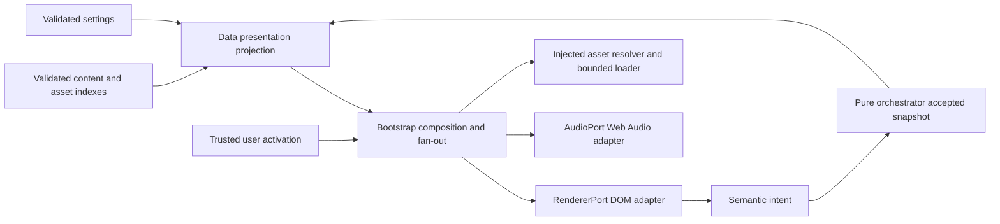

# Sprint 3 SSOT: Interactive Light Novel RPG — Living High-Fidelity Prototype

| Document control | Value |
|---|---|
| Sprint / document | `SPRINT-03` / `JKB-SPRINT-03-SSOT` |
| Version / date | `1.1.0` / Task 1 implementation evidence 2026-09-07; design approved 2026-09-07 (Asia/Bangkok) |
| Status | **APPROVED architecture — Task 1 implemented and verified; PR owner review pending** |
| Phase | Phase 2: Interactive Light Novel RPG Transformation, benchmark slice |
| Plan author | GPT-6 Astra — Senior Software Engineer / Principal Systems Architect |
| Collaborators / reviewers | CEO / Product Owner; Gemini 3.8 Flash — Tech Lead; Narrative, Game Design, Accessibility, QA, Art/Audio owners |
| Planning branch | `feat/sprint-03-architecture-plan`, from verified `develop@b07523c` |
| Documentation PR | [#8](https://github.com/T3thr/JaoKob/pull/8) → develop; implementation PRs remain separate |
| Task 1 implementation PR | [#9](https://github.com/T3thr/JaoKob/pull/9) → develop; implementation `1e9f1b2`, owner review pending |
| Standards | Repository Spec-Driven AI Loop, ISO/IEC/IEEE 12207:2017, ISO/IEC/IEEE 29148:2018, WCAG 2.2 AA |
| Change proposal | [CR-0003 — presentation, audio and compatibility contracts](../rfc/CR-0003-interactive-light-novel-presentation.md) |

PO และ Tech Lead อนุมัติแผนและ CR-0003 ตาม **PO & TECH LEAD JOINT DIRECTIVE: SPRINT 3 ARCHITECTURAL APPROVAL**, 2026-09-07. มติ D5–D8 ในแผนฉบับนี้เป็นข้อยุติ: three-choice Scene 3 handoff, ลูกอ๊อดลวดลาย/ผ้าผูกคอสีน้ำเงิน, Bond Locked Chip และ deferred Full Log/Animated Typewriter. ดู [approval record](../changelog/2026-09/2026-09-07-0042-sprint-03-architecture-approval.md) และ [ADR-P0-015](../adr/ADR-P0-015-interactive-light-novel-presentation.md)

Documentation Session เดิมอนุญาต commit/push/PR/squash merge เฉพาะเอกสาร ผ่าน PR #8 ที่ `559b6d7`. **Session ปัจจุบัน PO สั่งเริ่ม Step 0 และ Task 1 โดยชัดเจน**: branch `feat/sprint-03-interactive-light-novel` จาก clean/up-to-date develop. Task 1 implementation/automated verification ครบ (**WBS 1/5 implemented; owner PR review pending**); Tasks 2–5, media rights, UI benchmark และ deployment ยังไม่เสร็จ. ดู [Task 1 record](../changelog/2026-09/2026-09-07-0119-sprint-03-task-01-presentation-contracts.md)

ประวัติ planning: ฐาน runtime ที่รวมผ่าน PR #7 คือ `70bac18`; HEAD ใน planning Session `b07523c` เพิ่ม Sprint 2 closeout record เท่านั้น. Git identity ตรวจแล้วเป็น `T3thr <t.theerapat33@gmail.com>`; fetch/pull แบบ fast-forward ยืนยัน develop up to date ก่อนสร้าง local documentation branch. [Sprint 2 SSOT](sprint-02-ssot.md) และ [closeout record](../changelog/2026-09/2026-09-05-0128-sprint-02-merge-closeout.md) เป็น integrated baseline. คำสั่งปัจจุบันเปลี่ยน next milestone จาก Act 2 ใน closeout มาเป็น visual/audio benchmark; งาน Act 2 ยกไป planning หลัง benchmark ไม่แก้ประวัติ Sprint 2 ย้อนหลัง

ชื่อ Phase ในเอกสารเดิมบางแห่งเรียก Sprint 2 ว่า Phase 2A และ AGENTS ยังนำทาง Sprint 1; สำหรับงานนี้ยึด `SPRINT-03` และ scope ตามคำสั่ง PO นี้ ไม่ตีความเป็นการเปิด scope เต็ม Phase 2 หรือผ่าน Release G2

## 1. Sprint Goal & Value Proposition

ทำให้เจ้ากบมีพื้นที่เล่าเรื่องอย่างอ่อนโยน ผ่านฉากบึงบัวที่สื่อแสง อุณหภูมิและจังหวะน้ำ ตัวละครที่มีชีวิต กล่องบทอ่านพื้นผิวกระดาษสา เสียงบรรยากาศที่ผู้เล่นควบคุมได้ และการ์ดทางเลือกที่อ่านง่าย เป้าหมายคือของขวัญส่วนตัวที่อบอุ่น เศร้าอย่างมีความหวัง และดูแลความรู้สึกคนอ่าน โดยคงการเล่นแบบ client-side ที่เรียบง่าย

ส่งมอบ **Living High-Fidelity Prototype ที่เล่นกับ engine/content/save จริง** เพื่อให้ PO ตรวจคุณภาพทางศิลป์ การอ่าน และเสียงก่อนผลิต media ครบเจ็ดฉาก. การเพิ่มจำนวนภาพไม่ใช่เกณฑ์สำเร็จ; ตัวชี้วัดคือ flow อ่าน–สำรวจ–เลือก–บันทึก–กลับมาอ่านต่อที่รักษาอารมณ์โดยไม่เสีย usability หรือ domain correctness

### 1.1 Benchmark boundary — APPROVED

| Production slice | Actual content IDs | Acceptance boundary |
|---|---|---|
| Scene 1 / `NAR-SC-A1-001` | `node.act1.opening` | หกบรรทัดเปิดเรื่อง; Desktop Reading composition; explicit advance; reload exact page |
| Scene 2 / `NAR-SC-A1-002` | `node.act1.nursery`, `node.act1.observe-lily`, `node.act1.observe-roots`, `node.act1.observe-shadows`, `node.act1.observe-mother` | Exploration + four observation Cutscenes; skip/partial/full observations และ revisit โดยไม่เพิ่ม counter ซ้ำ |
| **Interaction handoff only**, Scene 3 / `NAR-SC-A1-003` | `node.act1.home-focus` → `node.act1.home-reflection` | อนุมัติขยายจุดตรวจรับไปยัง Decision จริง: mother/roots/siblings ครบ **3** ตัวเลือกและผลสะท้อน ใช้งานภาพ/เสียง benchmark ร่วม ไม่ผลิต media scene ใหม่ |
| Remaining Act 1 | Existing remaining nodes through `node.act1.rest` | เล่นต่อได้ด้วย neutral/text fallback; graph, effects, feedback, notices และ save ไม่เปลี่ยน; ทดสอบ 12 routes ทั้งองก์ |

**Approved CR-0003 D5:** Scene 1–2 ตาม Canon ไม่มี Decision จึงตรวจ handoff ที่ Scene 3 `node.act1.home-focus` พร้อมตัวเลือกจริงทั้งสามใบ **ว่ายตามแม่ / อยู่ฟังรากบัว / อยู่กับพี่น้อง** และผลสะท้อนเดิม. ไม่เปลี่ยน node type, stable IDs หรือผลทางเลือกเพื่อให้ตรงภาพตัวอย่างสองใบ

### 1.2 Visual acceptance and explicit deviations

- [Approved Desktop Reading](../proposals/phase-02-visual-novel-architecture/jaokob-visual-target-desktop-reading-state.png): ภาพเป็นพื้นที่หลัก, HUD เล็ก, กล่องอ่านกว้างพอดีด้านล่าง, ตัวละครไม่ถูกบัง, ไม่มี choice cards ระหว่าง reading beat; โลโก้/epigraph อยู่ Title เท่านั้น
- [Approved Mobile Decision](../proposals/phase-02-visual-novel-architecture/jaokob-visual-target-mobile-decision-state.png): safe areas, prompt สั้นตาม content, การ์ดเรียงตามการอ่าน, texture เขียว/น้ำเงินที่ไม่สื่อดี/ชั่ว, ไม่มี Next indicator เมื่อพร้อมเลือก; จำนวนการ์ดตาม content จริง
- [Rejected desktop draft](../proposals/phase-02-visual-novel-architecture/jaokob-visual-draft-v2-desktop.png): ใช้ตรวจไม่ให้โลโก้ บทกวี HUD บทอ่านและ choices แย่งสายตาพร้อมกัน. ไม่ถือภาพจำลอง browser/device เป็นหลักฐานว่าผ่าน browser test
- **Approved D6:** Playable Act 1 Scene 1–2 ใช้ **ลูกอ๊อดตัวน้อยที่มีลวดลาย/ผ้าผูกคอสีน้ำเงิน** ตาม Canon (`NAR-CHR-001`, `NAR-WLD-005`, `lifeStage=tadpole`). กบเขียวโตเสื้อน้ำเงินใช้เฉพาะ Title Screen / Branding mascot; final asset ยังต้องผ่าน art/provenance review
- **Approved D7:** Top HUD Act 1 แสดง **Bond: Locked พร้อมไอคอนดอกบัวและแม่กุญแจ** ผ่าน localization; accessible label อธิบายสถานะล็อกโดยไม่เผยตัวเลข. Domain Bond คง 0, gate คง Act 4 `NAR-SC-A4-004`. แก้ UI contract/production test expectation จาก total absence เป็น locked presence + numerical non-disclosure ตาม [RFC §6.1](../rfc/CR-0003-interactive-light-novel-presentation.md#61-d7-ui-contract-and-regression-transition). HP/พลังใจยังใช้ค่าจริง

### 1.3 Non-goals and carried work

ไม่ผลิต media ครบเจ็ดฉาก, Act 2–5, Ending ใหม่, combat/inventory/XP, voice acting/TTS, localization ภาษาใหม่, login, monetization, telemetry, backend, external CDN, runtime package, Canvas/WebGL engine, service worker/offline install, live asset customization editor หรือ production deployment

Full dialogue backlog ≥50 entries, animated typewriter/speed/skip และ auto-advance UI ตาม `FR-UI-004`/`GDD-UX-006` เป็นงานตาม baseline หลัง benchmark โดย D8 อนุมัติเลื่อน Full Log Backlog และ Animated Typewriter; speed/skip/auto-advance UI คงอยู่นอกขอบเขต benchmark ตามแผน; ห้ามใส่ปุ่ม Log/voice ที่ยังไม่มีหน้าที่. Benchmark แสดงข้อความครบและให้ผู้เล่นเดินหน้าเอง, auto-advance ไม่ทำงาน. Settings รอบนี้รับผิดชอบ audio, reduced intensity, font scale, reduced motion, high contrast และ retained confirmation behavior; ไม่อ้างว่า FR-SET-001 ทั้งชุดเสร็จแล้ว. Owner ของ backlog คือ UI Maintainer + PO ใน milestone ขยาย presentation หลัง benchmark

### 1.4 Sprint 3 → Sprint 4 roadmap

Sprint 3 เป็น Living High-Fidelity Benchmark Slice เพื่อทดสอบเคมีของภาพ กราฟิก BGM/Ambience ระบบสัมผัส และ pacing. ใช้ Reading Beats แบบกดอ่านสบายตาสลับ Decision Crossroads 2–3 ใบตาม content จริง ไม่ใส่ choices ทุกคลิก. Sprint 4 ใช้ playtest findings ปรับ Narrative, Graphic และ Gameplay ได้ผ่าน requirement/change control และ PO review; ไม่ถือคำว่า roadmap flexible เป็นการอนุมัติเปลี่ยน Canon/mechanics ล่วงหน้า. UI Maintainer/PO รับผิดชอบ Full Log/Animated Typewriter backlog หลัง benchmark

## 2. Traceability Matrix

แหล่ง requirement: [SRS](../phase-0/03-software-requirements-specification.md), [GDD](../phase-0/01-game-design-document.md), [Narrative Bible](../phase-0/02-narrative-bible.md), [Architecture](../phase-0/04-architecture-blueprint.md), [Directory Plan](../phase-0/05-production-directory-plan.md). ตารางนี้ไม่สร้าง FR/NFR/GDD ใหม่ให้ Approved. `TC-S3-*` เป็น **proposed test/evidence IDs** ที่ Task owner ต้อง materialize

| Requirement / decision | Design / observable outcome | Owned artifact / WBS | Verification / eventual PR |
|---|---|---|---|
| `FR-UI-001`, `NFR-MA-001/002`, `ADR-P0-001/004/005/012` | Immutable projection; UI sends intents; six states unchanged; overlays outside domain | Contracts/projector T1, renderer T3, bootstrap T4 | `TC-S3-ARCH-001`, `TC-S3-STATE-001`; PRs T1/T3/T4 pending |
| `FR-UI-002/003`, `GDD-UX-004/005/007`, `NFR-US-004` | Busy/confirmation/feedback/save notice remain visible and announced once; rejected action has no effect | T3 renderer; T4 accepted-action fan-out | `TC-S3-STATE-001`, `TC-S3-E2E-001`; PRs T3/T4 pending |
| `FR-UI-005`, `GDD-BOND-005`, `GDD-UX-003`, `NAR-CON-005` | Act 1 Bond stays zero; visible Locked Chip with lotus/lock, no numeric leak; Act 4 gate unchanged | T1 meter projection, T3 HUD; D7 | `TC-S3-A11Y-001`, D7 replacement DOM/AX locked-presence + no-numeric-leak assertions; PRs T1/T3 pending |
| Requested **GDD-MET mapping** → actual `GDD-MEC-001`–`006`, `GDD-HP-001`–`007`, `GDD-SAN-001`–`007`, `GDD-BOND-001`–`007` | GDD §7 is real meter source; integer 0–100, New Game 80/70/0, pre-state guards, atomic ordering, textual deltas unchanged | Existing meters/state/transactions protected; T1/T4 integration only | All baseline unit assertions + `TC-S3-STATE-001`; future PR trace uses actual IDs, not nonexistent `GDD-MET-*` |
| `FR-CNT-001/002/004/005`, `ADR-P0-013`, CR D1 | New optional environment, strict version/type/reference rules; old schemas frozen | T1 schema/catalog/runtime/projector | `TC-S3-CONTRACT-001`; PR T1 pending |
| `FR-CNT-003`, `FR-ENG-008`, `ADR-P0-014`, `NAR-SC-A1-001/002/003` | Six media nodes + approved handoff; all 14 nodes/21 edges/12 outcomes retained; no effect replay | T2 package presentation; T5 graph verification; D5 | `TC-S3-STATE-001`, `TC-S3-E2E-001`; PRs T2/T5 pending |
| `FR-CNT-006`, `NAR-IP-001/003/004`, `NAR-L10N-004`, CR D6 | Original asset identity, rights/provenance/hash, Thai text alternatives; reference art not shipped automatically | T2 assets/provenance/manifest | `TC-S3-ASSET-001`; PO/Narrative/rights review; PR T2 pending |
| `FR-SET-004`, `GDD-ACC-007`, `FR-SET-001/003`, `NFR-US-003`, CR D2 | Gesture unlock, 4 volume controls, zero preserved, reduced intensity, silent complete journey | T3 controls; T4 AudioPort/adapter | `TC-S3-AUDIO-001/002`, `TC-S3-SAVE-001`; PRs T3/T4 pending |
| `FR-SAV-001/003/004/005/006/007/009`, `ADR-P0-014`, CR D3 | Explicit 2.0→2.1 mapping; exact cursor/settings; raw recovery and stage/commit write protection | T1 migration/policy, T4 wiring, T5 faults | `TC-S3-SAVE-001`; PRs T1/T4/T5 pending |
| `NFR-US-001/002/003/005/006`, `GDD-UX-001/002`, `FR-UI-007` | First-run notice/settings retained; calm readable Thai; keyboard/touch tutorial and safe fallback | T3 stage/settings; T5 human walkthrough | `TC-S3-A11Y-001`, `TC-S3-UX-001`; PRs T3/T5 pending |
| `FR-ACC-001`–`004`, `FR-LOC-001/003`, `NFR-PO-004`, `GDD-ACC-001`–`005/008/010` | 320–2560 px, 200% text, reflow/zoom, focus, contrast, reduced motion, no timed choices | T1 localized VM; T3 DOM/CSS | `TC-S3-VIS-001`, `TC-S3-A11Y-001`; PRs T1/T3 pending |
| `NFR-PE-001`–`005`, `NFR-PO-002`, CR D4 | Async bounded preload, input independent of media, root/subpath, measured load/frame/cache budgets | T2 resolver/preloader, T3 animation, T4 audio | `TC-S3-PERF-001`, `TC-S3-ASSET-001`; PRs T2/T3/T4/T5 pending |
| `NAR-WLD-001/002/005`, `NAR-VOI-001/002/003`, `NAR-DLG-001/004`, `NAR-TONE-001` | Sensory-first art/audio; no voice spoken as human, no new prose or fate assertion; title vs life stage review | T2 art/audio; T3 speaker semantics; D6 | `TC-S3-UX-001`; D6 approved by joint directive; final art review pending |
| `FR-UI-004`, `GDD-UX-006`, `GDD-ACC-006`, CR D8 | Manual advance/full-text baseline retained; full log/typewriter/speed/skip not delivered by benchmark | T3 retains behavior; post-benchmark backlog | Partial/deferred, never claim whole requirement passed |

## 3. Architectural Review — Five Tech Lead Questions

### 3.1 Q1: Select Option A with a new schema version

Approved CR-0003 D1: new `v1.2.0` package/tree with optional `environment` for background/BGM/ambience; reuse existing portrait and asset rights fields. **Do not edit published root/v1.1 schemas.** Exploration already supports background; keep legacy form, reject coexistence with environment. No path-dependent inheritance: absent fields produce neutral/silent defaults, so Resume resolves the same presentation without replaying prior nodes. Option B still needs a separate versioned contract and integrity checks; its extra join offers little benefit for this two-scene authored slice

Precise schema pointers, strict definition, capability changes and invalid cases are in [RFC §2](../rfc/CR-0003-interactive-light-novel-presentation.md#2-d1--scene-binding-approved-option-a-versioned-additive-extension). Content becomes 2.1.0 because assets change; [RFC §4](../rfc/CR-0003-interactive-light-novel-presentation.md#4-d3--version-compatibility-migration-and-rollback) specifies explicit 2.0→2.1 mapping with save format 1 retained. No stable ID remapping

### 3.2 Q2: AudioPort inside Core contracts; orchestration at bootstrap

`src/core/ports/audio-port.js` defines browser-free structural methods. `src/ui/audio/web-audio-adapter.js` owns Web Audio lifecycle. Data projects immutable desired media IDs/settings alongside localized ViewModel; bootstrap fans out to RendererPort and AudioPort. Renderer never directly calls audio; Core has no event broker or audio timing logic



Diagram shows runtime information flow, not import permission: only bootstrap imports concrete Data/UI adapters. Media resolution receives accepted snapshots only. Audio failure never changes commit/save results. `unlock()` occurs synchronously in the trusted activation callback **before** async dispatch; unresolved unlock permits silent play. Four buses, 1.5s crossfade, idempotent loops, stale-load cancellation, SFX dedupe, visibility handling and saved-zero behavior are specified in RFC D2

### 3.3 Q3: Demand-driven prefetch with bounded media readiness

1. **Critical shell first:** CSS in initial document, stable stage dimensions and neutral color before image, one self-hosted Thai body font with fallback (`font-display: swap`), critical localized controls and content. Preload only the first background and font where measurement justifies it. Do not block Title on audio/full art/all fonts
2. **Resolve securely:** manifest IDs resolve to same-origin URLs beneath the configured application base (`/` or `/JaoKob/`), not relative to the nested package directory. Reject traversal, credentials, external redirects and unsupported MIME/size. One resolver owns URL construction; no raw content URL reaches CSS or audio
3. **Queue:** prioritize current visible scene, then one-hop eligible next environments from existing validated successor/guard facts. Cap speculative concurrency at **2**, dedupe requests by content version + asset ID + path, and cancel/discard obsolete branch generation. No speculative effects, occurrence changes, viewed-dialogue marks or save writes. Respect available data-saving hints; hints absent still use conservative bounds. No unbounded graph walk
4. **Images:** load asynchronously in UI image readiness helper, call `HTMLImageElement.decode()` before swapping, keep current decoded image through a same-environment transition; show neutral placeholder immediately on changed scene until ready, with no empty image/broken icon. Generation check prevents old load finishing over new scene. Decode-before-insertion avoids the empty-image frame. [Browser API documentation](https://developer.mozilla.org/en-US/docs/Web/API/HTMLImageElement/decode)
5. **Audio:** request/decode short seamless BGM/ambience loops and SFX only after sound is requested; queue without awaiting inside a story action. Loop boundaries are authored/verified, current sound fades when target ready; missing target becomes silence. Long tracks are out of benchmark; streaming via media elements is a future alternative if bounded buffers prove unsuitable
6. **Cache:** browser HTTP cache is opportunistic; add bounded in-memory LRU, no LocalStorage/base64 media. Approved app-managed decoded design budgets **32 MiB images + 16 MiB audio**, including retained/fading resources; count estimated RGBA and PCM sizes, not compressed transfer. At most two full-stage decoded backgrounds, one current/next sprite group and two voices per loop bus during fade. Decline prefetch before exceeding budget, evict inactive buffers/images, release Blob URLs if used. Browser/GPU total memory must be measured separately
7. **Failure:** each media fetch gets a **10s timeout**, explicit retry via accessible UI when appropriate, no infinite automatic retries. Persistent media failure keeps readable content, usable controls and silent/neutral presentation. Valid content load failure remains existing Thai fatal/retry shell. Font failure never hides text

Approved media design envelope for art handoff: primary WebP stage ≤1600×900, transparent sprite ≤512×512, one Thai WOFF2 body family initially; microtexture ≤50 KB. A 1600×900 RGBA image is about 5.5 MiB even if transfer is small. Asset acceptance checks both compressed and decoded sizes. 2560 CSS px is a layout requirement; never force 5120px/2× art on mobile. If mobile crop loses the focal subject, PO reviews a separate crop/variant contract before adding it; no filename guessing

Static delivery uses stable/hash-named assets and tested relative URLs. No custom cache-header guarantee, service worker, bundler or hosting change is assumed. Root/subpath is tested locally before any separately authorized Pages smoke

### 3.4 Q4: Semantic DOM + bounded CSS layers; 60 FPS is measured

Use one semantic `main` with stage hooks `#stage-bg`, `#stage-char`, `#stage-dialogue`, `#stage-hud` and a choices region inside the dialogue flow. Optional atmosphere is a decorative child of the art stage. Hook IDs support tests; CSS uses low-specificity classes per engineering standards. This is four principal layers with choices/FX as sublayers, not a requirement to allocate six compositing surfaces

- Art is isolated in a positioned viewport; dialogue/HUD/choices use Grid/Flexbox and document flow. Desktop reading panel has a design max width around 42rem with breathing space. At narrow widths/zoom it grows vertically and the page scrolls; do not force text and three cards into `100vh` or clip overflow to resemble the screenshot
- Provide `100vh` fallback plus `svh`/`dvh` and `env(safe-area-inset-*)`; test dynamic Safari bars, portrait/landscape and short desktop heights. Logical padding/inset, fluid type and line-height around 1.8 protect Thai marks. No character counting to truncate text; expand rather than overlay controls
- Start with static painted light/water/texture. Animate only brief opacity/transform transitions where useful; stop nonessential ambient animation when hidden/reduced motion. Prefer small opaque/translucent HUD over full-screen blur. `backdrop-filter` is optional progressive enhancement with solid fallback, not necessary to achieve contrast
- No blanket `translateZ(0)`/`will-change`, permanent layer promotion, animated large blur/filter/shadow or layout measurements inside per-frame loops. Profile paint/compositing before enabling FX; DOM alone does not guarantee FPS. Browser guidance recommends transform/opacity and restraint with layer promotion. [Chrome performance guidance](https://web.dev/articles/animations-guide)
- Native buttons for Next/choice/hotspots; all hotspots have a readable keyboard/touch list. The renderer respects current readiness facts: final Exploration/Decision preface may expose actions together with its prompt, as ADR-P0-014 requires. Reading mode hides **narrative choice cards**, not Next/settings/actual exploration controls. Confirmation remains separate and input locking survives transitions
- Thai speaker names, alt descriptions, meter tiers, controls and errors come from localization. Decorative texture/FX are hidden from assistive technology; meaningful scene information already in prose remains available without images. Live regions announce a complete line/status once, never glyph by glyph. Missing media cannot move focus or replace narrative text
- Settings dialog restores invoking focus, prevents gameplay input while modal and supports Escape. Reduced motion/high contrast remove textures and motion as needed. Keep full text visible; do not invent a typewriter timer that changes the saved cursor

Accessibility baseline: 44×44 CSS px project targets (56px card height is a design preference), text contrast ≥4.5:1 or ≥3:1 for qualifying large text, non-text/focus contrast ≥3:1; high contrast target ≥7:1. Test keyboard, focus not obscured, 200% text, 320px reflow and 400% browser zoom equivalent to 320 CSS px from 1280. WCAG AA target-size minimum is 24 CSS px with exceptions, so the proposal's 48/56px values are not quotations of WCAG. [WCAG 2.2 criteria](https://www.w3.org/TR/WCAG22/)

### 3.5 Q5: Benchmark before batch production

Yes: final media for Scenes 1–2, approved first Decision handoff, and full Act 1 regression. Require PO visual/audio acceptance on a working candidate before all-seven-scene media production. Performance/rights/narrative problems should be resolved on this small asset set. No artificial end node or new ending is added at Scene 2; normal story remains playable through the existing Act 1 rest

## 4. Five-Task Work Breakdown Structure

Paths below are **planned artifacts**, not claims that files or commands exist. One active writer per file. Every Task includes meaningful tests of its own behavior and a trace/change record; T5 integrates evidence rather than waiting until then to test. Suggested PR scope is one coherent Task; all future feature PRs target `develop`, never direct commits to protected branches

- [x] **Task 1 — Versioned presentation contracts and save compatibility** — implemented/verified; Tech Lead/QA PR review pending

  **Owner:** Data Maintainer / Architect. **Review:** Tech Lead, QA. **Dependency:** CR-0003 D1/D3/D5/D7/D8 accepted; fixture/Port agreement before consumer coding.

  **Exclusive files:** new `specs/schemas/v1.2.0/content-package.schema.json`, `specs/schemas/v1.2.0/narrative-tree.schema.json`; `specs/README.md`; `src/data/validation/content-schema-catalog.js`, `content-validator.js`; `src/data/content/content-runtime.js`, `content-view-model.js`; new `src/data/content/content-presentation.js`; new `src/data/migrations/content-2-0-0-to-2-1-0.js`; `src/core/ports/renderer-port.js` for approved D7 locked presentation and media checks, retaining legacy-caller coverage; `tests/unit/content-loader.test.js`, new `tests/unit/content-presentation.test.js`, `content-migration.test.js`, `tests/fixtures/presentation/`. ADR-P0-015 already records approved direction; T1 adds implementation evidence without rewriting prior ADR rationale.

  **Acceptance:** precise RFC delta/parity and wrong-type/unknown/version tests; old schemas remain byte-identical; no UI/Data imports in Core. Immutable projection includes visual mode, localized scene/speaker, resolved asset references/readiness intents, authored actions and desired audio; no domain rules move to UI. Migration preserves exact payload/cursor/settings with explicit version mapping and protected raw recovery; unchanged gameplay/graph projection is machine-compared. Legacy contracts stay exercised. Document input/error/ownership contracts used by T2–T4; bootstrap wiring is T4, not T1.

  **Evidence:** `TC-S3-CONTRACT-001`, `TC-S3-ARCH-001`, `TC-S3-SAVE-001`; [Task 1 execution record](../changelog/2026-09/2026-09-07-0119-sprint-03-task-01-presentation-contracts.md), [consumer API handoff](../../specs/README.md#sprint-3-task-1-consumer-handoff). 550/550 unit tests, 11 reference metaschemas/36 structural cases, 12/12 existing Chromium routes. Production content remains 2.0.0; DOM chip/asset/audio/migration-write integration remains T2–T5.

- [ ] **Task 2 — Benchmark art/audio assets and bounded asset loading**

  **Owner:** Asset/Data Maintainer with Art & Audio owners. **Review:** PO, Narrative, rights, Performance QA. **Dependency:** T1 media contract accepted; D6 life-stage decision and asset provenance ready.

  **Exclusive files:** `assets/images/backgrounds/`, `assets/images/characters/jaokob/`, `assets/images/ui/`, `assets/audio/bgm/`, `ambience/`, `sfx/`, `assets/fonts/`, `assets/provenance/`; `src/data/content/packages/act-01.json` presentation/version fields only; new `src/data/assets/asset-resolver.js`, `asset-preloader.js`; new `src/ui/assets/image-cache.js`; new `tests/unit/asset-preloader.test.js`, `image-cache.test.js`, asset fault fixtures. T2 coordinates schema consumers through T1 and never edits their files concurrently.

  **Acceptance:** six benchmark nodes bind reviewed environment; handoff uses reviewed shared media; no new media for remaining scenes. Character/portrait policy respects actual speaker/life stage. Every shipped asset has creator/source/license/hash/Thai alt where required; reference mockups stay documentation. Async current/one-hop queue with bounds, dedupe, cancellation, no stale swap and neutral/silent failure. Root/subpath and same-origin safety verified. Media and fonts fit §3.3/§6 budgets; validate package and unchanged 14-node/21-edge/12-outcome graph. No art named final until PO reviews it.

  **Evidence:** `TC-S3-ASSET-001`, `TC-S3-PERF-001`, `TC-S3-UX-001`; future PR link pending.

- [ ] **Task 3 — Semantic reading stage, exploration and decision cards**

  **Owner:** UI Maintainer. **Review:** Design/PO, Accessibility, Narrative. **Dependency:** T1 VM/settings intent contract; T2 approved sample assets (failure fixtures may be used independently).

  **Exclusive files:** `src/ui/renderers/dom/dom-renderer.js`; `src/ui/styles/tokens.css`, `base.css`, `layout.css`, `components.css`, `motion.css`, `index.css`; `index.html`; new `src/ui/components/stage-view.js`, `settings-dialog.js`, `src/ui/accessibility/stage-focus.js` if needed; `src/data/localization/th-application.js` and `src/ui/localization/th-system-messages.js` through agreed resource-only ownership; `tests/unit/dom-renderer.test.js`, new `tests/unit/stage-view.test.js`, `settings-dialog.test.js`. No bootstrap edits.

  **Acceptance:** Title/Reading/Exploration/Decision/confirmation separation follows real facts, all three first choices render in order, no lost hotspot/Next/save notice. Target composition reviewed at desktop/mobile and reflows 320–2560; safe DOM Thai text and actual numeric HP/พลังใจ; Bond Locked Chip present with no numeric disclosure. Keyboard/focus/modal behavior, contrast, 200% text, reduced-motion/high-contrast and unavailable-media variants pass. Accessible sound/settings controls emit typed intent and allow trusted activation callback handoff; no Audio/Data concrete adapter import. Existing full-text/manual advance preserved; no inactive Log/voice control.

  **Evidence:** `TC-S3-VIS-001`, `TC-S3-A11Y-001`, `TC-S3-STATE-001`; future PR link pending.

- [ ] **Task 4 — Audio adapter and application composition**

  **Owner:** Application/Audio Maintainer. **Review:** Architect, Audio owner, Data/UI owners, QA. **Dependency:** T1 agreed contracts; T2 resolver/buffers; T3 activation/settings hooks. Audio adapter unit work may run parallel with T3 after contract freeze.

  **Exclusive files:** new `src/core/ports/audio-port.js`, `src/ui/audio/web-audio-adapter.js`, `silent-audio-adapter.js`; `src/bootstrap/index.js`; `src/data/persistence/local-storage-adapter.js` only for proven migration write-guard integration; `tests/unit/ports.test.js`, `act1-bootstrap.test.js`, `persistence.test.js`; new `tests/unit/audio-adapter.test.js`, `presentation-bootstrap.test.js`; application test helpers when needed. T4 alone wires migration/loader/renderer/audio concretely.

  **Acceptance:** trusted gesture unlock before async work; one context/bus graph; volumes/reduced intensity persist without resetting saved zeros; blocked/unavailable sound has accessible retry and silent play. Same loops survive rerenders, stale decode cannot resurrect a track, rapid commands/reload never replay SFX/entry effects. Lifecycle cleanup is bounded. Media readiness is never awaited by domain transaction/save. Resume migration works at every relevant page/state and stage/commit preserve incompatible records under races. No new game state, event flag, save field or Core browser API.

  **Evidence:** `TC-S3-AUDIO-001/002`, `TC-S3-STATE-001`, `TC-S3-SAVE-001`, `TC-S3-ARCH-001`; future PR link pending.

- [ ] **Task 5 — Integrated benchmark, regression and PO review evidence**

  **Owner:** Quality & DevOps Specialist. **Review:** PO, Tech Lead, Narrative, Accessibility, Art/Audio. **Dependency:** T1–T4 integrated candidate, reviewable media and actual test environment.

  **Exclusive files:** `tests/e2e/act1-playthrough.mjs`, `tests/e2e/README.md`; new `tests/e2e/visual-novel-benchmark.mjs`, `tests/e2e/evidence/sprint-03/`; `tests/unit/content-graph.test.js`, `tests/fixtures/content/graph/act-01-expectations.json` only for approved version metadata and added presentation invariance assertions; new `docs/traceability/sprint-03-presentation-matrix.md`. T5 owns consolidated SSOT/CHANGELOG/audit integration after per-Task records; other writers send evidence for serial entry.

  **Acceptance:** all retained 444 baseline cases plus additions pass with zero fail/cancel/skip/todo, all 12 canonical routes and 14/21 node/edge witnesses preserved. Existing tests may update approved version/fixture plumbing and D7 Bond presentation expectations with trace and equivalent old/new invariant coverage; never weaken an invariant or change Canon expectation to fit art. Benchmark record shows actual browser/device/commit/hash, chosen routes, media/audio faults, save migration/rollback, accessibility listening, visual comparison and recorded percentile measurements. PO signs working benchmark against approved D5–D8; every unrun gate is explicit. No claim full-game completion/WCAG certification/G2; no deploy implied.

  **Evidence:** full §6 matrix, reviewed trace + exact candidate PR(s); future PR links pending.

Dependency order: **T1 → T2/T3/T4 adapter work → T4 integration → T5**. `content-view-model.js` belongs to T1, package to T2, renderer/localization to T3, bootstrap/audio/persistence guard to T4. Any shared-contract adjustment goes back to its owner, with consumers waiting for the reviewed revision. Recheck Git identity and branch from current develop before each implementation PR under repository governance

## 5. Definition of Ready and Definition of Done

### 5.1 Planning deliverable readiness / current evidence

- [x] Read repository skill/engineering guide, proposal, three requested images, current sprint/closeout, controlling specs, schemas and affected consumers.
- [x] Inspect dirty worktree/diff, verify identity and local/remote baseline; preserve pre-existing `docs/README.md`, proposal/raw edits.
- [x] Record five architectural recommendations, precise draft schema delta, migration/rollback, five owners/tasks and verification matrix.
- [x] Re-run existing unit suite: **444/444**, no failure/cancel/skip/todo. This is unchanged-runtime regression evidence, not Phase 2 implementation evidence.
- [x] Draft-only in-memory schema experiment: **10/10 structural cases**, using the RFC definition and existing schema validator; no installed schema change or full semantic/metaschema claim.
- [x] PO/Tech Lead approved RFC/SSOT D1–D8 on 2026-09-07; authority/evidence recorded in Section 7.

### 5.2 Implementation DoR — all relevant items required per Task

ตาม [JKB-P0-AI-001 §6](../phase-0/06-ai-agent-engineering-guide.md#6-definition-of-ready) ต้องตรวจรายการที่แต่ละ Task พึ่งพา; Task 1 ผ่าน readiness ตาม execution record ส่วน Tasks 2–5 ยังต้องตรวจ dependencies ของตน:

- [x] D1/D2 schema/Port/desired-state and D3 mapping/rollback design approved by PO/Tech Lead; implementation QA proof remains required.
- [x] D5–D8 decided by PO/Tech Lead joint directive; no separate completed QA/Accessibility/asset review is inferred from that authority.
- [x] Task 1 observable success/failure AC, input/output/error types, actual source/fixture versions, one PR scope and exclusive files agreed; consumer contract recorded in specs/README.
- [x] Task 1 state, narrative, localization, accessibility, security, performance, stable IDs, settings and save effects reviewed; no new approved requirement invented.
- [ ] Art/audio/font briefs and production provenance/rights available before the dependent asset work; target mood and original mascot design reviewed.
- [ ] Representative device/browser/profile, proposed budget refinements and human reviewer time agreed; tooling planned below is actually available before claiming its gate.
- [x] Explicit new-session PO start authorization exists for Step 0 and Task 1; design approval alone was not used as implementation authorization.

### 5.3 Sprint implementation DoD

- [ ] WBS 5/5 complete only after each Task's AC and evidence pass; scenes/handoff scope approved and playable end to end with actual reviewed assets.
- [ ] Baseline domain/state/save invariants and all 12 routes preserved; new schema/media/audio/migration negatives pass; no reference/capability/schema-catalog drift.
- [ ] Actual desktop/mobile comparison, Thai editorial, keyboard/screen-reader/zoom/high-contrast/reduced-motion and listening review pass for changed journeys.
- [ ] Recorded §6 performance, payload/cache and asset/network gates pass; no runtime package/CDN/service introduced.
- [ ] Migration/rollback and corrupted/future/concurrent save preservation demonstrated; no audio playhead or presentation state leaks into domain save.
- [ ] PO signs benchmark aesthetics and sound, Tech Lead signs architecture, domain reviewers sign relevant deviations; no unresolved blocking finding.
- [ ] Trace → artifact → named test/evidence → actual PR links, change records and Section 7 complete; approved decisions recorded in a new ADR.
- [ ] All not-run/deferred requirements identified with owner/milestone; final report distinguishes benchmark from full release. Merge and deployment follow separately authorized governance.

## 6. Test & Verification Matrix

### 6.1 Existing commands and honest evidence status

Existing command, rerun during this draft:

```sh
node --test tests/unit/*.test.js
```

Result at unchanged runtime `b07523c`: **444 tests, 444 pass, 0 fail/cancelled/skipped/todo**, duration 1150.607542 ms. Includes Core invariants/state, content schema/graph, renderer, storage and bootstrap tests. Do not equate aggregate count with coverage of new audio/visual contracts

Existing browser command per [E2E README](../../tests/e2e/README.md), **not rerun in this planning task**:

```sh
JKB_PLAYWRIGHT_PATH=/absolute/path/to/playwright/index.mjs JKB_HEADED=1 node tests/e2e/act1-playthrough.mjs
```

Path is an environment parameter to resolve at execution, not an installed path assertion. Last retained [Sprint 2 evidence](../../tests/e2e/evidence/sprint-02/act1-evidence.json) reports 12/12 Chromium routes; current draft does not renew its browser/audio/accessibility/performance coverage. New test files below are **Not materialized / Not run** until their Task creates them and records actual commands

### 6.2 Required evidence by test ID

| Proposed ID / gate | Cases and pass condition | Owner / artifact |
|---|---|---|
| `TC-S3-CONTRACT-001` / SCHEMA | Valid 1.0/1.1/1.2 fixtures; old bytes unchanged; schema/catalog/ref/keyword parity; reject mixed package/tree versions, unknown env/weather, null, both BG forms, missing/wrong-type IDs; empty/absent semantics deterministic | T1 contract tests/fixtures; reference metaschema check separately recorded, never inferred from parity |
| `TC-S3-ARCH-001` / ARCH | Pure Core imports; immutable projection; injected resolver/adapter; no UI↔Data concrete import, DOM/audio in Core, production→tests or browser object in VM/Port | T1/T4 static/contract inspection and tests |
| `TC-S3-STATE-001` / CORE/STATE/GRAPH | Original 444 cases retained + new ones; 14 nodes/21 edges/12 canonical outcomes; 0/partial/full observations and replay; duplicate/stale input/confirmation; identical domain snapshots for muted/playing/loading/failing media; exact page/occurrence resume | T1/T4/T5 unit/graph and golden traces; no new transitions |
| `TC-S3-SAVE-001` / SAVE | Every benchmark page + Exploration/Decision + completed Act1 resume; 2.0→2.1 exact payload/settings and idempotence; migration integrity handling; format1/2.1 exact, Mock/future/corrupt/mixed denial; quota/disabled storage; race after preflight/stage/commit; rollback write guard | T1/T4 fixtures; T5 isolated browser contexts, never real player save |
| `TC-S3-ASSET-001` / IP/SECURITY | 100% manifest/provenance/hash/Thai alt; correct type/path/MIME/size; same-origin root/subpath; missing font/image/audio, timeout/decode failure; stale/cancelled request; bounded queue/cache; no speculative state effects; no docs/raw/specs/tests in intended distributable | T2 inventory/negative tests; T5 network/artifact report |
| `TC-S3-AUDIO-001` / UNIT/CONTRACT | Fake/injected context: gain routing, clamped channel values, master mute, saved zeros, 1.5s ramps, loop no-restart, deduped SFX only accepted action, late load generation, reduced intensity, hidden/dispose/unsupported/blocked cleanup | T4 adapter tests; passing fake tests is not audible/browser proof |
| `TC-S3-AUDIO-002` / BROWSER/LISTENING | Fresh profile before gesture silent; trusted pointer and Enter/Space unlock; rejected resume/play Promise handled; all buses separately audible/mutable; no gap/click/stale track under repeated scene changes; hidden/visible/reload/mute; silent journey complete; narration has visual equivalent | T4/T5 Chromium, real Safari/iOS and Firefox; Audio/Accessibility listening sign-off with device/output details |
| `TC-S3-VIS-001` / UX | Title/reading/exploration/decision/confirmation/settings/fallback screenshots at 320×568, 390×844, 768×1024, 1440×900, 2560×1440 plus landscape; image crop/sprite/panel readable; three cards fit by vertical flow; no horizontal content scroll/Thai clipping; approved high-contrast and reduced-motion states | T3/T5 screenshots indexed by node/page/settings; no mockup pixel identity claim |
| `TC-S3-A11Y-001` / A11Y/LOC | Native semantic landmarks/buttons, Thai names, focus order/restoration/not obscured, one live announcement, Bond Locked Chip present in DOM/AX with no numeric leak, 44×44 targets, AA contrasts; 200% text/long Thai fixture/400% zoom reflow; OS vs saved reduced-motion priority, missing font, no hover-only hotspot | T3/T5 automation + keyboard, VoiceOver/Safari and NVDA/Firefox listening; tool scan alone cannot pass manual gate |
| `TC-S3-E2E-001` / INTEGRATION | Existing 12 routes on real production modules at `/` and `/JaoKob/`; benchmark first Decision three choices, post-choice reflection, later scenes/rest fallback, reload/Resume and save replacement cancel/confirm; actual package identity/hash recorded | T5 retained runner plus proposed visual-novel-benchmark runner |
| `TC-S3-PERF-001` / PERF | §6.3 profiles/percentiles/payload/frame/cache; cold/warm/media-fault/rapid transition observations; 20 repeated boundary traversals have no unbounded app-owned handles or voices | T2/T3/T4 measurements; T5 consolidated trace |
| `TC-S3-UX-001` / NARRATIVE/PO | Compare working UI to target composition, life stage/speaker/sensory rules, comfort of audio/Thai text; small tutorial study ≥80% complete unaided (proposed n=5, at least 4 successes); record actual participants/protocol anonymously in evidence | PO + Narrative/Art/Audio/Accessibility; T5 reports descriptive scope, not statistical certification |

### 6.3 Performance protocol and budgets

**Baseline requirements remain unchanged:** `NFR-PE-001` mobile 4 logical cores/4GB Fast 3G p75 cold input-ready ≤3.0s, warm ≤1.5s; `NFR-PE-002` commit→immediate feedback p95 ≤100ms excluding reading/media decoding; `NFR-PE-003` general interaction p95 ≤100ms, animation SHOULD ≥50 FPS at p95; `NFR-PE-004` initial critical compressed ≤2 MB, HTML/CSS/JS/critical JSON ≤500 KB; `NFR-PE-005` save ≤250 KB UTF-8 and bounded history/cache

**Approved D4 design targets (unmeasured):** aim for stable **60 FPS on a 60Hz representative device**, report actual frame distribution and missed frames; animation p95 frame interval ≤20ms retains the existing 50-FPS floor, median near 16.7ms and missed-frame rate ≤5% are benchmark targets. Do not promise 60 FPS across every 320–2560 device from CSS choice alone. If missed, reduce decorative FX/blur or asset decode pressure and rerun; do not lower existing NFRs. App-managed decoded-memory/queue caps are §3.3; target critical transfer ≤600 KB for headroom under Fast 3G is a design target, not a replacement for load-time measurement

Record browser/OS exact versions, physical hardware/refresh rate, viewport/DPR, network shaping values, cache state, candidate commit + dirty diff/hash, asset/content/schema versions and audio state. Agree concrete reference device in DoR. For reproducibility, approved planning Fast 3G shaping is 1.6 Mbps down, 750 Kbps up, 150ms latency with tool semantics documented; emulation is supplementary, not proof of physical-device memory/audio performance

Minimum sample plan: 20 independent cold and 20 warm loads, 100 accepted interactions across at least five runs, three 30s animation captures for reading/transition/decision states. Measure input-ready marker and commit→feedback in app/browser instrumentation; browser-driver duration and DOMContentLoaded alone are insufficient. Record p75/p95 computation and raw samples. Warm cache is observed rather than assumed; preload/decode/main-thread tasks are included in total user-visible transition reporting even where PE-002 excludes decode

Media readiness must not delay the ≤100ms feedback shell. Inspect long tasks/paint/compositing traces and screenshots for blank frames, leaked voices/requests or layout shift while fonts load. Test both with audio enabled and muted, reduced motion on/off and failed media. If representative-device/assistive-technology hardware is unavailable, mark the relevant gate Not run and leave DoD open

### 6.4 Gate disposition at draft delivery

| Gate | Current result |
|---|---|
| Documentation scope/trace/link review | APPROVED by PO/Tech Lead 2026-09-07; documentation verification and PR integration recorded separately below; implementation gates remain open |
| Existing unit regression | Passed 444/444 on unchanged runtime |
| Existing browser routes | Historical Sprint 2 12/12 only; not rerun |
| Draft schema delta | In-memory structural experiment 10/10 passed: old/new versions, optional/empty environment, three channels, legacy background, mixed/unknown/null rejection. Asset reference/type semantics and full metaschema not exercised |
| Installed new schema/reference-implementation validation, asset/media/audio/UI/migration/rollback tests | Not materialized / Not run; this task changes documents only |
| Visual comparison / human listening / device performance / accessibility | Target images inspected for planning; no implemented Phase 2 candidate to verify |
| Release/G2/deployment | Out of scope; not performed |

## 7. Sprint Audit Trail, Risks and Approval Register

**Task 1 current evidence:** schema/catalog/reference, pure media/locked-Bond contract and compatibility tests passed; [retained browser regression](../../tests/e2e/evidence/sprint-03/task-01/act1-evidence.json) covers the existing renderer, not the new stage. Full audio/UI/asset/write-race/representative-device/manual-accessibility gates remain with T2–T5. The §6.4 table above is historical planning evidence, not the current implementation result.

| Record ID | Timestamp | Milestone / evidence | Status |
|---|---|---|---|
| `CR-20260907-0119` | 2026-09-07T01:19:37+07:00 | [Task 1 contracts, migration proof and verification](../changelog/2026-09/2026-09-07-0119-sprint-03-task-01-presentation-contracts.md) | WBS 1/5 implemented/verified; PR review pending |
| `CR-20260907-0042` | 2026-09-07T00:42:45+07:00 | [Joint architectural approval and documentation integration](../changelog/2026-09/2026-09-07-0042-sprint-03-architecture-approval.md) | APPROVED documentation; WBS 0/5 |
| `CR-20260906-2003` | 2026-09-06T20:03:27+07:00 | [Architectural review, CR-0003 and Sprint 3 draft](../changelog/2026-09/2026-09-06-2003-sprint-03-architecture-plan.md) | Draft delivered; approvals pending; WBS 0/5 |

| Decision / risk | Owner and next action | Current disposition |
|---|---|---|
| CR D1–D4: schema/audio/migration/performance | PO/Tech Lead joint approval 2026-09-07; QA/device evidence remains to be produced | APPROVED design |
| CR D5: Scene 3 three-choice interaction handoff | PO/Tech Lead joint directive 2026-09-07 | APPROVED |
| CR D6: blue-marked/scarf tadpole, adult blue-shirt Title mascot | PO/Tech Lead joint directive 2026-09-07; final art/provenance review still required | APPROVED art direction |
| CR D7: Bond Locked Chip and replacement UI assertions | PO/Tech Lead joint directive 2026-09-07; numeric secrecy/domain invariants retained | VM/Port implemented; DOM/AX chip acceptance pending T3/T5 |
| CR D8: reading/decision pacing; deferred Full Log/Animated Typewriter | PO/Tech Lead joint directive 2026-09-07; UI/PO own post-benchmark backlog | APPROVED |
| Thai font/crop/art/audio provenance and mix | Art/Audio + Narrative + rights/Accessibility reviewers | Needed for media DoR; mockups are not release-ready evidence |
| Additional payload/device decoding pressure | Performance QA applies caps and real device measurements before visual sign-off | Unmeasured; no FPS claim |
| 2.1 saves versus original 2.0 runtime | Data/QA prove migration and retain rollback write guard; no automatic downgrade | Pure mapping/protected raw preparation verified in T1; production guard wiring/races pending T4 |
| Documentation integration | Historical PO/Tech Lead documentation authorization | Integrated through PR #8 at 559b6d7 |
| Implementation handoff | PO new-session start instruction and per-Task DoR | T1 implemented/verified; T2–T5 pending; no merge/deploy implied |

**Historical planning rollback:** revert only this draft's documentation changes; runtime/save/assets unchanged, so no migration executes now. Existing proposal/raw files and previous sprint history remain intact. Implementation rollback follows CR D3. Completion of this planning artifact does not mark any implementation Task `[x]`, update historical Sprint 1/2 WBS or close G2. Documentation push/merge is explicitly authorized by the joint directive; runtime work and deployment are not
